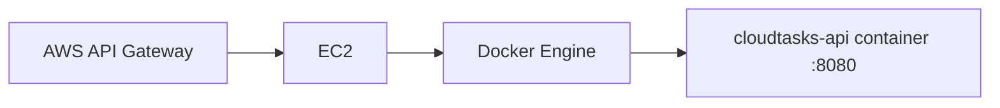

# ★ 02 · Desplegar CloudTasks containerizado en EC2

## Objetivo

Cumplir el mismo requisito institucional de despliegue en **EC2**, pero ejecutando el backend como contenedor Docker en vez de instalar Java y ejecutar el JAR directamente en el host.

> Para EV1, **EC2 sigue siendo obligatorio según la pauta**. ECS se deja fuera de esta ruta porque no aparece como requisito institucional de esta evaluación.

## Arquitectura



API Gateway no necesita saber que Spring Boot está containerizado: consume un endpoint HTTP igual que en la ruta base.

## 1. Crear EC2 igual que en la ruta base

Crear una instancia Linux permitida por el entorno académico.

Mantener las mismas reglas de seguridad:

- administración restringida;
- no abrir SSH a `0.0.0.0/0` indiscriminadamente;
- exponer únicamente lo necesario para validar/integrar;
- posteriormente el consumidor normal será API Gateway.

## 2. Instalar Docker Engine en EC2

Utilizar el procedimiento oficial correspondiente a la distribución Linux de la instancia.

No copiar comandos de Ubuntu a Amazon Linux o viceversa sin verificar la distribución.

Después de instalar:

```bash
docker version
```

Y validar:

```bash
docker run --rm hello-world
```

Si el usuario de administración todavía requiere `sudo docker`, corregir/configurar conscientemente según las reglas del laboratorio antes de automatizar nada.

## 3. Llevar la imagen al servidor

Para EV1 se permiten dos estrategias didácticas.

### Estrategia A · construir en EC2

Transferir/clonar el repositorio y ejecutar:

```bash
cd backend
docker build -t cloudtasks-api:ev1 .
```

Ventaja:

```text
menos infraestructura adicional
```

Desventaja:

```text
EC2 necesita descargar dependencias y compilar
```

### Estrategia B · mover una imagen ya construida

Usar un registry autorizado si el curso dispone de uno.

Conceptualmente:

```text
build local
→ push registry
→ pull EC2
→ run
```

No introducir ECR como requisito si el entorno académico no lo ha habilitado. El objetivo evaluado sigue siendo EC2 + API Gateway, no administrar un registry.

## 4. Variables de entorno

No escribir issuer, tokens o credenciales dentro de la imagen.

Ejecutar, por ejemplo:

```bash
docker run -d \
  --name cloudtasks-api \
  --restart unless-stopped \
  -p 8080:8080 \
  -e SPRING_SECURITY_OAUTH2_RESOURCESERVER_JWT_ISSUER_URI='<OIDC_ISSUER>' \
  cloudtasks-api:ev1
```

Comprobar:

```bash
docker ps
```

## 5. Logs

```bash
docker logs cloudtasks-api
```

Para seguimiento temporal:

```bash
docker logs -f cloudtasks-api
```

Salir con `Ctrl+C` no detiene el contenedor.

## 6. Validar desde EC2

```bash
curl -i http://localhost:8080/api/public/health
```

Esperado:

```text
200
```

Sin token:

```bash
curl -i http://localhost:8080/api/tasks
```

Esperado:

```text
401
```

Esto prueba primero aplicación + Docker sin introducir networking externo.

## 7. Validar remotamente

Desde un origen autorizado:

```bash
curl -i http://<HOST_EC2>:8080/api/public/health
```

Registrar:

```text
BACKEND_CLOUD_URL=http://<HOST_EC2>:8080
```

La URL tiene la misma función que en la ruta base.

## 8. Reinicio y persistencia

La ruta base utiliza un proceso Java administrado, por ejemplo, mediante `systemd`.

La ruta Docker utiliza:

```text
Docker daemon
+ restart policy del contenedor
```

Con:

```bash
--restart unless-stopped
```

probar que el backend no dependa de mantener una sesión SSH abierta.

## 9. Actualizar una versión

No entrar al contenedor a reemplazar el JAR manualmente.

Flujo correcto:

```text
cambio código
→ tests
→ docker build nueva imagen
→ detener/eliminar container anterior
→ iniciar nueva imagen
→ health check
```

Ejemplo simple:

```bash
docker stop cloudtasks-api
docker rm cloudtasks-api

docker run -d \
  --name cloudtasks-api \
  --restart unless-stopped \
  -p 8080:8080 \
  -e SPRING_SECURITY_OAUTH2_RESOURCESERVER_JWT_ISSUER_URI='<OIDC_ISSUER>' \
  cloudtasks-api:ev1
```

## 10. Convergencia con la ruta base

Cuando esto funcione, volver a:

→ [06 · AWS API Gateway + JWT Authorizer](../06-api-gateway-jwt.md)

Desde allí **no existe una EV1 Docker diferente**.

API Gateway recibe:

```text
BACKEND_CLOUD_URL
```

independientemente de si detrás existe:

```text
EC2 → java -jar
```

o:

```text
EC2 → Docker → java -jar dentro del container
```

## 11. ECS: dónde encaja conceptualmente

Una vez que existe una imagen Docker, una evolución profesional posible es:

```text
Docker image
→ registry
→ ECS task definition
→ ECS service
→ load balancer / networking
→ API Gateway
```

Pero eso agrega conceptos que **no aparecen como requisito de EV1** y pueden distraer de API Manager, IDaaS, OAuth/OIDC, JWT y CORS.

Por eso ECS no forma parte de esta implementación evaluativa mientras no exista una instrucción institucional explícita.

## Puerta de validación ★02

- [ ] EC2 creado según la pauta.
- [ ] Docker Engine funciona en EC2.
- [ ] CloudTasks corre como contenedor.
- [ ] health local EC2 = 200.
- [ ] protegida sin token = 401.
- [ ] endpoint remoto validado desde origen autorizado.
- [ ] container sobrevive al cierre de SSH.
- [ ] no hay secretos dentro de la imagen.
- [ ] `BACKEND_CLOUD_URL` queda listo para API Gateway.
- [ ] el alumno puede explicar diferencia entre EC2, Docker Engine, imagen y contenedor.

## Defensa avanzada sugerida

Pregunta:

> ¿Qué cambió para API Gateway al pasar de JAR directo a Docker?

Respuesta conceptual esperada:

> Prácticamente nada en el contrato HTTP. Cambió la forma en que el backend se empaqueta y ejecuta dentro de EC2, no la API pública ni el mecanismo de autenticación/autorización.
