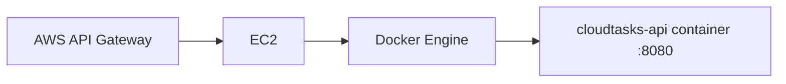

# ★ 02 · Desplegar CloudTasks containerizado en EC2

## Objetivo

Ejecutar el mismo backend CloudTasks como contenedor Docker sobre **EC2**, en vez de instalar Java y ejecutar el JAR directamente en el host.

Esta variante conserva EC2 + API Gateway para poder comparar únicamente el cambio de empaquetado/runtime. ECS queda fuera de esta práctica para no agregar todavía una capa de orquestación.

## Arquitectura



API Gateway no necesita saber que Spring Boot está containerizado: consume un endpoint HTTP igual que en la ruta base.

## 1. Crear EC2 igual que en la ruta base

Crear una instancia Linux permitida por el entorno académico.

Mantener las mismas reglas de seguridad:

- administración restringida;
- no abrir SSH a `0.0.0.0/0` indiscriminadamente;
- exponer únicamente lo necesario para validar/integrar;
- posteriormente el consumidor normal será API Gateway.

## 2. Instalar Docker Engine en EC2

Utilizar el procedimiento oficial correspondiente a la distribución Linux de la instancia.

No copiar comandos de Ubuntu a Amazon Linux o viceversa sin verificar la distribución.

Después de instalar:

```bash
docker version
docker run --rm hello-world
```

Si el usuario todavía requiere `sudo docker`, resolverlo conscientemente según las reglas del laboratorio antes de automatizar nada.

## 3. Llevar la imagen al servidor

### Estrategia A · construir en EC2

Transferir/clonar el repositorio y ejecutar:

```bash
cd backend
docker build -t cloudtasks-api:guia .
```

Ventaja: menos infraestructura adicional. Desventaja: EC2 descarga dependencias y compila.

### Estrategia B · mover una imagen ya construida

Usar un registry autorizado si el curso dispone de uno:

```text
build local
→ push registry
→ pull EC2
→ run
```

No introducir ECR por defecto si el entorno académico no lo ha habilitado. El foco es imagen → contenedor → EC2 → API Gateway.

## 4. Variables de entorno

No escribir issuer, audience, tokens o credenciales dentro de la imagen.

Ejecutar:

```bash
docker run -d \
  --name cloudtasks-api \
  --restart unless-stopped \
  -p 8080:8080 \
  -e OIDC_ISSUER='<OIDC_ISSUER>' \
  -e API_AUDIENCE='<API_AUDIENCE>' \
  cloudtasks-api:guia
```

Estos nombres son los mismos utilizados por 04A y por la ruta JAR. No crear una convención especial para Docker.

Comprobar:

```bash
docker ps
docker logs cloudtasks-api
```

## 5. Validar desde EC2

```bash
curl -i http://localhost:8080/api/public/health
curl -i http://localhost:8080/api/tasks
```

Esperado:

```text
health → 200
/tasks sin token → 401
```

Con Access Token real:

```bash
curl -i \
  -H "Authorization: Bearer <ACCESS_TOKEN>" \
  http://localhost:8080/api/tasks
```

Debe conservar la misma validación de issuer, audience y scopes que en local.

## 6. Validar remotamente

Desde un origen autorizado:

```bash
curl -i http://<HOST_EC2>:8080/api/public/health
```

Registrar:

```text
BACKEND_CLOUD_URL=http://<HOST_EC2>:8080
```

La URL tiene la misma función que en la ruta base.

## 7. Reinicio y persistencia

La ruta Docker utiliza:

```text
Docker daemon
+ --restart unless-stopped
```

Cerrar SSH y comprobar que el backend sigue respondiendo.

Después de reiniciar la instancia, comprobar otra vez:

```bash
docker ps
curl -i http://localhost:8080/api/public/health
```

## 8. Actualizar una versión

No modificar manualmente el JAR dentro de un contenedor.

Flujo:

```text
cambio código
→ tests
→ docker build nueva imagen
→ detener/eliminar contenedor anterior
→ iniciar nueva imagen con OIDC_ISSUER + API_AUDIENCE
→ health + prueba protegida
```

Ejemplo:

```bash
docker stop cloudtasks-api
docker rm cloudtasks-api

docker run -d \
  --name cloudtasks-api \
  --restart unless-stopped \
  -p 8080:8080 \
  -e OIDC_ISSUER='<OIDC_ISSUER>' \
  -e API_AUDIENCE='<API_AUDIENCE>' \
  cloudtasks-api:guia
```

## 9. Convergencia con la ruta base

Cuando esto funcione, volver a:

→ [06 · AWS API Gateway + JWT Authorizer](../06-api-gateway-jwt.md)

API Gateway recibe `BACKEND_CLOUD_URL` independientemente de si detrás existe:

```text
EC2 → java -jar
```

o:

```text
EC2 → Docker → java -jar dentro del container
```

## 10. ECS: dónde encaja conceptualmente

Una evolución profesional posible es:

```text
Docker image
→ registry
→ ECS task definition
→ ECS service
→ load balancer / networking
→ API Gateway
```

Eso agrega infraestructura que no es necesaria para comprender esta práctica base.

## Puerta de validación ★02

- [ ] EC2 creada y accesible.
- [ ] Docker Engine funciona en EC2.
- [ ] CloudTasks corre como contenedor.
- [ ] `OIDC_ISSUER` está presente en runtime.
- [ ] `API_AUDIENCE` está presente en runtime.
- [ ] health local EC2 = 200.
- [ ] protegida sin token = 401.
- [ ] Access Token válido conserva la política.
- [ ] endpoint remoto validado desde origen autorizado.
- [ ] contenedor sobrevive al cierre de SSH.
- [ ] no hay secretos dentro de la imagen.
- [ ] `BACKEND_CLOUD_URL` queda listo para API Gateway.
- [ ] el estudiante puede explicar EC2, Docker Engine, imagen y contenedor.

## Pregunta de comprobación avanzada

> ¿Qué cambió para API Gateway al pasar de JAR directo a Docker?

Respuesta conceptual esperada: prácticamente nada en el contrato HTTP; cambió el empaquetado/runtime dentro de EC2, no la API ni la autenticación/autorización.
