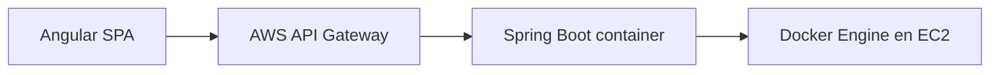

# ★ Advanced Developer · Guía integrada

Esta ruta es **opcional**. Permite realizar la misma práctica CloudTasks usando un entorno de desarrollo más cercano al trabajo profesional: **WSL2 + Ubuntu + terminal Linux + Docker**.

No reemplaza la ruta base. La misma aplicación, endpoints, Entra External ID, JWT, CORS, API Gateway y checkpoints siguen siendo válidos.

## Qué cambia

```text
Ruta base
Windows + IntelliJ/VS Code/WebStorm
→ Spring Boot ejecutado como JAR
→ EC2 + Java 21 + systemd

★ Advanced Developer
Windows como host
→ WSL2 + Ubuntu como entorno de desarrollo
→ terminal Linux
→ Docker Desktop con integración WSL2
→ Spring Boot empaquetado como imagen Docker
→ EC2 + Docker
```

## Qué NO cambia

```text
Angular
OAuth2/OIDC
Authorization Code + PKCE
Microsoft Entra External ID
Access Token JWT
scopes / roles
CORS
AWS API Gateway
JWT Authorizer
rutas
401 / 403
respuesta JSON
```

## Por qué existe esta ruta

El objetivo es mostrar una forma de trabajo más cercana a muchos equipos reales:

- herramientas Unix/Linux;
- paths y permisos Linux;
- scripts reproducibles;
- terminal como herramienta principal;
- artefacto de despliegue inmutable mediante Docker;
- mismo contenedor local y cloud;
- separación entre sistema operativo host y entorno de desarrollo.

## Arquitectura cloud de esta variante

La práctica mantiene EC2 + API Gateway. ECS puede estudiarse posteriormente como evolución natural de una aplicación containerizada, pero no se introduce aquí porque agregaría una segunda arquitectura antes de dominar la primera.

## Ruta recomendada

1. [★ 00 · Instalar WSL2 + Ubuntu y preparar Linux](./00-wsl2-ubuntu.md)
2. Continuar la ruta base para crear backend/frontend.
3. [★ 01 · Containerizar Spring Boot y probar Docker local](./01-docker-local.md)
4. Completar identidad/JWT de la ruta base.
5. [★ 02 · Desplegar contenedor en EC2](./02-docker-ec2.md)
6. Volver a API Gateway, CORS, frontend cloud y verificaciones de la ruta base.

## Regla de bifurcación

```text
Ruta base → continuar aquí
★ Advanced Developer → seguir enlace alternativo
```

Después de completar la alternativa, ambas rutas vuelven a converger en el mismo checkpoint funcional.

## Convención del workspace

En WSL se recomienda guardar el proyecto dentro del filesystem Linux:

```bash
~/dev/cloudtasks
```

y no trabajar diariamente desde:

```text
/mnt/c/...
```

Esto evita diferencias innecesarias de rendimiento, permisos y tooling entre filesystem Windows y Linux.

## Git

La ruta avanzada sigue usando GitHub mediante HTTPS. No requiere configurar SSH para completar la práctica.

Además se recomienda mantener finales de línea Linux para archivos ejecutados en WSL/Docker mediante `.gitattributes`.

## Resultado final esperado



El contenedor es una diferencia de empaquetado/ejecución. **API Gateway sigue hablando con la misma API HTTP** y la aplicación conserva exactamente el mismo contrato.
