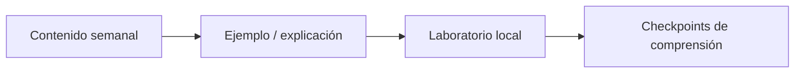
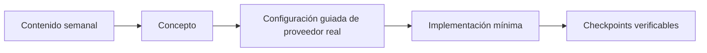

# Laboratorios · DSY1107

Esta carpeta contiene los **laboratorios canónicos del repositorio docente**. Las carpetas semanales solo enlazan hacia aquí.

## Regla canónica

Los laboratorios del repositorio se clasifican explícitamente en dos tipos:

### 1. Labs locales/autocontenidos

Son la opción preferida cuando la competencia puede practicarse sin depender de infraestructura cloud real.

### 2. Labs provider-backed

Se permiten cuando **el proveedor cloud es parte esencial de la competencia**, por ejemplo Identity as a Service, autenticación federada, JWT Authorizers o una capacidad administrada que perdería sentido si se simulase por completo.

Un lab provider-backed debe:

- declarar de forma visible qué proveedor externo utiliza;
- tener un paso a paso reproducible y no asumir pasos ocultos de consola;
- poder realizarse con cuenta gratuita cuando sea razonablemente posible;
- evitar secretos, service-account keys, tokens reutilizables o credenciales en el repositorio;
- distinguir claramente configuración cloud, código local y evidencia de funcionamiento;
- incluir checkpoints antes de agregar complejidad adicional.

Los ejercicios institucionales publicados en AVA siguen siendo material oficial independiente. Un lab del repo no reemplaza una actividad obligatoria de AVA, aunque practique una competencia similar.

## Disponibles

### Locales/autocontenidos

- [`api-gateway-local/`](api-gateway-local/) — routing, integración, versionado, políticas y CORS mediante Spring Cloud Gateway + backend público.
- [`identidad-local/`](identidad-local/) — laboratorio histórico de OAuth2/OIDC, PKCE, tokens, scopes, roles, 401/403, tenant y app registration.
- [`jwt-forense/`](jwt-forense/) — Semana 3: JWT, claims, audience/issuer/expiración, scopes, 401/403 y frontera gateway/backend con dominio neutral.

### Provider-backed

- [`firebase-auth-miniapp/`](firebase-auth-miniapp/) — Semana 4: mini app web con Firebase Authentication. Implementa zona pública/privada, Register, Login, Password Reset y Logout con Email/Password; solo después agrega Google Sign-In como proveedor federado.
- [`fullstack-seguro/`](fullstack-seguro/) — Semana 4: laboratorio por etapas que consume la guía canónica de Identity y aplica **dos App Registrations**, MSAL + PKCE, access token para API propia, AWS API Gateway/JWT Authorizer, Spring Security Resource Server, validación explícita de audience, matriz 401/403/2xx, troubleshooting y threat sketch.

## Relación con AVA

Cuando AVA incluya una actividad cloud sobre la misma competencia, la semana puede enlazar o mencionar esa correspondencia pedagógica. Esa referencia sirve para que el estudiante reconozca el mismo concepto en un proveedor real, pero:

- la actividad cloud sigue siendo material institucional de AVA;
- el lab del repo conserva su propia intención, evidencia y checkpoints;
- completar un lab del repo no reemplaza una actividad institucional obligatoria del AVA;
- una actividad AVA no convierte automáticamente el lab del repo en una fase obligatoria de la misma secuencia.

## Independencia del Proyecto Formativo

Los laboratorios deben mantenerse independientes de RegistrApp. Si una competencia aprendida en un lab se aplica posteriormente al proyecto formativo, esa transferencia ocurre después y se documenta en `proyecto-formativo/`.

→ [Estrategia completa de laboratorios y relación con AVA](../docs/ESTRATEGIA-LABORATORIOS-CONCEPTO-A-CLOUD.md)
