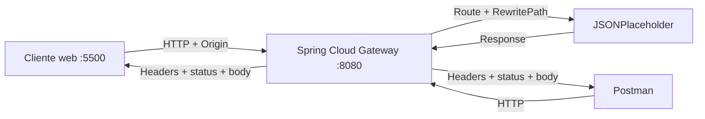

# Laboratorio 1 · API Gateway local con Spring Cloud Gateway

**Asignatura:** DSY1107 · Desarrollo Cloud Native I  
**Semana:** 01  
**Modalidad:** grupal  
**Entrega:** repositorio GitHub por grupo  
**Objetivo:** comprender API Gateway, routing, HTTP nivel 2, versionado y CORS mediante configuración, sin programar lógica de negocio.

> Este laboratorio reemplaza temporalmente la práctica en Amazon API Gateway mientras el laboratorio AWS no se encuentre disponible. La tecnología es distinta, pero los conceptos arquitectónicos son equivalentes: punto de entrada, ruta, integración, políticas transversales, versionado y CORS.

---

## 1. ¿Qué van a construir?

Trabajarán con tres elementos concretos:

```text
┌──────────────────────┐
│ Cliente              │
│ Postman / navegador  │
└──────────┬───────────┘
           │ http://localhost:8080/api/v1/...
           ▼
┌──────────────────────┐
│ Spring Cloud Gateway │
│ localhost:8080       │
└──────────┬───────────┘
           │ https://jsonplaceholder.typicode.com/...
           ▼
┌──────────────────────┐
│ Backend de prueba    │
│ JSONPlaceholder      │
└──────────────────────┘
```

### Cliente

El cliente será:

- **Postman** o `curl` para las pruebas HTTP generales;
- un **cliente web ya preparado** para comprobar CORS desde navegador.

No deben programar el cliente.

### Gateway

El gateway será una aplicación Spring Cloud Gateway entregada como starter. El trabajo principal consiste en modificar:

```text
gateway/src/main/resources/application.yml
```

No deben crear controllers ni lógica Java.

### Backend

El backend será la API pública de prueba:

```text
https://jsonplaceholder.typicode.com
```

No deben crear ni programar el backend.

JSONPlaceholder simula operaciones de creación, actualización y eliminación. Es suficiente para estudiar routing, métodos, status codes y headers, pero los cambios no quedan persistidos permanentemente.

---

## 2. Conceptos que deben reconocer

Al finalizar deben ser capaces de explicar:

1. qué diferencia existe entre **API**, **API Gateway** y **API Management**;
2. qué significa que el gateway sea un **punto de entrada**;
3. qué es una **route**;
4. qué hace un **predicate**;
5. qué representa la **integration** o destino;
6. qué es un **filter**;
7. cómo viaja una petición `cliente → gateway → backend → gateway → cliente`;
8. qué significa trabajar con HTTP en **Richardson Maturity Model nivel 2**;
9. por qué pueden coexistir `/api/v1` y `/api/v2`;
10. qué problema resuelve CORS y qué problema **no** resuelve.

---

## 3. Requisitos antes de comenzar

Cada grupo debe disponer de:

- JDK 21 o superior;
- Maven 3.9+;
- Git;
- cuenta GitHub;
- Postman;
- navegador;
- conexión a Internet.

Verifiquen:

```bash
java -version
mvn -version
git --version
```

Si alguno falla, resuélvanlo antes de continuar.

---

## 4. Crear el repositorio grupal

Un integrante crea un repositorio, por ejemplo:

```text
dsy1107-lab-api-gateway-grupo-03
```

Debe agregar al resto como colaboradores.

Todos los integrantes deben clonar **el repositorio grupal**, no trabajar sobre el repositorio de la asignatura.

La estructura final debe quedar similar a:

```text
dsy1107-lab-api-gateway-grupo-03/
├── README.md
├── gateway/
│   ├── pom.xml
│   └── src/main/resources/application.yml
├── client/
│   └── index.html
└── docs/
    └── evidencias.md
```

Copien dentro de ese repositorio el contenido de [`starter/`](starter/).

Luego hagan un primer commit:

```bash
git add .
git commit -m "chore: agregar starter del laboratorio"
git push
```

---

## 5. Estrategia de trabajo colaborativo

No deben hacer todo directamente en `main`.

Distribuyan tareas. Ejemplo:

```text
feature/routing-v1
feature/version-v2
feature/cors
docs/evidencias
```

Cada integrante debe:

1. crear o utilizar una rama de trabajo;
2. realizar al menos un aporte identificable;
3. hacer commits comprensibles;
4. hacer `push` de su rama;
5. abrir un Pull Request;
6. integrar el cambio al repositorio grupal.

No se evalúa cantidad artificial de commits. Se busca evidencia real de colaboración.

---

# PARTE A · Primer API Gateway

## 6. Levantar el gateway

Desde la raíz del repositorio grupal:

```bash
cd gateway
mvn spring-boot:run
```

Cuando esté iniciado debería quedar escuchando en:

```text
http://localhost:8080
```

No necesitan abrir esa URL directamente en el navegador.

Mantengan esa terminal ejecutándose.

---

## 7. Conocer directamente el backend

Antes de usar el gateway, prueben el backend directamente en Postman:

```http
GET https://jsonplaceholder.typicode.com/posts
```

Luego:

```http
GET https://jsonplaceholder.typicode.com/posts/1
```

Registren en `docs/evidencias.md`:

- URL;
- método;
- status code;
- body recibido.

### Pregunta

En este momento el cliente conoce directamente la dirección física del backend. ¿Qué problema podría producir eso si existieran muchos servicios o si el backend cambiara de ubicación?

---

## 8. Probar la ruta inicial del gateway

El starter ya contiene **una única ruta inicial**.

Revisen:

```text
gateway/src/main/resources/application.yml
```

Encontrarán conceptualmente:

```yaml
- id: posts-v1
  uri: https://jsonplaceholder.typicode.com
  predicates:
    - Path=/api/v1/posts/**
  filters:
    - RewritePath=...
```

No copien mecánicamente la configuración: identifiquen qué representa cada parte.

| Configuración | Concepto |
|---|---|
| `id` | nombre interno de la route |
| `uri` | integración / backend destino |
| `Path` | condición que determina cuándo aplica la route |
| `RewritePath` | transformación antes de enviar la petición al backend |

Prueben ahora:

```http
GET http://localhost:8080/api/v1/posts
```

Luego:

```http
GET http://localhost:8080/api/v1/posts/1
```

El cliente habla con `localhost:8080`, no con JSONPlaceholder.

### Deben poder explicar este recorrido

```text
GET /api/v1/posts/1
       │
       ▼
Spring Cloud Gateway
       │
       ├─ Path hace match
       ├─ RewritePath transforma la ruta
       ▼
https://jsonplaceholder.typicode.com/posts/1
       │
       ▼
Backend responde
       │
       ▼
Gateway devuelve la respuesta al cliente
```

Registren esta prueba.

---

# PARTE B · HTTP y Richardson Maturity Model nivel 2

## 9. Trabajar con recursos y métodos HTTP

En este laboratorio consideraremos una API que trabaja al menos a **Richardson Maturity Model nivel 2** porque utiliza:

- recursos identificables;
- métodos HTTP con significado;
- status codes HTTP.

Utilicen siempre el gateway:

### Obtener colección

```http
GET http://localhost:8080/api/v1/posts
```

### Obtener recurso individual

```http
GET http://localhost:8080/api/v1/posts/1
```

### Crear

```http
POST http://localhost:8080/api/v1/posts
Content-Type: application/json
```

Body:

```json
{
  "title": "Cloud Native",
  "body": "Laboratorio API Gateway",
  "userId": 1
}
```

### Actualizar

```http
PUT http://localhost:8080/api/v1/posts/1
Content-Type: application/json
```

Body:

```json
{
  "id": 1,
  "title": "Cloud Native actualizado",
  "body": "Prueba PUT mediante gateway",
  "userId": 1
}
```

### Eliminar

```http
DELETE http://localhost:8080/api/v1/posts/1
```

Completen:

| Método | Recurso | Status | Significado |
|---|---|---:|---|
| GET | `/api/v1/posts` | | colección |
| GET | `/api/v1/posts/1` | | recurso |
| POST | `/api/v1/posts` | | creación |
| PUT | `/api/v1/posts/1` | | actualización/reemplazo |
| DELETE | `/api/v1/posts/1` | | eliminación |

### Importante

JSONPlaceholder simula POST, PUT y DELETE. No esperen que los cambios sigan existiendo después en el backend.

---

# PARTE C · Versionado

## 10. Crear `/api/v2`

Ahora sí deben **modificar configuración**.

Creen una rama:

```bash
git switch -c feature/version-v2
```

En `application.yml`, agreguen una segunda route basada en `posts-v1` que reciba:

```text
/api/v2/posts/**
```

Debe continuar utilizando el mismo backend.

A la route `v1` agreguen:

```yaml
- AddResponseHeader=X-API-Version, v1
```

Y a la route `v2`:

```yaml
- AddResponseHeader=X-API-Version, v2
```

Reinicien el gateway si es necesario.

Prueben:

```http
GET http://localhost:8080/api/v1/posts/1
```

```http
GET http://localhost:8080/api/v2/posts/1
```

En Postman revisen **Headers**.

Deben observar:

```text
X-API-Version: v1
```

o:

```text
X-API-Version: v2
```

### Respondan

1. ¿Por qué podrían coexistir v1 y v2?
2. ¿Por qué no se obliga a todos los clientes a migrar el mismo día?
3. ¿La versión de la URL representa necesariamente una versión del servidor desplegado?
4. ¿Cuándo retirarían v1?

Hagan commit y Pull Request.

---

# PARTE D · Política transversal

## 11. Agregar un header del gateway

El gateway puede aplicar comportamientos que no pertenecen a la lógica de negocio.

Agreguen un `default-filter` para que todas las respuestas incluyan:

```text
X-Gateway-Lab: DSY1107
```

La idea conceptual es:

```yaml
default-filters:
  - AddResponseHeader=X-Gateway-Lab, DSY1107
```

Comprueben el header en Postman.

### Analicen

Clasifiquen estas responsabilidades:

| Responsabilidad | Cliente | Gateway | Backend |
|---|:---:|:---:|:---:|
| routing | | | |
| lógica de negocio | | | |
| autenticación/autorización | | | |
| transformación de rutas | | | |
| persistencia | | | |
| rate limiting | | | |
| reglas de negocio | | | |
| observabilidad del tráfico | | | |

Algunas pueden implementarse en más de una capa. Justifiquen su decisión.

---

# PARTE E · CORS

## 12. ¿Por qué Postman no demuestra CORS?

Postman puede invocar el endpoint aunque CORS no esté configurado porque la política CORS está relacionada principalmente con navegadores y la **Same-Origin Policy**.

Por eso esta parte se probará además desde un navegador.

---

## 13. Ejecutar el cliente web entregado

El starter incluye:

```text
client/index.html
```

No deben programarlo.

Sirvan esa carpeta en el puerto `5500`.

Pueden utilizar **Live Server** de VS Code y configurar el puerto 5500, o cualquier servidor estático equivalente.

La URL esperada es:

```text
http://localhost:5500
```

El cliente intentará consultar:

```text
http://localhost:8080/api/v1/posts/1
```

### Primera prueba

Antes de configurar CORS, abran el cliente.

Observen:

- resultado en pantalla;
- consola del navegador;
- pestaña Network.

Registren qué ocurre.

---

## 14. Configurar CORS en el gateway

Creen una rama:

```bash
git switch -c feature/cors
```

Configuren CORS global bajo:

```text
spring.cloud.gateway.server.webflux.globalcors
```

Debe permitir como origen:

```text
http://localhost:5500
```

Y los métodos:

```text
GET
POST
PUT
DELETE
OPTIONS
```

También permitan headers necesarios para el laboratorio.

La configuración debe considerar preflight (`OPTIONS`).

Después de modificar `application.yml`, reinicien el gateway.

---

## 15. Verificar CORS desde navegador

Recarguen:

```text
http://localhost:5500
```

El cliente ahora debería poder obtener la respuesta.

En DevTools → Network revisen los headers.

Luego prueben manualmente un preflight:

```bash
curl -i -X OPTIONS http://localhost:8080/api/v1/posts \
  -H "Origin: http://localhost:5500" \
  -H "Access-Control-Request-Method: POST"
```

Busquen headers como:

```text
Access-Control-Allow-Origin
Access-Control-Allow-Methods
```

### Respondan

1. ¿Por qué Postman podía funcionar aunque el navegador fallara?
2. ¿Qué es un preflight?
3. ¿CORS autentica usuarios?
4. ¿CORS autoriza operaciones de negocio?
5. ¿Qué problema tendría permitir cualquier origen indiscriminadamente?

Hagan commit y Pull Request.

---

# PARTE F · Arquitectura y evidencia

## 16. Completar el diagrama

En el README del grupo incluyan Mermaid:



Adáptenlo si su solución difiere.

---

## 17. README obligatorio de la entrega

El `README.md` del repositorio grupal debe contener:

1. nombre de la actividad;
2. integrantes;
3. objetivo;
4. arquitectura;
5. explicación cliente/gateway/backend;
6. requisitos;
7. instrucciones completas para ejecutar;
8. rutas configuradas;
9. pruebas HTTP;
10. explicación de RMM nivel 2;
11. estrategia de versionado;
12. evidencia de v1 y v2;
13. explicación y evidencia CORS;
14. responsabilidades gateway vs backend;
15. problemas encontrados;
16. conclusiones;
17. evidencia de colaboración GitHub.

---

## 18. Evidencias mínimas

`docs/evidencias.md` debe contener al menos:

- acceso directo al backend;
- GET mediante gateway;
- POST mediante gateway;
- PUT mediante gateway;
- DELETE mediante gateway;
- status codes;
- headers relevantes;
- evidencia `/api/v1`;
- evidencia `/api/v2`;
- `X-API-Version`;
- `X-Gateway-Lab`;
- fallo o comportamiento previo a CORS;
- funcionamiento posterior a CORS;
- preflight OPTIONS;
- diagrama;
- explicación del recorrido de una petición;
- enlaces a Pull Requests.

Capturas pueden complementar, pero una captura sin explicación no es evidencia suficiente.

---

## 19. Cierre conceptual

Cada integrante debe poder responder oralmente:

1. ¿Qué URL conoce el cliente?
2. ¿Qué URL conoce el gateway?
3. ¿Qué hizo el predicate `Path`?
4. ¿Qué hizo `RewritePath`?
5. ¿Qué representa `uri`?
6. ¿Qué demuestra que trabajaron a nivel 2 de Richardson?
7. ¿Por qué existen v1 y v2?
8. ¿Por qué CORS se comprobó desde navegador?
9. ¿Qué no debería colocarse como lógica dentro del gateway?
10. ¿Qué cambiaría al implementar estos mismos conceptos en Amazon API Gateway?

---

## 20. Criterios de revisión formativa

Se revisará:

- comprensión conceptual;
- gateway funcional;
- routing correcto;
- uso de métodos/status HTTP;
- versionado visible;
- CORS explicado y comprobado;
- documentación reproducible;
- separación de responsabilidades;
- colaboración GitHub mediante ramas y PR;
- capacidad de explicar la solución.

**No se busca premiar cantidad de código.** El código principal ya está entregado; el aprendizaje está en comprender y configurar la infraestructura de entrada a la API.
