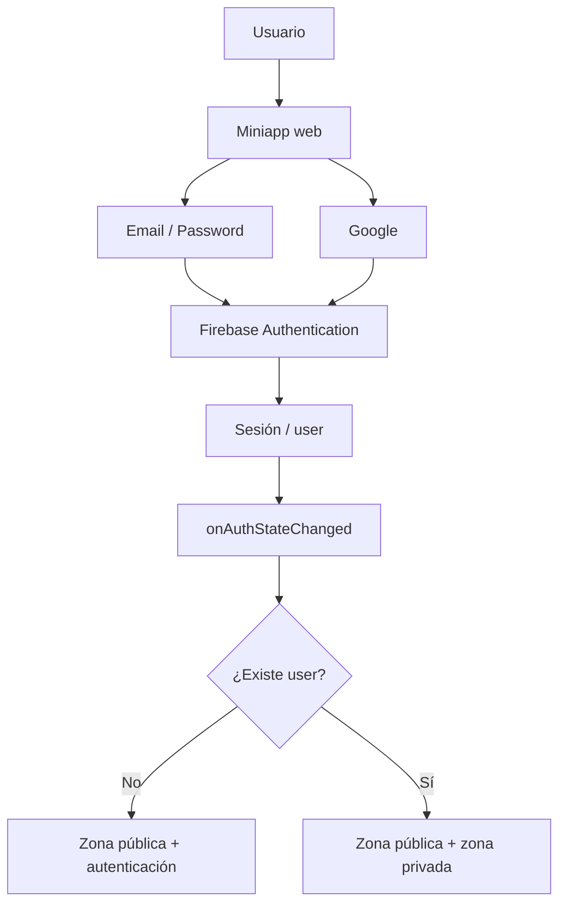
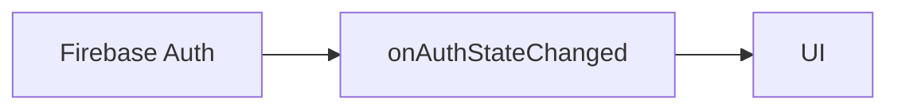
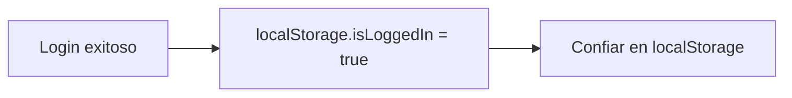
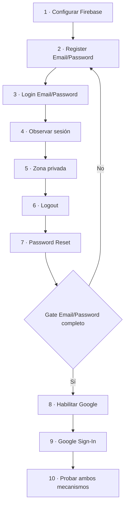
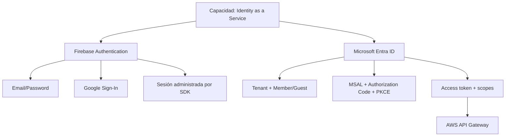
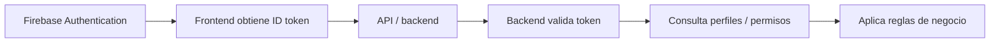

# Parte 0 · Conceptos y arquitectura del laboratorio

← [Volver al índice](./README.md)

## Qué problema resolvemos

La miniapp necesita distinguir entre personas anónimas y personas autenticadas sin implementar por cuenta propia almacenamiento de passwords, validación de credenciales ni integración OAuth con Google.

La solución elegida es **Firebase Authentication como Identity as a Service (IDaaS)**.

---

## Autenticación vs autorización

### Autenticación

Responde:

> ¿Quién es el usuario?

Ejemplos del lab:

- email/password;
- Google.

### Autorización

Responde:

> ¿Qué puede hacer ese usuario?

Este laboratorio solo representa una autorización muy simple en UI: si existe sesión, se muestra una zona privada.

Eso **no reemplaza autorización real de backend**.

---

## Actor y responsabilidades

| Componente | Responsabilidad |
|---|---|
| Navegador | ejecutar la miniapp |
| Miniapp | presentar formularios y reaccionar al estado de sesión |
| Firebase SDK | conectar la app con Firebase Authentication |
| Firebase Authentication | crear identidades, autenticar, mantener sesión, password reset, Google |
| Google | autenticar al usuario dentro del flujo federado |

---

## Qué deliberadamente NO construiremos

Para reducir complejidad accidental, no incorporamos:

- backend propio;
- Spring Boot;
- API REST;
- validación manual de ID token;
- roles;
- Firestore;
- Firebase Hosting;
- email verification custom;
- pantalla custom de password reset;
- React/Vue/Angular;
- router.

Cada uno de esos elementos puede ser correcto en un producto real, pero no es necesario para comprender el objetivo de este ejercicio.

---

## Fuente de verdad

La sesión de Firebase es la única fuente de verdad de autenticación.

### Correcto

### Incorrecto

Un booleano local puede falsificarse y además puede quedar desincronizado respecto de Firebase.

---

## Evolución pedagógica

La secuencia es intencional:

No adelantes Google porque ocultaría parte del aprendizaje sobre el ciclo tradicional de credenciales.

---

## Relación con Microsoft Entra ID

Este laboratorio usa Firebase para aislar la capacidad **Identity as a Service**. En el proyecto cloud de DSY1107, la misma capacidad se estudia con Microsoft Entra ID, pero el modelo operativo cambia.

### Firebase

El estudiante habilita mecanismos de autenticación como:

- Email/Password;
- Google Sign-In.

Firebase administra las identidades y el estado de sesión de la miniapp.

### Microsoft Entra ID en la primera etapa del proyecto

El escenario inicial es:

- tenant propio del grupo;
- SPA registrada como **single-tenant**;
- integrantes del tenant como `Member`;
- compañeros externos incorporados como `Guest/B2B`;
- Authorization Code + PKCE mediante MSAL;
- access token destinado a la API propia;
- validación del JWT en AWS API Gateway.

La competencia importante no es memorizar pantallas de cada proveedor, sino reconocer:

1. quién administra la identidad;
2. quién puede autenticarse;
3. qué token se obtiene;
4. para qué recurso fue emitido;
5. qué componente valida el token;
6. dónde comienza la autorización real.

Para el procedimiento completo de usuarios externos en Entra:

→ [Microsoft Entra ID · usuarios externos en una SPA con API protegida](../../docs/identity/entra-usuarios-externos-spa-api-gateway.md)

---

## Relación con una aplicación productiva

Una aplicación real puede extender el flujo:

Este laboratorio termina antes de esa frontera.

---

# Preguntas antes de empezar

Deberías poder responder al terminar:

1. ¿Qué delegamos a Firebase?
2. ¿Qué sigue siendo responsabilidad de nuestra miniapp?
3. ¿Por qué una API no debería confiar únicamente en que el frontend muestre una zona privada?
4. ¿Qué tienen en común Email/Password y Google una vez autenticados?
5. ¿Por qué no necesitamos `localStorage.isLoggedIn`?
6. ¿Qué diferencia existe entre crear un usuario Firebase y agregar un usuario Guest/B2B a un tenant Entra?
7. ¿Por qué una SPA Entra debe pedir un access token para su API y no reutilizar un token emitido para Microsoft Graph?

---

## Continúa

→ [Parte 1 · Preparación del proyecto y Firebase](./01-preparacion-y-firebase.md)
