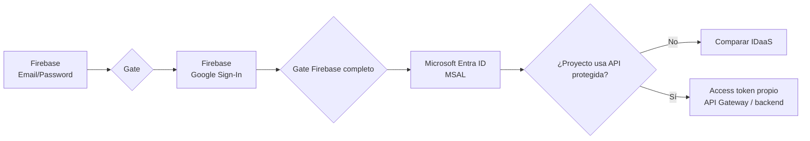
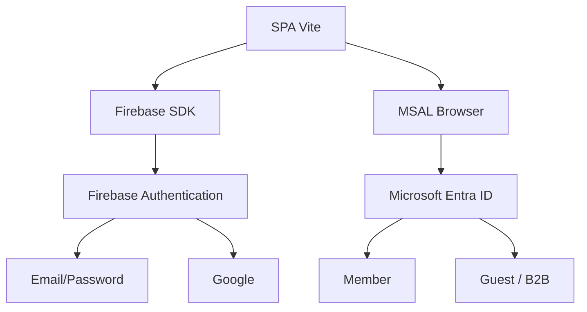
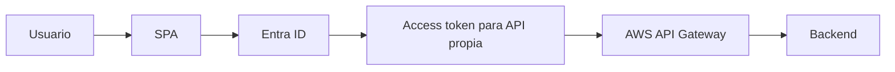

# Parte 9 · Microsoft Entra ID + MSAL como tercera etapa

← [Volver al índice](./README.md)

## Objetivo

Extender la misma SPA usada en el laboratorio Firebase para comparar dos implementaciones reales de **Identity as a Service**:

1. **Firebase Authentication**
   - Email/Password;
   - Google Sign-In;
   - sesión administrada por Firebase SDK.
2. **Microsoft Entra ID + MSAL Browser**
   - tenant;
   - Member / Guest;
   - App Registration;
   - Authorization Code + PKCE;
   - sesión/cuenta administrada por MSAL;
   - opcionalmente access token para la API propia.

> **Importante:** Microsoft Entra ID mediante MSAL **no es un tercer provider de Firebase** en este ejercicio. Es un segundo IDaaS integrado directamente en la SPA para comparar arquitecturas y fronteras de confianza.

---

# Gate previo obligatorio

No comenzar esta parte hasta que estén verdes:

- Email/Password;
- Password Reset;
- sesión y Logout Firebase;
- Google Sign-In;
- matriz `AUTH-01…AUTH-11`.

La progresión es:



---

# 1. Comprender qué se agrega

La SPA tendrá dos contextos de autenticación independientes:



No asumir que una sesión Firebase crea una sesión Entra ni viceversa.

Para las pruebas de clase se recomienda **cerrar una sesión antes de probar el otro IDaaS**. No es objetivo de este laboratorio resolver linking de cuentas entre proveedores.

---

# 2. Preparar el tenant para trabajar en grupo

Para DSY1107 usamos inicialmente una App Registration **single-tenant**.

Eso significa:

```text
Accounts in this organizational directory only
```

Pueden autenticarse:

- miembros del tenant;
- compañeros invitados como usuarios externos `Guest`.

Si el alumno dueño del tenant puede entrar pero sus compañeros no, **no cambiar a multitenant como parche**.

Seguir la guía específica:

→ [Microsoft Entra ID · usuarios externos en una SPA con API protegida](../../docs/identity/entra-usuarios-externos-spa-api-gateway.md)

Checkpoint antes de tocar código:

- [ ] tenant correcto seleccionado;
- [ ] dueño visible como Member;
- [ ] compañeros agregados como Guest;
- [ ] invitaciones aceptadas;
- [ ] usuarios no bloqueados;
- [ ] si `Assignment required? = Yes`, usuarios/grupos asignados a la Enterprise Application.

---

# 3. Registrar la SPA en Microsoft Entra ID

En Microsoft Entra admin center:

1. `Entra ID`.
2. `App registrations`.
3. `New registration`.
4. Nombre sugerido:

```text
dsy1107-auth-miniapp-spa
```

5. Supported account types:

```text
Accounts in this organizational directory only
```

6. Registrar.

Guardar estos dos valores:

```text
Application (client) ID
Directory (tenant) ID
```

No son passwords ni secretos privados; identifican el cliente y el tenant.

## No crear Client Secret

Esta aplicación corre en el navegador y es un **public client**.

Nunca poner un `client_secret` en JavaScript, `.env` del frontend ni código versionado.

---

# 4. Configurar plataforma SPA y redirect URI

En:

`App registrations → <SPA> → Authentication`

Agregar plataforma:

```text
Single-page application
```

Para Vite, registrar exactamente:

```text
http://localhost:5173/redirect.html
```

También puedes registrar el origen productivo más adelante cuando exista deployment real.

## Por qué usamos `redirect.html`

La versión actual de MSAL Browser utiliza una página de redirect dedicada para completar de forma segura la comunicación de popup/iframe con la ventana principal.

No utilizar una página con router, lógica de negocio o inicialización de la app completa como redirect bridge.

---

# 5. Instalar MSAL Browser

En el mismo proyecto Vite:

```bash
npm install @azure/msal-browser
```

Ahora el proyecto tendrá dos SDK de identidad independientes:

```text
firebase
@azure/msal-browser
```

---

# 6. Crear `redirect.html`

En la raíz del proyecto, junto a `index.html`:

```html
<!doctype html>
<html lang="es">
  <head>
    <meta charset="UTF-8" />
    <title>Procesando autenticación</title>
  </head>
  <body>
    <p>Procesando autenticación...</p>

    <script type="module">
      import { broadcastResponseToMainFrame } from "@azure/msal-browser/redirect-bridge";

      broadcastResponseToMainFrame();
    </script>
  </body>
</html>
```

Esta página debe permanecer deliberadamente mínima.

### Checkpoint 9.1

Abrir manualmente:

```text
http://localhost:5173/redirect.html
```

Debe cargar sin error de Vite/import.

---

# 7. Configurar variables públicas del cliente

Crear `.env.local`:

```properties
VITE_ENTRA_TENANT_ID=REEMPLAZAR_TENANT_ID
VITE_ENTRA_CLIENT_ID=REEMPLAZAR_SPA_CLIENT_ID
```

Agregar `.env.local` a `.gitignore` para evitar que cada alumno pise la configuración local de otro.

> `tenantId` y `clientId` de una SPA no son secretos. Usamos variables de entorno para separar configuración del código, **no porque estos valores puedan ocultarse al navegador**.

No poner aquí:

- client secret;
- contraseña;
- access token;
- refresh token;
- certificado privado.

---

# 8. Crear `src/msal.js`

```javascript
import {
  InteractionRequiredAuthError,
  PublicClientApplication
} from "@azure/msal-browser";

const tenantId = import.meta.env.VITE_ENTRA_TENANT_ID;
const clientId = import.meta.env.VITE_ENTRA_CLIENT_ID;

if (!tenantId || !clientId) {
  throw new Error(
    "Falta VITE_ENTRA_TENANT_ID o VITE_ENTRA_CLIENT_ID en .env.local"
  );
}

const redirectUri = `${window.location.origin}/redirect.html`;

export const msalInstance = new PublicClientApplication({
  auth: {
    clientId,
    authority: `https://login.microsoftonline.com/${tenantId}`,
    redirectUri,
    postLogoutRedirectUri: window.location.origin
  },
  cache: {
    cacheLocation: "sessionStorage"
  }
});

export async function initializeMsal() {
  await msalInstance.initialize();

  const accounts = msalInstance.getAllAccounts();

  if (accounts.length === 1) {
    msalInstance.setActiveAccount(accounts[0]);
  }

  return msalInstance.getActiveAccount();
}

export async function loginWithMicrosoft() {
  const response = await msalInstance.loginPopup({
    scopes: ["openid", "profile", "email"],
    redirectUri
  });

  msalInstance.setActiveAccount(response.account);
  return response.account;
}

export async function logoutMicrosoft() {
  const account = msalInstance.getActiveAccount();

  if (!account) {
    return;
  }

  await msalInstance.logoutPopup({
    account,
    postLogoutRedirectUri: window.location.origin
  });

  msalInstance.setActiveAccount(null);
}

export async function getApiAccessToken(apiScope) {
  const account = msalInstance.getActiveAccount();

  if (!account) {
    throw new Error("No existe una cuenta Microsoft activa");
  }

  const request = {
    account,
    scopes: [apiScope]
  };

  try {
    const response = await msalInstance.acquireTokenSilent(request);
    return response.accessToken;
  } catch (error) {
    if (!(error instanceof InteractionRequiredAuthError)) {
      throw error;
    }

    const response = await msalInstance.acquireTokenPopup({
      ...request,
      redirectUri
    });

    return response.accessToken;
  }
}
```

### Qué hace esta configuración

- `clientId`: identifica la SPA registrada;
- `authority`: fuerza autenticación contra **el tenant del proyecto**, no contra `common`;
- `redirectUri`: recibe la respuesta del flujo OAuth/OIDC;
- `sessionStorage`: deja el cache de MSAL asociado a la sesión del navegador;
- `initialize()`: debe terminar antes de usar APIs interactivas de MSAL;
- `setActiveAccount(...)`: define qué cuenta utilizar en futuras solicitudes de token.

---

# 9. Agregar botón Microsoft a la UI

Ejemplo:

```html
<button id="microsoft-login-button" type="button">
  Continuar con Microsoft
</button>

<button id="microsoft-logout-button" type="button" hidden>
  Cerrar sesión Microsoft
</button>
```

En `main.js`:

```javascript
import {
  initializeMsal,
  loginWithMicrosoft,
  logoutMicrosoft
} from "./msal";

const microsoftLoginButton = document.querySelector(
  "#microsoft-login-button"
);

const microsoftLogoutButton = document.querySelector(
  "#microsoft-logout-button"
);

let entraAccount = await initializeMsal();

microsoftLoginButton.addEventListener("click", async () => {
  try {
    entraAccount = await loginWithMicrosoft();
    renderAuthenticationState();
  } catch (error) {
    console.error(error);
    showMessage(`Microsoft login falló: ${error.errorCode ?? error.message}`);
  }
});

microsoftLogoutButton.addEventListener("click", async () => {
  try {
    await logoutMicrosoft();
    entraAccount = null;
    renderAuthenticationState();
  } catch (error) {
    console.error(error);
    showMessage(`Microsoft logout falló: ${error.errorCode ?? error.message}`);
  }
});
```

---

# 10. Integrar la zona privada sin mentir sobre la fuente de identidad

Hasta ahora la miniapp tenía una sola fuente de identidad: Firebase.

Al agregar MSAL existirán dos estados posibles.

Una forma didáctica de coordinarlos:

```javascript
let firebaseUser = null;
let entraAccount = null;

function getCurrentIdentity() {
  if (firebaseUser) {
    return {
      provider: "firebase",
      label: firebaseUser.email ?? firebaseUser.displayName ?? firebaseUser.uid
    };
  }

  if (entraAccount) {
    return {
      provider: "entra",
      label: entraAccount.username ?? entraAccount.name ?? entraAccount.homeAccountId
    };
  }

  return null;
}

function renderAuthenticationState() {
  const identity = getCurrentIdentity();
  const authenticated = identity !== null;

  publicZone.hidden = authenticated;
  privateZone.hidden = !authenticated;

  if (authenticated) {
    currentUserLabel.textContent =
      `${identity.label} · proveedor: ${identity.provider}`;
  }
}
```

El observer Firebase alimenta su estado:

```javascript
onAuthStateChanged(auth, (user) => {
  firebaseUser = user;
  renderAuthenticationState();
});
```

Y MSAL alimenta `entraAccount` después de inicializar/login/logout.

## Regla de la práctica

No iniciar dos proveedores simultáneamente durante la demostración.

Secuencia recomendada:

```text
Firebase Email/Password
→ logout
→ Firebase Google
→ logout
→ Microsoft Entra/MSAL
→ logout
```

La meta es comparar mecanismos, no implementar account linking.

---

# 11. Prueba con el dueño del tenant

Primero probar con quien creó/configuró el tenant.

Resultado esperado:

```text
click Microsoft
→ Microsoft Entra ID
→ autenticación
→ MSAL recibe cuenta
→ SPA muestra zona privada
```

### Checkpoint 9.2

- [ ] abre experiencia Microsoft;
- [ ] usuario puede autenticarse;
- [ ] `getAllAccounts()` devuelve cuenta;
- [ ] existe active account;
- [ ] zona privada muestra proveedor `entra`;
- [ ] logout Microsoft funciona.

---

# 12. Prueba obligatoria con un compañero

Esta prueba es parte del aprendizaje, no un detalle administrativo.

## Caso A · compañero no invitado

Para app single-tenant, el acceso debe ser rechazado.

## Caso B · compañero invitado pero pendiente

Completar la invitación antes de seguir depurando código.

## Caso C · compañero Guest aceptado

Debe poder autenticarse contra el tenant del grupo.

Si el dueño entra y el compañero no, usar el checklist:

→ [Diagnóstico de usuarios externos](../../docs/identity/entra-usuarios-externos-spa-api-gateway.md#13-checklist-rápido-cuando-a-mí-me-funciona-pero-a-mi-compañero-no)

Revisar en este orden:

1. tenant correcto;
2. usuario Guest existente;
3. invitación aceptada;
4. `authority` con tenant correcto;
5. redirect URI exacto;
6. `Assignment required?`;
7. diferencia entre error de login y error al invocar API.

---

# 13. Extensión: obtener access token para la API propia

Autenticarse en la SPA demuestra identidad, pero no protege una API.

Para el proyecto transversal:



## Registro recomendado

Usar dos App Registrations:

```text
SPA client
API resource
```

En la API registration:

`Expose an API`

Definir, por ejemplo:

```text
Application ID URI:
api://<API_CLIENT_ID>

Scope:
api.read
```

Scope completo:

```text
api://<API_CLIENT_ID>/api.read
```

En la SPA registration agregar ese permiso delegado.

Después:

```javascript
const token = await getApiAccessToken(
  "api://<API_CLIENT_ID>/api.read"
);

const response = await fetch(API_URL, {
  headers: {
    Authorization: `Bearer ${token}`
  }
});
```

No imprimir ni guardar el token como evidencia.

---

# 14. Qué debe validar API Gateway

El JWT Authorizer no debe aceptar "cualquier token Microsoft".

Debe validar el token para el recurso esperado.

Para tenant específico:

```text
issuer:
https://login.microsoftonline.com/<TENANT_ID>/v2.0
```

Además verificar:

- firma;
- audience de la API;
- expiración;
- scope requerido (`scp`).

La explicación detallada vive en:

→ [Usuarios externos + SPA + API Gateway](../../docs/identity/entra-usuarios-externos-spa-api-gateway.md)

---

# 15. Matriz de pruebas MSAL

| ID | Escenario | Resultado esperado |
|---|---|---|
| MSAL-01 | App sin cuenta Microsoft activa | sesión Entra ausente |
| MSAL-02 | Login dueño tenant | autenticación exitosa |
| MSAL-03 | Logout dueño tenant | sesión Microsoft finaliza |
| MSAL-04 | Compañero no invitado | login rechazado en single-tenant |
| MSAL-05 | Guest con invitación pendiente | completar invitación |
| MSAL-06 | Guest aceptado | login exitoso |
| MSAL-07 | Redirect URI incorrecto | autenticación rechazada; corregir URI exacto |
| MSAL-08 | `authority` de otro tenant | login no corresponde al directorio esperado |
| MSAL-09 | Token para API propia | `aud` y `scp` corresponden al recurso esperado |
| MSAL-10 | API sin token | API Gateway rechaza |
| MSAL-11 | API con audience incorrecta | API Gateway rechaza |
| MSAL-12 | API con scope insuficiente | autorización rechazada |

---

# 16. Errores frecuentes

## `uninitialized_public_client_application`

Se utilizó MSAL antes de completar:

```javascript
await msalInstance.initialize();
```

## Redirect URI mismatch

El valor configurado en Entra y el enviado por la SPA deben coincidir exactamente:

```text
http://localhost:5173/redirect.html
```

Revisar protocolo, host, puerto y path.

## El dueño entra pero el compañero no

No cambiar código primero.

Revisar Guest/B2B, invitación, tenant y asignación de Enterprise Application.

## Se utilizó `common`

Para este laboratorio single-tenant usar:

```text
https://login.microsoftonline.com/<TENANT_ID>
```

## Se creó un Client Secret

No corresponde a la SPA.

Eliminarlo del código si alguien lo agregó y rotarlo/revocarlo si fue expuesto.

## Login funciona pero API devuelve 401/403

Entonces el problema ya no es el login.

Revisar:

```text
scope solicitado
→ access token
→ iss
→ aud
→ exp
→ scp
→ configuración JWT Authorizer
```

## Se está enviando un ID token al backend

Incorrecto.

La API debe recibir un **access token destinado a esa API**.

---

# 17. Evidencia esperada

Para la etapa Entra/MSAL:

- App Registration SPA single-tenant;
- redirect URI SPA configurado;
- `clientId` y `tenantId` sanitizados o visibles sin secretos;
- login del dueño del tenant;
- al menos un compañero Guest aceptado;
- login del Guest;
- logout;
- matriz `MSAL-01…MSAL-08` para el alcance solo-login;
- si se conecta API: `MSAL-09…MSAL-12`;
- diagrama Mermaid del flujo;
- DevLog con un error real diagnosticado.

Nunca entregar:

- passwords;
- client secrets;
- access tokens;
- refresh tokens;
- certificados privados;
- credenciales cloud.

---

# 18. Comparación que el estudiante debe poder defender

| Aspecto | Firebase Auth | Entra ID + MSAL |
|---|---|---|
| Email/Password | Provider Firebase | No es el foco de esta etapa |
| Google | Provider Firebase | No forma parte del flujo single-tenant del ejercicio |
| Directorio/tenant | abstraído por Firebase | explícito en Entra |
| Usuario externo | usuario Firebase / proveedor federado | Guest/B2B dentro del tenant |
| SDK frontend | Firebase SDK | MSAL Browser |
| Flujo SPA | abstraído por SDK | Authorization Code + PKCE mediante MSAL |
| API propia | Firebase ID token si se diseña así | access token con audience/scope de la API |
| Gateway | fuera del core Firebase de este lab | integración explícita del proyecto cloud |

La conclusión no debe ser "Firebase es mejor" o "Entra es mejor".

La competencia es poder reconocer:

```text
capacidad de identidad
→ modelo de usuarios
→ flujo de autenticación
→ sesión cliente
→ token correcto
→ frontera de autorización
→ recurso protegido
```

---

# Próximo paso

Una vez validado Microsoft Login:

→ revisar [MSAL y autenticación de frontend](../../semanas/semana-04/01-msal-frontend.md)  
→ revisar [usuarios externos + API Gateway](../../docs/identity/entra-usuarios-externos-spa-api-gateway.md)  
→ continuar con [Spring Security como Resource Server](../../semanas/semana-04/02-spring-security-backend.md) cuando el flujo de access token esté comprendido.
