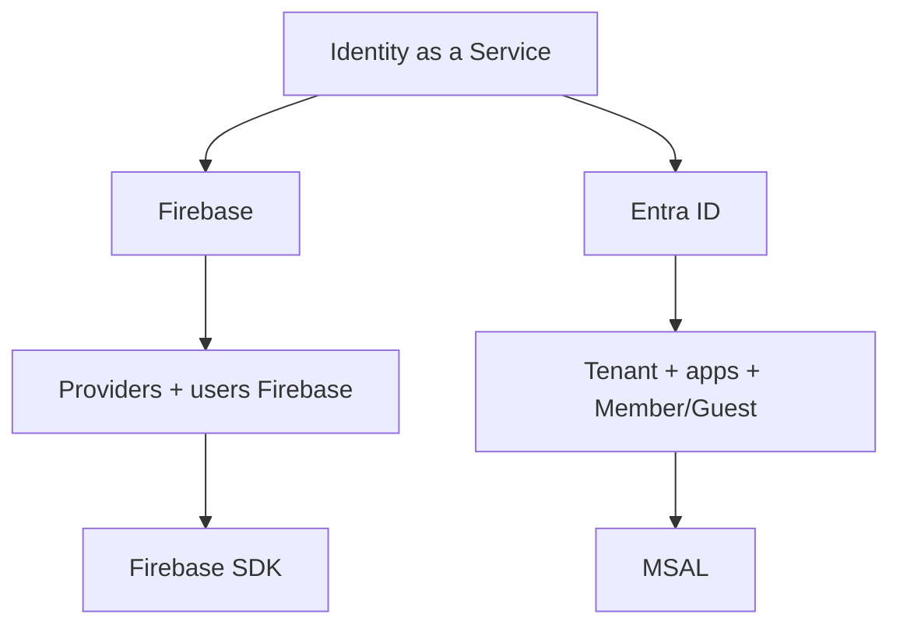

# Parte 9A · Prerrequisito Entra desde cero

Antes de ejecutar la integración MSAL de la Parte 9, completar la guía canónica de Microsoft Entra ID:

→ **[Microsoft Entra ID · guía completa por etapas](../../docs/identity/entra-guia-completa/README.md)**

## Por qué este paso existe

La Parte 9 supone que el entorno Entra está utilizable. Este prerequisito evita que errores administrativos se confundan con errores de JavaScript/MSAL.

Completar primero:

```text
Cuenta Duoc + Azure for Students
→ directorio/tenant correcto
→ permisos para App Registration
→ SPA single-tenant
→ API + scopes
→ usuarios Guest/B2B
→ recién después MSAL
```

## Gate antes de abrir `src/msal.js`

- [ ] Azure for Students visible y activo;
- [ ] Tenant ID conocido;
- [ ] directorio correcto seleccionado;
- [ ] App Registration SPA creada;
- [ ] redirect URI SPA definido;
- [ ] API registration y scope definidos si se probará backend;
- [ ] compañeros Guest invitados y aceptados;
- [ ] no existe client secret en frontend.

Solo después continuar con:

→ [Parte 9 · Microsoft Entra ID + MSAL](./09-microsoft-entra-msal.md)

## Comparación con Firebase

En Firebase el alumno crea/habilita usuarios y proveedores dentro del servicio Firebase. En Entra, antes del SDK existe una capa administrativa explícita de tenant, aplicaciones y pertenencia de usuarios.

Ese contraste es parte del aprendizaje:


