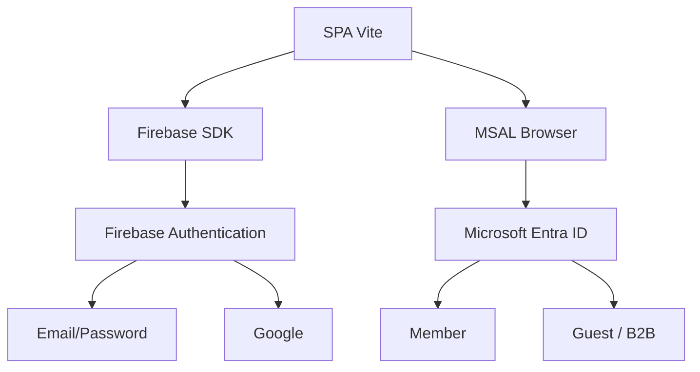
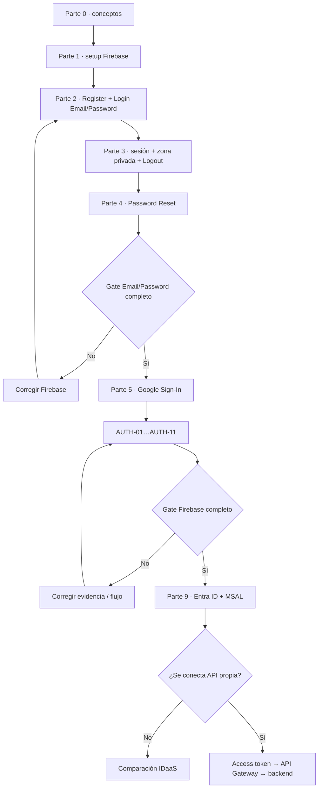
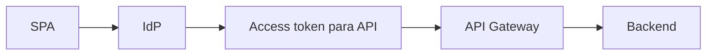
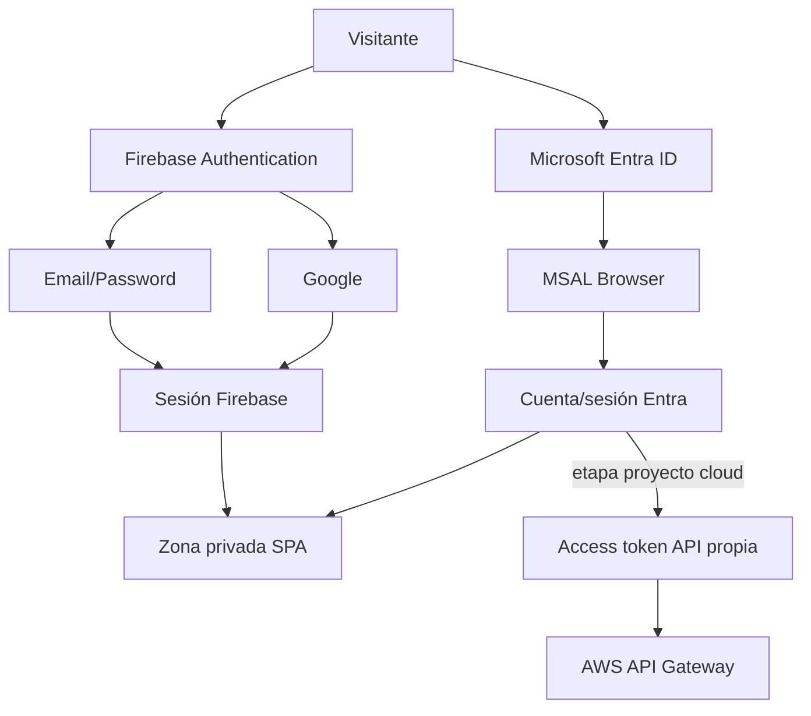

# Lab · Mini App con Firebase Authentication + extensión Entra/MSAL

**Asignatura:** DSY1107 Desarrollo Cloud Native I  
**Semana sugerida:** Semana 4 · Identity as a Service  
**Modalidad:** laboratorio guiado con proveedores cloud reales  
**Proveedor principal:** Firebase Authentication  
**Extensión comparativa:** Microsoft Entra ID + MSAL Browser  
**Frontend:** JavaScript + Vite

← [Volver al índice de laboratorios](../README.md)

---

## Propósito

Construir una mini aplicación web incremental con:

- zona pública;
- Register con Email/Password;
- Login con Email/Password;
- recuperación de contraseña;
- estado de sesión;
- zona privada;
- Logout;
- Google Sign-In como segunda etapa;
- Microsoft Entra ID mediante MSAL como tercera etapa comparativa;
- opcionalmente, adquisición de access token para una API propia protegida por API Gateway.

> **Regla principal:** primero debe funcionar completamente Email/Password. Google se habilita solo después de superar el gate Firebase. MSAL se incorpora únicamente cuando el flujo Firebase completo ya puede demostrarse.

## Qué significa agregar MSAL

MSAL **no convierte Microsoft Entra ID en un provider de Firebase** dentro de este ejercicio.

La SPA integra dos contextos de identidad diferentes:



Esto permite comparar la misma capacidad —**Identity as a Service**— implementada por dos proveedores y modelos distintos.

### Estándar de diagramación

Este laboratorio **consume**, sin redefinirlo, el estándar transversal `STD-ENG-DIAG-001 — Diagramming & Visual Representation Standard` de ADÜMÜN. Los diagramas técnicos se expresan en Mermaid cuando sea viable; PlantUML es fallback justificado y ASCII queda como último recurso.

---

# Ruta guiada

Este README es únicamente el **índice del laboratorio**. El contenido detallado vive en archivos independientes para poder extender cada etapa sin convertir la guía en un documento monolítico.

## 0 · Comprender antes de programar

→ [Conceptos y arquitectura](./00-conceptos-y-arquitectura.md)

Aprenderás:

- Identity as a Service;
- autenticación vs autorización;
- responsabilidades de Firebase y de la miniapp;
- por qué una zona privada visual no sustituye seguridad de backend.

## 1 · Preparar Vite y Firebase

→ [Preparación del proyecto y configuración de Firebase](./01-preparacion-y-firebase.md)

Incluye:

- prerrequisitos;
- creación Vite;
- instalación SDK;
- proyecto Firebase;
- Web App;
- `firebaseConfig`;
- `src/firebase.js`;
- habilitación inicial de Email/Password;
- errores habituales de configuración.

## 2 · Register + Login Email/Password

→ [Registro y login con Email/Password](./02-email-password.md)

Incluye:

- `createUserWithEmailAndPassword`;
- `signInWithEmailAndPassword`;
- `UserCredential`;
- pruebas;
- errores de credenciales;
- por qué no guardar passwords ni estado inventado de autenticación en `localStorage`.

## 3 · Sesión + zona privada + Logout

→ [Estado de sesión, zona privada y Logout](./03-sesion-zona-privada.md)

Incluye:

- `onAuthStateChanged`;
- restauración de sesión;
- zona pública vs privada;
- `signOut`;
- Firebase como fuente de verdad **del contexto Firebase**;
- frontera entre control visual y protección real de backend.

## 4 · Password Reset

→ [Recuperación de contraseña con Firebase](./04-recuperar-password.md)

Incluye:

- `sendPasswordResetEmail`;
- correo enviado por Firebase;
- pantalla estándar administrada por Firebase;
- cambio efectivo de contraseña;
- errores frecuentes;
- **gate obligatorio antes de Google**.

## 5 · Agregar Google

→ [Google Sign-In](./05-google-sign-in.md)

Incluye:

- habilitación del proveedor;
- `GoogleAuthProvider`;
- `signInWithPopup`;
- popup cancelado/bloqueado;
- convivencia con Email/Password;
- por qué no obtenemos/persistimos manualmente un ID token en esta etapa.

## 6 · Verificar que Firebase realmente funciona

→ [Pruebas, evidencias y criterio de término](./06-pruebas-y-evidencias.md)

Incluye:

- matriz `AUTH-01` a `AUTH-11`;
- evidencia mínima;
- preguntas de comprensión;
- criterio de término;
- autoevaluación.

## 7 · Cuando algo falla

→ [Troubleshooting y FAQ](./07-troubleshooting-faq.md)

Incluye:

- método de diagnóstico;
- códigos Firebase frecuentes;
- problemas de popup;
- problemas de sesión;
- recuperación;
- preguntas conceptuales;
- FAQ de entrega.

## 8 · Referencia de integración Firebase

→ [Ensamblaje final de la miniapp](./08-referencia-codigo-final.md)

Úsalo **después** de implementar las partes anteriores para comparar estructura e imports. Esta referencia cubre el core Firebase y no reemplaza el trabajo incremental.

## 9 · Tercera etapa: Microsoft Entra ID + MSAL

→ [Microsoft Entra ID + MSAL en la misma SPA](./09-microsoft-entra-msal.md)

Incluye paso a paso:

- App Registration single-tenant;
- `Application (client) ID` y `Directory (tenant) ID`;
- plataforma SPA;
- redirect URI dedicado `redirect.html`;
- instalación de `@azure/msal-browser`;
- `PublicClientApplication` e `initialize()`;
- Login/Logout Microsoft;
- cuenta activa MSAL;
- integración de la zona privada sin confundir Firebase con Entra;
- compañeros como usuarios externos Guest/B2B;
- diagnóstico de "al dueño le funciona pero al compañero no";
- access token para la API propia;
- scopes, issuer, audience y AWS API Gateway;
- matriz `MSAL-01…MSAL-12`.

Apoyo específico de usuarios externos:

→ [Entra ID · usuarios externos en SPA + API Gateway](../../docs/identity/entra-usuarios-externos-spa-api-gateway.md)

---

# Secuencia obligatoria



No se considera terminado el core Firebase si Google funciona pero alguno de los casos Email/Password quedó incompleto.

MSAL es una etapa posterior: **no debe utilizarse para evitar terminar Firebase**.

---

# Principios que no deben romperse

## 1. Cada SDK es fuente de verdad de su propio contexto

Firebase administra el estado Firebase mediante `onAuthStateChanged`.

MSAL administra cuentas/sesión Microsoft mediante `PublicClientApplication` y sus APIs de cuentas.

No inventar:

```javascript
localStorage.setItem("isLoggedIn", "true");
```

como fuente global de autenticación.

## 2. No persistir datos sensibles manualmente

Nunca guardar manualmente:

- passwords;
- ID tokens;
- access tokens;
- refresh tokens;
- claves privadas;
- service accounts;
- client secrets.

`localStorage` puede usarse únicamente para estado auxiliar no sensible si realizas una extensión opcional.

## 3. Password Reset usa Firebase estándar

La miniapp solicita el reset mediante `sendPasswordResetEmail` y el usuario cambia su contraseña utilizando la experiencia administrada por Firebase.

No se construye una pantalla custom de reset dentro del alcance obligatorio.

## 4. Una SPA es public client

Ni Firebase web config ni `clientId` / `tenantId` de Entra son secretos de backend.

Un `client_secret` **sí es secreto** y no debe existir dentro de una SPA.

## 5. Zona privada visual ≠ API protegida

Ocultar HTML según sesión sirve para estudiar estado autenticado en frontend. No constituye por sí solo seguridad del lado servidor.

Para el proyecto transversal, el salto posterior es:



## 6. ID token ≠ access token

Un ID token representa información de autenticación hacia el cliente.

La API propia debe recibir el **access token destinado a esa API**, con issuer, audience y scopes coherentes.

---

# Resultado esperado

Al completar las etapas correspondientes, el estudiante debe poder explicar y demostrar:



Y, especialmente, debe poder responder:

1. ¿Qué responsabilidad delega a cada IDaaS?
2. ¿Por qué Google dentro de Firebase y Microsoft vía MSAL no son exactamente el mismo tipo de integración?
3. ¿Qué significa single-tenant?
4. ¿Por qué un compañero puede necesitar ser Guest/B2B?
5. ¿Por qué MSAL usa Authorization Code + PKCE en una SPA?
6. ¿Por qué no existe un client secret en el frontend?
7. ¿Qué token debe llegar a una API propia?
8. ¿Qué deben validar API Gateway y/o el backend?

---

# ¿Por dónde empiezo?

Si recién comienzas:

→ **[Parte 0 · Conceptos y arquitectura](./00-conceptos-y-arquitectura.md)**

Si Firebase Email/Password + Google ya está completamente verde:

→ **[Parte 9 · Microsoft Entra ID + MSAL](./09-microsoft-entra-msal.md)**
