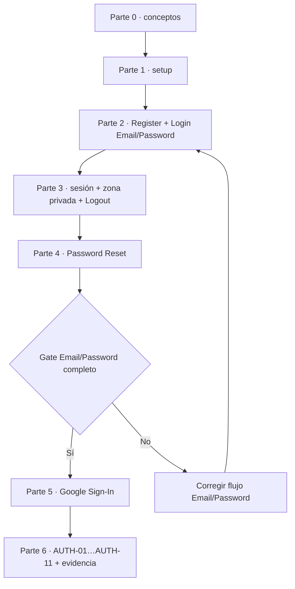
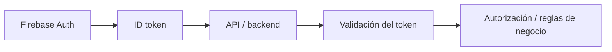
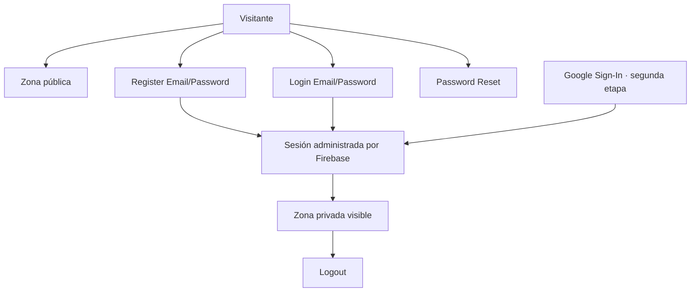

# Lab · Mini App con Firebase Authentication

**Asignatura:** DSY1107 Desarrollo Cloud Native I  
**Semana sugerida:** Semana 4 · Identity as a Service  
**Modalidad:** laboratorio guiado con proveedor cloud real  
**Proveedor:** Firebase Authentication  
**Frontend:** JavaScript + Vite

← [Volver al índice de laboratorios](../README.md)

---

## Propósito

Construir una mini aplicación web con:

- zona pública;
- Register con Email/Password;
- Login con Email/Password;
- recuperación de contraseña;
- estado de sesión;
- zona privada;
- Logout;
- Google Sign-In como segunda etapa.

> **Regla principal:** primero debe funcionar completamente Email/Password. Google se habilita solo después de superar el gate de la Parte 4.

### Estándar de diagramación

Este laboratorio **consume**, sin redefinirlo, el estándar transversal `STD-ENG-DIAG-001 — Diagramming & Visual Representation Standard` de ADÜMÜN. Los diagramas técnicos se expresan en Mermaid cuando sea viable; PlantUML es fallback justificado y ASCII queda como último recurso.

---

# Ruta guiada

Este README es únicamente el **índice del laboratorio**. El contenido detallado vive en archivos independientes para poder extender cada etapa sin convertir la guía en un documento monolítico.

## 0 · Comprender antes de programar

→ [Conceptos y arquitectura](./00-conceptos-y-arquitectura.md)

Aprenderás:

- Identity as a Service;
- autenticación vs autorización;
- responsabilidades de Firebase y de la miniapp;
- por qué Firebase Auth es la fuente de verdad;
- por qué este lab no necesita backend.

## 1 · Preparar Vite y Firebase

→ [Preparación del proyecto y configuración de Firebase](./01-preparacion-y-firebase.md)

Incluye:

- prerrequisitos;
- creación Vite;
- instalación SDK;
- proyecto Firebase;
- Web App;
- `firebaseConfig`;
- `src/firebase.js`;
- habilitación inicial de Email/Password;
- errores habituales de configuración.

## 2 · Register + Login Email/Password

→ [Registro y login con Email/Password](./02-email-password.md)

Incluye:

- `createUserWithEmailAndPassword`;
- `signInWithEmailAndPassword`;
- `UserCredential`;
- pruebas;
- errores de credenciales;
- por qué no guardar passwords ni estado de autenticación en `localStorage`.

## 3 · Sesión + zona privada + Logout

→ [Estado de sesión, zona privada y Logout](./03-sesion-zona-privada.md)

Incluye:

- `onAuthStateChanged`;
- restauración de sesión;
- zona pública vs privada;
- `signOut`;
- Firebase como única fuente de verdad;
- frontera entre control visual y protección real de backend.

## 4 · Password Reset

→ [Recuperación de contraseña con Firebase](./04-recuperar-password.md)

Incluye:

- `sendPasswordResetEmail`;
- correo enviado por Firebase;
- pantalla estándar administrada por Firebase;
- cambio efectivo de contraseña;
- errores frecuentes;
- **gate obligatorio antes de Google**.

## 5 · Agregar Google

→ [Google Sign-In](./05-google-sign-in.md)

Incluye:

- habilitación del proveedor;
- `GoogleAuthProvider`;
- `signInWithPopup`;
- popup cancelado/bloqueado;
- convivencia con Email/Password;
- por qué no obtenemos/persistimos manualmente un ID token en este lab.

## 6 · Verificar que realmente funciona

→ [Pruebas, evidencias y criterio de término](./06-pruebas-y-evidencias.md)

Incluye:

- matriz `AUTH-01` a `AUTH-11`;
- evidencia mínima;
- preguntas de comprensión;
- criterio de término;
- extensiones opcionales;
- autoevaluación.

## 7 · Cuando algo falla

→ [Troubleshooting y FAQ](./07-troubleshooting-faq.md)

Incluye:

- método de diagnóstico;
- códigos Firebase frecuentes;
- problemas de popup;
- problemas de sesión;
- recuperación;
- preguntas conceptuales;
- FAQ de entrega.

## 8 · Referencia de integración

→ [Ensamblaje final de la miniapp](./08-referencia-codigo-final.md)

Úsalo **después** de implementar las partes anteriores para comparar estructura e imports. No reemplaza el trabajo incremental.

---

# Secuencia obligatoria



No se considera terminado el laboratorio si Google funciona pero alguno de los casos Email/Password quedó incompleto.

---

# Principios que no deben romperse

## 1. Firebase es la fuente de verdad

No crear:

```javascript
localStorage.setItem("isLoggedIn", "true");
```

para representar autenticación.

## 2. No persistir datos sensibles manualmente

Nunca guardar:

- passwords;
- ID tokens;
- refresh tokens;
- claves privadas;
- service accounts.

`localStorage` puede usarse únicamente para estado auxiliar no sensible si realizas una extensión opcional.

## 3. Password Reset usa Firebase estándar

La miniapp solicita el reset mediante `sendPasswordResetEmail` y el usuario cambia su contraseña utilizando la experiencia administrada por Firebase.

No se construye una pantalla custom de reset dentro del alcance obligatorio.

## 4. No agregar backend artificial

Una aplicación productiva puede extenderse así:



Ese patrón es importante, pero queda fuera de esta miniapp porque el objetivo aquí es aislar y comprender Firebase Authentication como IDaaS.

## 5. Zona privada visual ≠ API protegida

Ocultar HTML según sesión sirve para estudiar estado autenticado en frontend. No constituye por sí solo seguridad del lado servidor.

---

# Resultado esperado

Al terminar debes ser capaz de explicar y demostrar:



---

# ¿Por dónde empiezo?

→ **[Parte 0 · Conceptos y arquitectura](./00-conceptos-y-arquitectura.md)**
