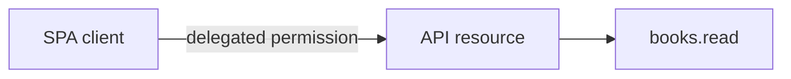
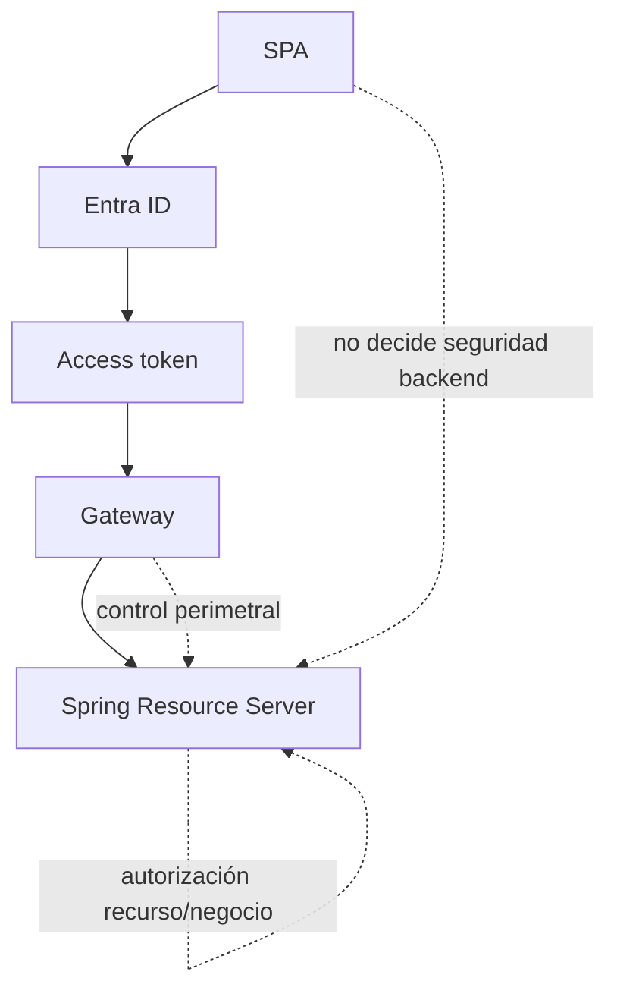

# 00 · Prerrequisitos y contrato de seguridad

## Objetivo

Entrar al laboratorio con un contrato técnico mínimo ya comprendido. Esta etapa evita configurar Gateway o Spring sobre una base de identidad todavía inconsistente.

## Prerrequisitos canónicos

Debes haber completado o poder defender las Etapas 0–7 de:

→ [Guía completa de Microsoft Entra ID](../../docs/identity/entra-guia-completa/README.md)

En particular:

- tenant/directorio correcto;
- App Registration de la SPA;
- App Registration de la API;
- scope expuesto por la API;
- Guest/B2B manual cuando corresponda;
- MSAL configurado;
- access token para la API propia;
- diagnóstico base de 401/403.

## Dos App Registrations

No uses una sola App Registration para simplificar artificialmente el escenario.



### App Registration 1 · SPA

Responsabilidad:

- representar al frontend;
- `clientId` público;
- plataforma SPA;
- redirect URI;
- Authorization Code + PKCE;
- **sin client secret**.

### App Registration 2 · API

Responsabilidad:

- representar el recurso protegido;
- exponer scope;
- recibir tokens cuyo `aud` corresponde al recurso esperado.

Scope del laboratorio:

```text
api://<api-client-id>/books.read
```

## Contrato de endpoints

```text
GET /public/health
público

GET /api/books
autenticado
scope requerido: books.read
```

## Contrato de claims

Para el laboratorio debes poder inspeccionar de forma sanitizada:

- `iss` — emisor esperado;
- `aud` — recurso/API esperado;
- `exp` — vigencia;
- `scp` — permisos delegados.

No publiques el JWT completo.

## Qué componente decide qué



## Gate P0

- [ ] tengo dos App Registrations separadas;
- [ ] la API expone `books.read`;
- [ ] la SPA tiene permiso para solicitar ese scope;
- [ ] sé distinguir ID token de access token;
- [ ] sé cuál debería ser el audience de mi API;
- [ ] no hay secrets en frontend;
- [ ] no estoy usando un token de Microsoft Graph para llamar mi API.

→ Continúa con [01 · SPA, MSAL y access token](./01-spa-msal-token-api.md).
