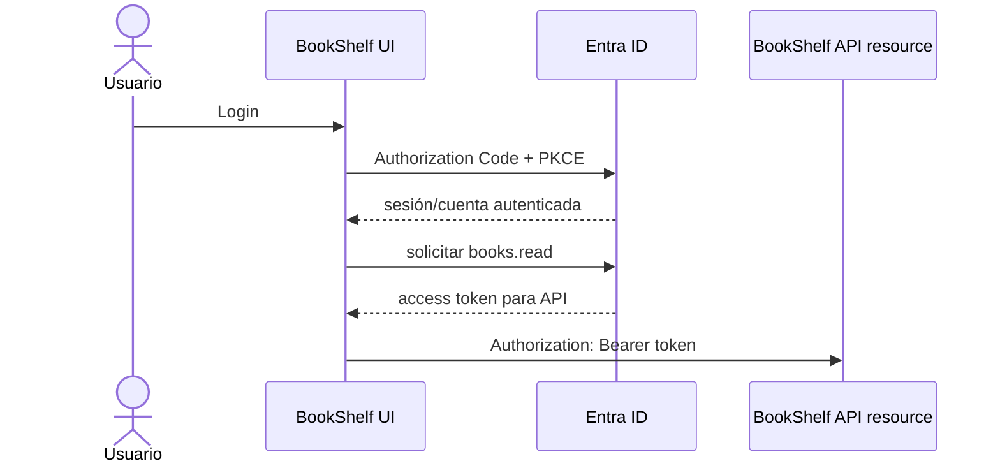
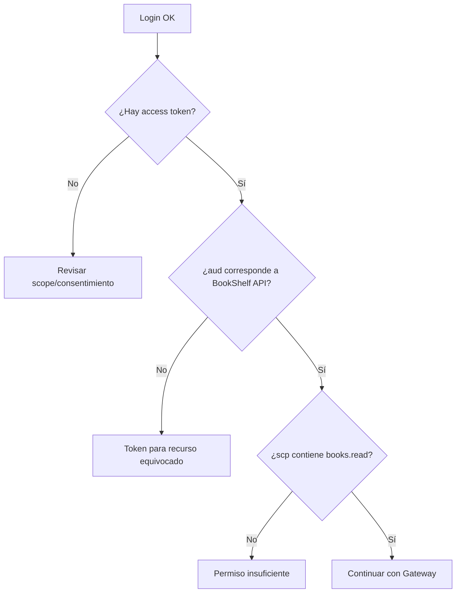

# 01 · SPA, MSAL y access token para la API propia

## Objetivo

Demostrar que la SPA autentica al usuario con MSAL y obtiene un **access token destinado a la API BookShelf**, no a Microsoft Graph ni a otro recurso.

## Configuración mínima

```javascript
const msalConfig = {
  auth: {
    clientId: "<spa-client-id>",
    authority: "https://login.microsoftonline.com/<tenant-id>",
    redirectUri: "http://localhost:5173"
  }
};
```

La SPA es un public client. No agregues `client_secret`.

## Scope de la API propia

```javascript
const tokenRequest = {
  scopes: ["api://<api-client-id>/books.read"]
};
```

No uses `User.Read` como sustituto. Ese scope corresponde a Microsoft Graph.

## Flujo



## Inspección segura

Decodifica el token únicamente para observar claims. No confundas decodificación con verificación.

Registra de forma sanitizada:

```text
iss = <issuer esperado>
aud = <audience API>
scp = books.read
exp = <vigencia observada>
```

No pegues el token completo en README, DevLog, screenshots públicos ni commits.

## Checks

### Caso 1 · login exitoso

El usuario aparece como cuenta activa en MSAL.

Eso solo demuestra autenticación del cliente.

### Caso 2 · token de API propia

El token solicitado debe corresponder a `books.read` y a la API resource.

### Caso 3 · token equivocado

Obtén conceptualmente un token para otro recurso y explica por qué no debería ser aceptado por BookShelf API.

## Error frecuente: login OK, API 401

No asumas que MSAL está roto.

Diagnóstico:



## Gate P1

- [ ] MSAL inicializado antes de usar APIs interactivas;
- [ ] login funciona;
- [ ] solicito `api://<api-client-id>/books.read`;
- [ ] puedo distinguir ID token de access token;
- [ ] puedo explicar `iss`, `aud`, `scp` y `exp`;
- [ ] no uso Microsoft Graph como audience de mi backend;
- [ ] no expongo tokens completos.

→ Continúa con [02 · API Gateway y JWT Authorizer](./02-api-gateway-jwt-authorizer.md).
