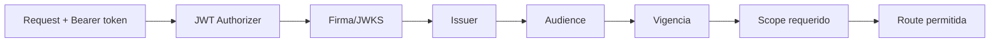
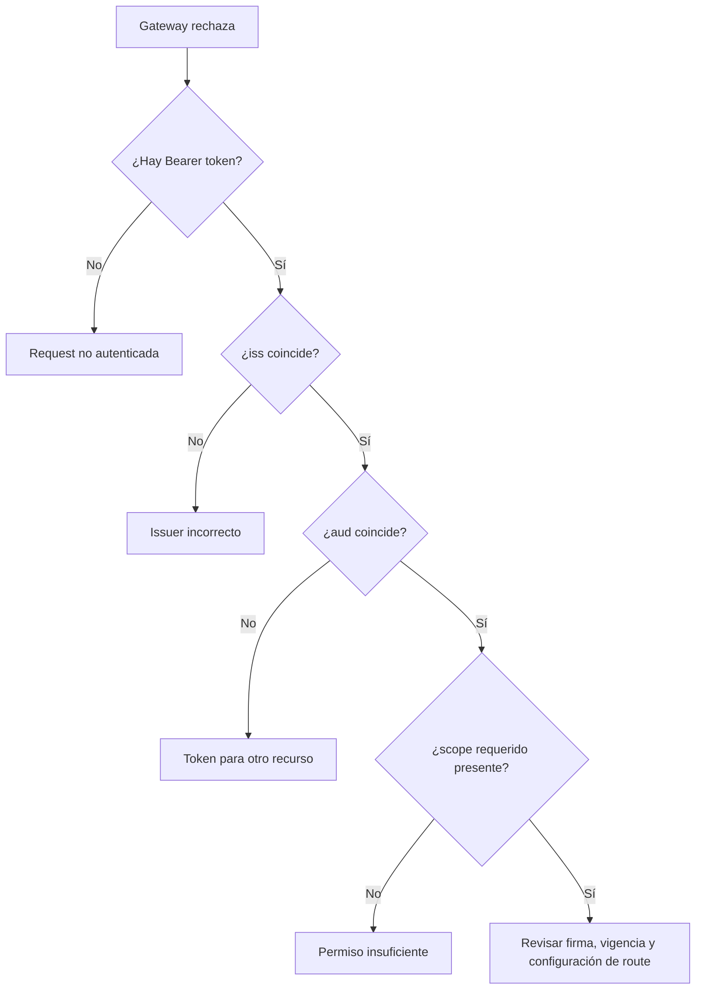

# 02 · API Gateway y JWT Authorizer

## Objetivo

Configurar conceptualmente el perímetro de la API para que AWS API Gateway rechace tokens que no correspondan al emisor, audience o scope esperados antes de enrutar al backend.

## Prerrequisito

Debes llegar con un access token válido para la API propia desde la Etapa 01.

## Configuración lógica del authorizer

Para un HTTP API con JWT Authorizer necesitas al menos:

```text
Issuer:
https://login.microsoftonline.com/<tenant-id>/v2.0

Audience:
<audience real del access token para BookShelf API>
```

No copies un audience por intuición. Verifica el claim `aud` del token real y alinéalo con la configuración de la API resource.

## Scope requerido por ruta

Para:

```text
GET /api/books
```

la política del laboratorio exige:

```text
books.read
```

Conceptualmente:



## Qué no debe hacer el Gateway

El Gateway no debe convertirse en el lugar donde vive toda la autorización de negocio.

Puede resolver controles comunes/perimetrales, pero el backend sigue teniendo responsabilidad sobre:

- autorización del recurso;
- reglas de negocio;
- ownership de datos;
- validaciones que no deben desaparecer si cambia el perímetro.

## Pruebas mínimas del authorizer

| Caso | Condición | Resultado esperado |
|---|---|---|
| GW-01 | sin token | rechazo |
| GW-02 | token malformado/inválido | rechazo |
| GW-03 | issuer incorrecto | rechazo |
| GW-04 | audience incorrecta | rechazo |
| GW-05 | token válido sin `books.read` | rechazo de autorización según configuración de ruta |
| GW-06 | token válido + `books.read` | request puede llegar al backend |

No memorices el status como único criterio. Registra **qué frontera rechazó la request**.

## Diagnóstico



## Evidencia

Conserva evidencia sanitizada de:

- issuer configurado;
- audience configurada;
- scope requerido por la ruta;
- al menos un rechazo por token/recurso incorrecto;
- un request autorizado que alcance el backend.

No publiques tokens completos ni credenciales AWS.

## Gate P2

- [ ] sé qué issuer espera el authorizer;
- [ ] audience coincide con el token real de la API;
- [ ] `/api/books` exige `books.read`;
- [ ] puedo explicar por qué un token válido para otro recurso se rechaza;
- [ ] entiendo que pasar el Gateway no implica autorización de negocio completa.

→ Continúa con [03 · Spring Security Resource Server](./03-spring-security-resource-server.md).
