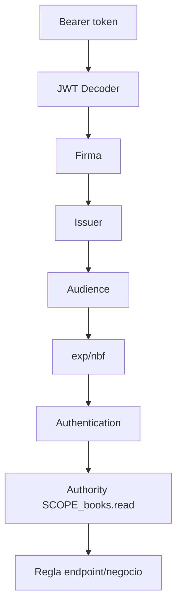
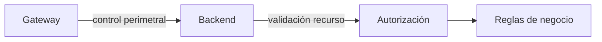

# 03 · Spring Security Resource Server

## Objetivo

Configurar el backend Spring Boot para validar access tokens como Resource Server y aplicar autorización por scope sin delegar toda la seguridad al Gateway.

## Dependencias conceptuales

Usa Spring Security OAuth2 Resource Server con JWT.

Configuración base:

```yaml
spring:
  security:
    oauth2:
      resourceserver:
        jwt:
          issuer-uri: https://login.microsoftonline.com/<tenant-id>/v2.0
```

`issuer-uri` permite descubrir metadata/JWKs y validar el emisor esperado, pero **no debe presentarse como sustituto de una validación explícita del audience de tu API**.

## Validar audience explícitamente

El backend debe comprobar que el token fue emitido para BookShelf API.

Ejemplo conceptual:

```java
@Bean
JwtDecoder jwtDecoder() {
    NimbusJwtDecoder decoder = JwtDecoders.fromIssuerLocation(issuer);

    OAuth2TokenValidator<Jwt> withIssuer = JwtValidators.createDefaultWithIssuer(issuer);
    OAuth2TokenValidator<Jwt> withAudience = jwt ->
        jwt.getAudience().contains(expectedAudience)
            ? OAuth2TokenValidatorResult.success()
            : OAuth2TokenValidatorResult.failure(
                new OAuth2Error("invalid_token", "Invalid audience", null));

    decoder.setJwtValidator(
        new DelegatingOAuth2TokenValidator<>(withIssuer, withAudience));

    return decoder;
}
```

Los nombres/beans pueden adaptarse al proyecto real; lo importante es que la validación contextual quede explícita.

## SecurityFilterChain

```java
@Bean
SecurityFilterChain security(HttpSecurity http) throws Exception {
    return http
        .authorizeHttpRequests(auth -> auth
            .requestMatchers("/public/**").permitAll()
            .requestMatchers("/api/books").hasAuthority("SCOPE_books.read")
            .anyRequest().authenticated())
        .oauth2ResourceServer(oauth -> oauth.jwt())
        .build();
}
```

## Qué valida el backend



## 401 vs 403

| Caso | Estado esperado |
|---|---:|
| sin token | 401 |
| token inválido/expirado | 401 |
| issuer incorrecto | 401 |
| audience incorrecta | 401 |
| token válido sin `books.read` | 403 |
| token válido con `books.read` | 2xx |

## Defensa en profundidad

Aunque Gateway ya haya validado el token, el backend conserva responsabilidades.



Ejemplo: `books.read` puede autorizar lectura del endpoint, pero una regla de negocio adicional puede decidir qué colección concreta puede ver el usuario.

## Errores frecuentes

- asumir que `issuer-uri` valida automáticamente toda audience esperada;
- desactivar Spring Security porque Gateway “ya protege”;
- mapear permisos sin haber validado antes el token;
- usar un claim controlado por frontend como fuente de autorización;
- registrar el JWT completo;
- tratar CORS como mecanismo de autenticación.

## Gate P3

- [ ] backend configurado como Resource Server;
- [ ] issuer esperado definido;
- [ ] audience de BookShelf API validada explícitamente;
- [ ] `/public/**` es público;
- [ ] `/api/books` exige `SCOPE_books.read`;
- [ ] puedo explicar 401 vs 403;
- [ ] backend no depende exclusivamente del Gateway.

→ Continúa con [04 · Pruebas, troubleshooting y evidencia](./04-pruebas-troubleshooting-evidencia.md).
