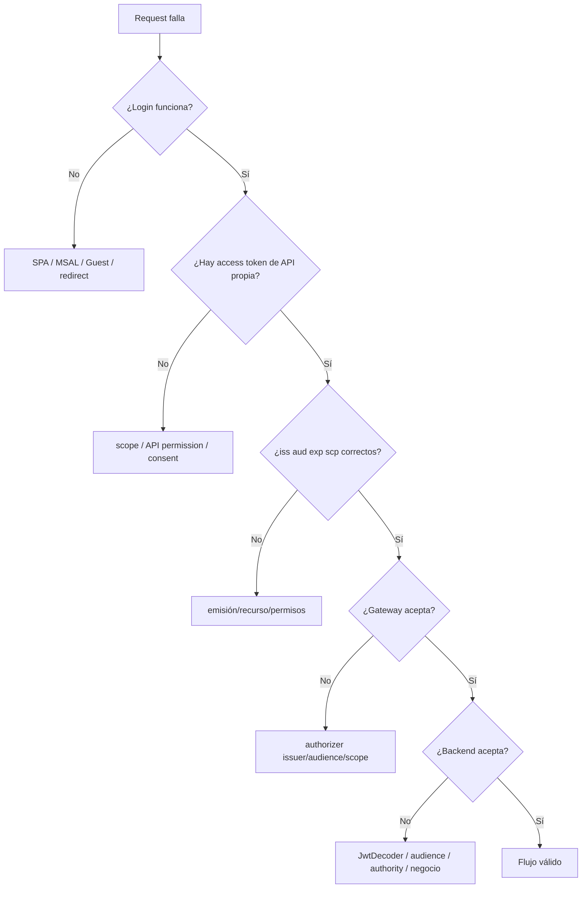

# 04 · Pruebas, troubleshooting y evidencia

## Objetivo

Demostrar el flujo completo por capas y diagnosticar fallos sin cambiar simultáneamente frontend, tenant, Gateway y backend.

## Matriz mínima

| ID | Escenario | Resultado esperado |
|---|---|---|
| FS-01 | `/public/health` sin token | 2xx |
| FS-02 | `/api/books` sin token | 401 |
| FS-03 | token malformado/expirado | 401 |
| FS-04 | token con issuer incorrecto | 401 |
| FS-05 | token válido para otro audience | 401 |
| FS-06 | token válido sin `books.read` | 403 |
| FS-07 | token válido + `books.read` | 2xx |
| FS-08 | login correcto pero token Graph | API rechaza |
| FS-09 | Gateway acepta y backend rechaza por regla propia | rechazo backend explicable |

## Orden de diagnóstico

## Diagnósticos frecuentes

### Login funciona pero API devuelve 401

Revisar primero:

1. ¿el token enviado es access token?
2. ¿fue solicitado para la API propia?
3. ¿`aud` corresponde a BookShelf API?
4. ¿issuer coincide con el tenant esperado?
5. ¿token está vigente?

### Gateway rechaza pero token “se ve bien”

Decodificar no verifica firma ni configuración del authorizer. Comparar configuración real de issuer, audience y route scope.

### Gateway acepta pero Spring responde 401

Revisar:

- `issuer-uri`;
- JWK/metadata;
- audience validator;
- vigencia;
- Bearer header realmente reenviado.

### Spring responde 403

La autenticación ya puede ser válida. Revisar:

- `scp`;
- mapping a `SCOPE_books.read`;
- matcher del endpoint;
- reglas adicionales de autorización.

## Evidencia mínima

La evidencia debe probar estados, no cada click.

Conserva:

1. diagrama Mermaid del flujo;
2. dos App Registrations identificadas por rol, sin exponer datos innecesarios;
3. scope de API propia;
4. claims sanitizados `iss`, `aud`, `exp`, `scp`;
5. configuración sanitizada del JWT Authorizer;
6. configuración Spring relevante;
7. evidencia FS-02, FS-05, FS-06 y FS-07;
8. al menos un troubleshooting real con síntoma → frontera → corrección → resultado;
9. DevLog.

## No publicar

- access token completo;
- refresh token;
- password;
- client secret;
- códigos OTP;
- cookies de sesión;
- credenciales AWS/Azure;
- claves/certificados privados.

## Gate P4

- [ ] ejecuté la matriz mínima;
- [ ] puedo distinguir rechazo de Gateway y rechazo de backend;
- [ ] puedo explicar 401 vs 403 por condición concreta;
- [ ] probé audience incorrecta;
- [ ] probé scope insuficiente;
- [ ] documenté al menos un fallo real y su corrección;
- [ ] evidencia sanitizada.

→ Continúa con [05 · Arquitectura segura y threat sketch](./05-arquitectura-threat-sketch.md).
