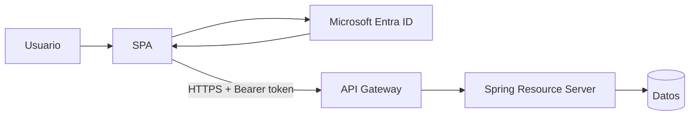
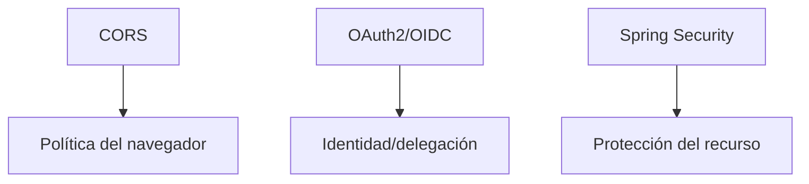
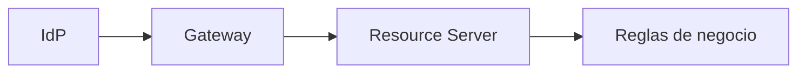

# 05 · Arquitectura segura y threat sketch

## Objetivo

Cerrar el laboratorio justificando responsabilidades y controles, no solo mostrando requests exitosos.

## Arquitectura final

## Responsabilidades

### SPA

- inicia Authorization Code + PKCE;
- solicita scopes mínimos;
- no almacena secretos;
- minimiza exposición de tokens.

### Entra ID

- autentica identidad;
- emite tokens;
- representa tenant, aplicaciones y permisos;
- publica metadata/JWKs.

### API Gateway

- entrada controlada;
- validación JWT temprana;
- issuer/audience/scope de route;
- routing;
- rate limiting y observabilidad técnica cuando corresponda.

### Spring Resource Server

- valida token/contexto nuevamente según su contrato;
- valida audience del recurso;
- mapea scopes/authorities;
- aplica autorización de endpoint y negocio.

## Threat sketch

| Riesgo | Control principal | No resuelve por sí solo |
|---|---|---|
| interceptación de authorization code | PKCE + HTTPS | XSS en SPA |
| secret expuesto en navegador | public client sin secret | robo de sesión/token |
| token para otra API | validación de audience | permisos excesivos dentro de la API |
| token de otro issuer/tenant | validación de issuer | autorización de negocio |
| token expirado | validación temporal | revocación instantánea en todos los casos |
| scopes excesivos | mínimo privilegio | ownership de recursos |
| bypass del Gateway | backend valida/autorización propia | exposición de infraestructura mal configurada |
| token en logs | logging sanitizado | fuga por otros canales |
| CORS permisivo | orígenes mínimos | clientes no-browser |

## CORS no es autenticación

No uses CORS como explicación para un 401/403 de autenticación/autorización.

## Defensa en profundidad

Cada capa reduce riesgo dentro de su frontera. Ninguna debe usarse como excusa para eliminar las demás.

## Criterio de término

El laboratorio queda aprobado cuando el estudiante puede:

1. dibujar el circuito completo;
2. explicar las dos App Registrations;
3. identificar el audience esperado;
4. explicar el scope requerido;
5. demostrar 401, 403 y 2xx;
6. identificar si rechazó Gateway o backend;
7. justificar al menos cinco controles del threat sketch;
8. mostrar evidencia sanitizada y DevLog reproducible.

## Transferencia

Con el laboratorio cerrado, recién corresponde transferir el patrón al proyecto formativo.

→ [RegistrApp · Semana 4](../../proyecto-formativo/semana-04/README.md)

← [Volver al índice del laboratorio](./README.md).
