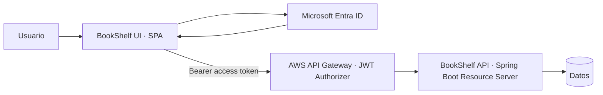
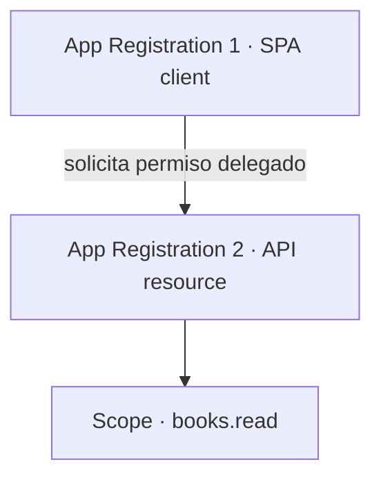
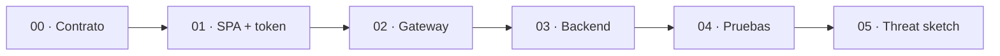
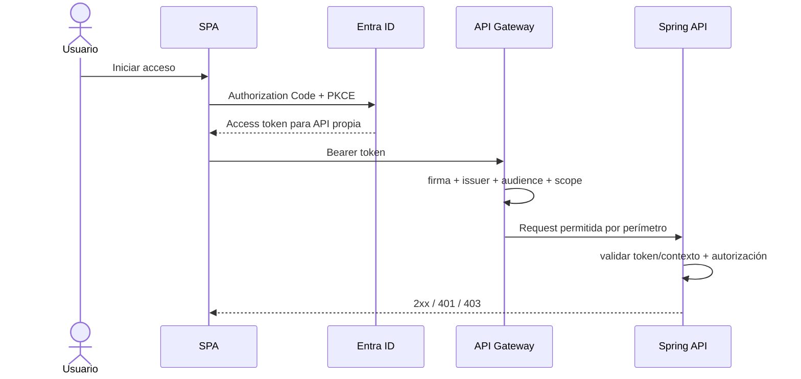

# Laboratorio · Flujo Full Stack protegido

**Semana:** 4  
**Foco:** Microsoft Entra ID + MSAL + API Gateway/JWT Authorizer + Spring Security Resource Server

← [Volver al índice de laboratorios](../README.md)

## Propósito

Aplicar de extremo a extremo el modelo de identidad ya estudiado sin crear una segunda fuente de verdad sobre Microsoft Entra ID.

La configuración canónica de tenant, App Registrations, Guest/B2B, MSAL, scopes, tokens y API Gateway vive en:

→ [Dominio Identity & Access](../../docs/identity/README.md)  
→ [Guía completa de Microsoft Entra ID](../../docs/identity/entra-guia-completa/README.md)

Este laboratorio **consume** ese conocimiento y lo convierte en una práctica Full Stack reproducible.

## Arquitectura objetivo

## Contrato de aplicaciones

Se utilizan dos App Registrations distintas:

- **SPA client:** identifica al frontend público; no contiene `client_secret`.
- **API resource:** representa el recurso protegido y expone el scope `books.read`.
- La SPA solicita un **access token para la API propia**, no un token para Microsoft Graph.

## Ruta del laboratorio

1. [00 · Prerrequisitos y contrato de seguridad](./00-prerrequisitos-y-contrato.md)
2. [01 · SPA, MSAL y access token para la API propia](./01-spa-msal-token-api.md)
3. [02 · API Gateway y JWT Authorizer](./02-api-gateway-jwt-authorizer.md)
4. [03 · Spring Security Resource Server](./03-spring-security-resource-server.md)
5. [04 · Pruebas, troubleshooting y evidencia](./04-pruebas-troubleshooting-evidencia.md)
6. [05 · Arquitectura segura y threat sketch](./05-arquitectura-threat-sketch.md)

## Gate de entrada

No comenzar configurando Spring o Gateway si todavía no puedes demostrar:

- tenant correcto;
- App Registration SPA;
- App Registration API;
- scope de API propia;
- Guest/B2B manual cuando corresponde;
- login mediante MSAL;
- access token destinado a la API propia.

Si falta alguno, vuelve a la [Parte I de la guía Identity, Etapas 0–7](../../docs/identity/entra-guia-completa/README.md).

## Resultado esperado

Al terminar debes poder explicar y demostrar:

- Authorization Code + PKCE en una SPA;
- por qué no existe `client_secret` en frontend;
- diferencia entre ID token y access token;
- diferencia entre **SPA client** y **API resource**;
- qué significan `iss`, `aud`, `exp` y `scp`;
- qué valida el JWT Authorizer;
- qué sigue validando/autorizando Spring Security;
- por qué una request produce 401, 403 o 2xx;
- cómo diagnosticar el flujo por fronteras sin cambiar cinco capas al mismo tiempo.

## Regla principal

> Login correcto no implica API autorizada.

El recorrido que debe quedar demostrado es:

## Transferencia posterior

Este laboratorio es independiente de RegistrApp. Solo cuando el patrón pueda explicarse y probarse se transfiere al proyecto formativo.

→ [RegistrApp · Semana 4](../../proyecto-formativo/semana-04/README.md)
