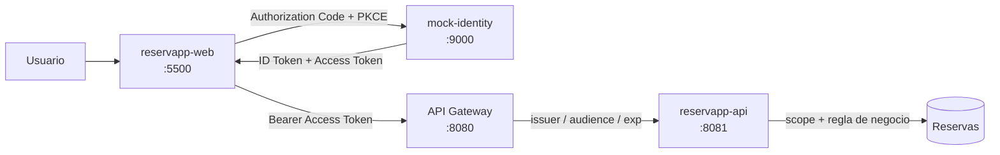
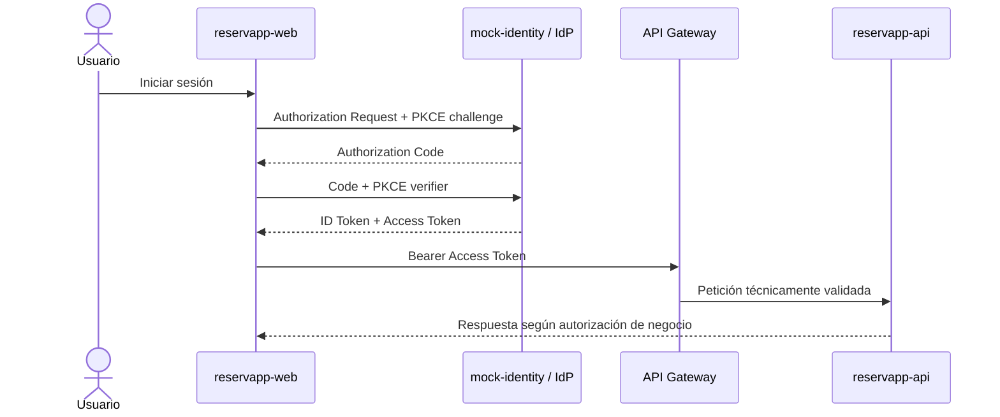
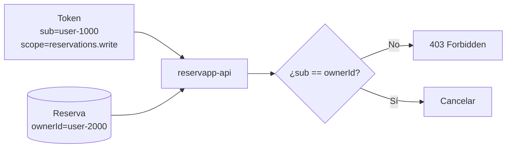
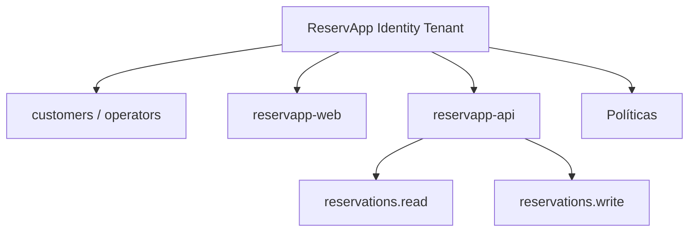

# Laboratorio · ReservApp · Identidad, autorización e IDaaS

**Duración sugerida:** 60–90 minutos, divisible entre bloques de la semana.  
**Modalidad:** grupos de máximo 3 integrantes.  
**Prerequisito:** comprender el laboratorio de API Gateway de Semana 01.

Este laboratorio integra **1.2.1 a 1.2.4** sobre una aplicación real de laboratorio. No se queda solo en diagramas: deben **levantar ReservApp, ejecutar el flujo, provocar errores y explicar qué componente toma cada decisión**.

> ReservApp es el dominio formativo transversal de DSY1107. No corresponde al dominio de las evaluaciones sumativas.

> El `mock-identity` es un **simulador didáctico**, no un proveedor OAuth2/OIDC real. Sus tokens no son JWT reales y su código no debe reutilizarse como seguridad de producción.

---

## 1. Starter ejecutable

Usen la aplicación incluida en:

[`starter/`](./starter/README.md)

La arquitectura es:



Antes de avanzar, cada integrante debe poder identificar:

- Resource Owner;
- Client;
- Authorization Server / IdP;
- Resource Server;
- API Gateway.

---

# Etapa A · Levantar y reconocer la aplicación

Sigan las instrucciones de [`starter/README.md`](./starter/README.md) y levanten:

1. `mock-identity` en `9000`;
2. `reservapp-api` en `8081`;
3. `gateway` en `8080`;
4. `client` en `5500`.

No modifiquen código todavía.

## Evidencia

En el README del grupo registren:

- los cuatro componentes levantados;
- qué rol conceptual cumple cada uno;
- una captura o salida que demuestre que ReservApp está operativa.

---

# Etapa B · “Continuar con Google” vs “Conectar Google Drive”

Antes de probar ReservApp, relacionen el laboratorio con algo cotidiano.

### Caso 1 · Continuar con Google

Una aplicación permite reconocer al usuario usando su identidad Google.

Preguntas:

1. ¿La aplicación recibe la contraseña de Google?
2. ¿Qué problema principal estamos resolviendo?
3. ¿Qué papel cumple Google?
4. ¿Cómo se relaciona este caso con OIDC?

### Caso 2 · Conectar Google Drive

El usuario ya inició sesión, pero ahora una aplicación desea abrir o guardar archivos en Drive.

Preguntas:

1. ¿El login anterior entrega automáticamente acceso al Drive?
2. ¿Qué recurso protegido aparece ahora?
3. ¿Por qué hace falta autorización adicional?
4. ¿Cómo se relaciona este caso con OAuth2?

Conclusión esperada:

```text
reconocer quién eres ≠ obtener permiso para usar otro recurso
```

---

# Etapa C · Ejecutar Authorization Code + PKCE

En `reservapp-web` mantengan inicialmente:

```text
client_id    = reservapp-web
redirect_uri = http://localhost:5500/index.html
audience     = reservapp-api
scope        = reservations.read
```

Pulsen **Ejecutar flujo PKCE y obtener tokens**.

Observen la traza y ubiquen:

1. `code_verifier`;
2. `code_challenge`;
3. Authorization Request;
4. `client_id`;
5. `redirect_uri`;
6. Authorization Code;
7. intercambio Code + verifier;
8. ID Token;
9. Access Token.

Luego dibujen el flujo que realmente observaron:



## Preguntas

- ¿Por qué `Client ID` no es una contraseña?
- ¿Por qué la redirect URI debe estar registrada?
- ¿Qué intenta proteger PKCE?
- ¿Por qué una SPA se considera cliente público?
- ¿Por qué no colocaríamos un client secret en JavaScript frontend?

---

# Etapa D · Access Token vs ID Token

Después del login observen ambos tokens decodificados.

Identifiquen en el **Access Token didáctico**:

```text
sub
iss
aud
scope
role
exp
```

Luego pulsen:

**Usar ID token como access token**

y ejecuten:

```text
GET /api/reservations
```

Registren:

- status HTTP;
- componente que rechaza la petición;
- motivo;
- diferencia de propósito entre ambos tokens.

Deben poder explicar:

```text
ID Token     → informa al Client quién se autenticó
Access Token → se presenta ante el recurso protegido
```

---

# Etapa E · Scopes y mínimo privilegio

## Prueba E1 · Solo lectura

Autentíquense como **Ana** con:

```text
reservations.read
```

Ejecuten:

```text
GET /api/reservations
```

Luego intenten:

```text
DELETE /api/reservations/R-101
```

Respondan:

- ¿por qué una operación funciona y la otra no?;
- ¿qué scope falta?;
- ¿por qué no conviene pedir `reservations.write` si solo necesitamos consultar?

## Prueba E2 · Lectura y escritura

Repitan el login agregando:

```text
reservations.write
```

Intenten cancelar `R-101`.

Registren el resultado.

---

# Etapa F · 401: fallos de autenticación/validación técnica

Ejecuten cada escenario por separado.

## F1 · Sin token

Pulsen **Quitar token** y consulten reservas.

## F2 · Audience incorrecta

Antes del login cambien:

```text
reservapp-api
```

por:

```text
otra-api
```

## F3 · ID token enviado a la API

Obtengan tokens válidos y luego usen el ID token como Bearer token.

Para cada caso indiquen:

```text
status HTTP
componente que rechaza
qué validación falló
por qué no corresponde continuar al backend
```

Relacionen la prueba con:

- issuer;
- audience;
- tipo de token;
- expiración.

> El simulador no incluye un botón para adelantar el reloj. Expliquen qué ocurriría cuando `exp` quede en el pasado.

---

# Etapa G · 403 por autorización técnica

Autentíquense como **Ana** solo con:

```text
reservations.read
```

e intenten cancelar una reserva.

El token es válido, pero no posee la capacidad requerida.

Respondan:

- ¿por qué esto no es igual al caso “sin token”?;
- ¿qué diferencia conceptual existe entre 401 y 403?;
- ¿qué componente toma la decisión por scope en esta implementación?

---

# Etapa H · 403 por autorización de negocio

Autentíquense como **Ana** con:

```text
reservations.read reservations.write
```

Intenten cancelar:

```text
R-202
```

Esa reserva pertenece a Bruno.

Luego cancelen:

```text
R-101
```

Respondan:

1. ¿por qué el scope `reservations.write` no basta para cancelar cualquier reserva?;
2. ¿qué dato del token identifica al sujeto?;
3. ¿qué dato del dominio debe compararse con ese sujeto?;
4. ¿por qué esta validación pertenece al backend y no solamente al Gateway?

Dibujen la decisión:



---

# Etapa I · Roles: customer vs operator

Repitan la prueba anterior como **Operador**, con lectura y escritura.

Comparen el resultado.

Expliquen:

- qué representa `role=operator`;
- por qué un role no es lo mismo que un scope;
- qué ocurriría si un operador tuviera role correcto pero no `reservations.write`.

---

# Etapa J · Tenant, IDaaS y CIAM sobre la app que está corriendo

Ahora mapeen el sistema ejecutado a los conceptos de las guías.

Creen `tenant-design.md` con:



Respondan:

- ¿qué está simulando `mock-identity`?;
- ¿qué capacidades reales esperaremos de un IDaaS?;
- ¿por qué ReservApp corresponde a un escenario cercano a CIAM para clientes externos?;
- ¿un usuario del IdP debe ser exactamente la misma entidad que `Cliente` en la base de datos de ReservApp?;
- ¿qué significa que el tenant sea una frontera de confianza?

---

# Etapa K · App registration

Creen `app-registration-design.md` usando lo observado en el starter.

## `reservapp-web`

```text
Rol: Client
Tipo: público
Client ID: reservapp-web
Redirect URI: http://localhost:5500/index.html
Flujo: Authorization Code + PKCE
Scopes: reservations.read / reservations.write
Client secret: no
```

## `reservapp-api`

```text
Rol: Resource Server
Issuer esperado: https://identity.reservapp.local
Audience esperada: reservapp-api
Scopes: reservations.read / reservations.write
```

### Pruebas obligatorias

1. Cambien `client_id` a un valor no registrado y ejecuten login.
2. Restáurenlo.
3. Cambien `redirect_uri` y ejecuten login.
4. Restáurenla.

Para cada prueba indiquen **en qué momento falla el flujo**. No intenten convertir estos errores artificialmente en 401/403 de la API: ocurren antes de llamar a `reservapp-api`.

---

# Etapa L · Arquitectura final

Construyan un Mermaid final que reúna lo ejecutado durante la semana:

- usuario;
- `reservapp-web`;
- tenant / IdP / IDaaS;
- Authorization Code + PKCE;
- ID Token;
- Access Token;
- `client_id`;
- redirect URI;
- issuer;
- audience;
- scopes;
- role;
- API Gateway;
- `reservapp-api`;
- datos de negocio;
- validación técnica;
- autorización por scope;
- autorización de negocio.

El diagrama debe permitir explicar de extremo a extremo una petición real que ustedes hayan ejecutado.

---

# Entrega mínima

El repositorio grupal debe contener:

```text
README.md
tenant-design.md
app-registration-design.md
```

El `README.md` debe incluir:

- instrucciones de ejecución;
- evidencia del starter funcionando;
- resultados de las pruebas C–I;
- matriz de errores;
- explicación 401 vs 403;
- Access Token vs ID Token;
- OAuth2 vs OIDC;
- IAM / IDaaS / CIAM;
- Mermaid de secuencia;
- Mermaid de arquitectura final;
- qué cambiará al reemplazar `mock-identity` por un proveedor real.

---

# Matriz mínima de pruebas

| Prueba | Resultado esperado |
|---|---|
| Client ID no registrado | flujo de autorización rechazado |
| Redirect URI no registrada | flujo de autorización rechazado |
| Access Token válido + `read` | lectura permitida |
| Sin token | 401 |
| ID Token usado como Bearer | 401 |
| Audience incorrecta | 401 |
| Sin `reservations.write` | 403 |
| Customer cancela reserva ajena | 403 |
| Customer cancela reserva propia con scope | permitido |
| Operator con scope cancela reserva ajena | permitido |

---

# Defensa técnica

Cada integrante debe poder explicar, mostrando la aplicación funcionando:

1. OAuth2 vs OIDC;
2. Access Token vs ID Token;
3. Client ID vs identidad del usuario;
4. redirect URI;
5. PKCE;
6. issuer;
7. audience;
8. scopes vs roles;
9. 401 vs 403;
10. Gateway vs backend;
11. IDaaS y CIAM;
12. por qué el simulador local se reemplazará después por un proveedor real.

No se requiere PPT.

---

# Checkpoint para la próxima experiencia

No desechen la aplicación ni los documentos.

ReservApp queda con:

```text
API Gateway + versionado + CORS
            ↓
Authorization Code + PKCE
            ↓
modelo de identidad
            ↓
Access / ID Token
            ↓
issuer / audience / scopes / roles
            ↓
Gateway + autorización de negocio
```

En las experiencias siguientes reemplazaremos progresivamente las piezas simuladas por infraestructura real sin cambiar el dominio ni recomenzar desde cero.
