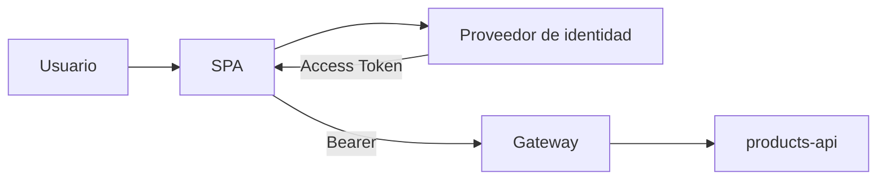

# Etapa 0 · Contexto y contrato de análisis

## Objetivo

Aislar autenticación, validación de credenciales y autorización utilizando una API ficticia `products-api`, sin depender de un proveedor cloud real.

## Escenario

Una SPA consulta y modifica productos. El proveedor de identidad emite Access Tokens para `products-api`.

Scopes:

```text
products.read
products.write
```

Pipeline:



## Tres preguntas distintas

1. **Autenticación:** ¿existe una identidad/credencial aceptable?
2. **Validación técnica:** ¿firma, issuer, audience y tiempo son aceptables para este recurso?
3. **Autorización:** ¿los permisos y reglas permiten esta operación?

## Contrato HTTP de laboratorio

| Operación | Requisito |
|---|---|
| `GET /products` | `products.read` |
| `POST /products` | `products.write` |
| `DELETE /products/{id}` | `products.write` + regla de negocio |

## Checkpoint 0

El estudiante puede explicar por qué “usuario autenticado” no significa “puede ejecutar cualquier endpoint”.
