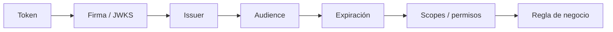

# Etapa 4 · Decodificar no es verificar

## Objetivo

Demostrar que un payload legible puede ser falso o estar alterado.

## Experimento

1. toma un JWT **sintético** de laboratorio;
2. separa sus tres segmentos;
3. decodifica el payload;
4. modifica localmente el JSON;
5. vuelve a codificar ese segmento sin recalcular una firma válida;
6. observa que el nuevo payload sigue siendo legible.

Resultado conceptual:

```text
payload legible
≠ firma válida
≠ token aceptable
≠ operación autorizada
```

## Pipeline de validación



## Conceptos

- **decode:** transformar Base64URL y leer estructura;
- **verify:** comprobar integridad/firma y condiciones técnicas;
- **authenticate:** aceptar la credencial como identidad válida en el recurso;
- **authorize:** decidir si esa identidad puede realizar la acción.

## Seguridad

No usar tokens reales reutilizables para ejercicios públicos ni pegarlos en repositorios. Preferir payloads sintéticos o tokens expirados de sandbox.

## Checkpoint 4

El estudiante puede explicar por qué una web que “muestra los claims” no sustituye la validación realizada por Gateway o Resource Server.
