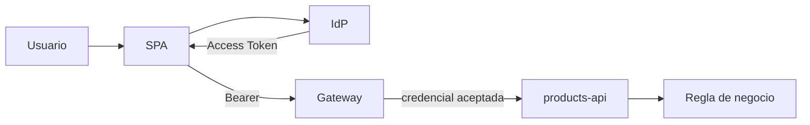

# Etapa 5 · Arquitectura, evidencia y cierre

## Objetivo

Consolidar el análisis en una arquitectura defendible y una evidencia que otro estudiante pueda reproducir.

## Diagrama mínimo

El diagrama debe incluir:
- usuario;
- cliente;
- proveedor de identidad;
- emisión de Access Token;
- gateway;
- backend;
- issuer;
- audience;
- scopes;
- una regla de negocio que permanezca en backend.

Ejemplo de frontera:

## Evidencia final

Crear una tabla con al menos cuatro credenciales/casos analizados:

| Caso | `iss` | `aud` | vigencia | scope | HTTP esperado |
|---|---|---|---|---|---|
| válido lectura | | | | | |
| audience incorrecta | | | | | |
| expirado | | | | | |
| sin scope write | | | | | |

Agregar:
- matriz 401/403/2xx;
- diagrama;
- explicación `decode ≠ verify ≠ authorize`;
- DevLog con una decisión y una duda resuelta.

## Preguntas de salida

1. ¿Por qué `aud` importa incluso con firma válida?
2. ¿Qué relación existe entre `kid` y JWKS?
3. ¿Dónde debería vivir ownership?
4. ¿Por qué el Gateway no reemplaza todas las reglas del backend?

## Transferencia

Solo después de cerrar este lab se transfiere el patrón a [RegistrApp · Semana 03](../../proyecto-formativo/semana-03/).

## Definition of Done

- [ ] claims interpretados;
- [ ] casos inválidos diagnosticados;
- [ ] matriz HTTP completa;
- [ ] decode/verify diferenciados;
- [ ] arquitectura documentada;
- [ ] evidencia reproducible.
