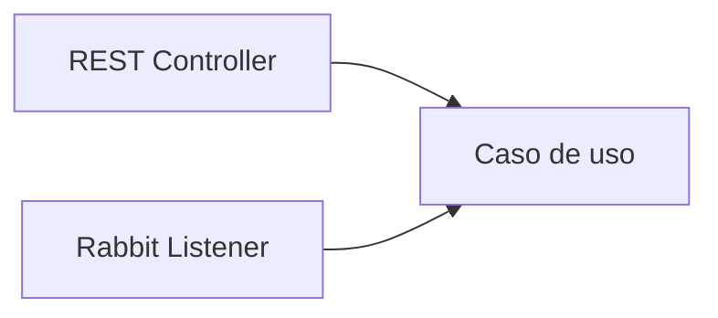

# Etapa 5 · Separación de responsabilidades

## Meta

Evitar que RabbitMQ se convierta en la arquitectura completa de la aplicación.

Estructura sugerida:

```text
config/
  RabbitMQConfig
messaging/
  PedidoPublisher
  PedidoCreadoListener
application/
  ProcesarPedidoUseCase
web/
  PedidoController
```

## Regla

El listener transforma el mensaje en una llamada a una capacidad.



## Checkpoint

El caso de uso debe poder probarse sin necesitar que el código de negocio “sepa” qué es RabbitMQ.
