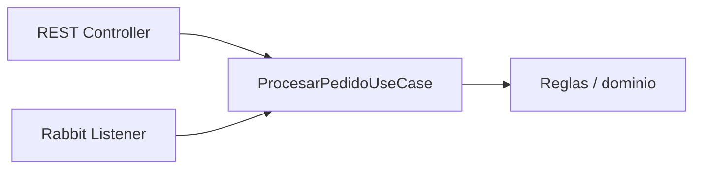

# Etapa 5 · Separación de responsabilidades

## Objetivo

Evitar que RabbitMQ se convierta en la lógica de negocio de la aplicación.

## Estructura recomendada

```text
config/
  RabbitMQConfig
messaging/
  PedidoPublisher
  PedidoCreadoListener
application/
  ProcesarPedidoUseCase
web/
  PedidoController
```

## Regla central

El Controller y el Listener son **adaptadores de entrada**. Ambos pueden activar una misma capacidad de aplicación.



## Ejemplo de caso de uso

```java
public interface ProcesarPedidoUseCase {
    void procesar(ProcesarPedidoCommand command);
}
```

El controller traduce HTTP → command. El listener traduce mensaje → command. Ninguno debe copiar la regla central.

## Anti-patrón

```text
@RabbitListener
  ├─ valida reglas de negocio
  ├─ calcula totales
  ├─ guarda directamente
  └─ envía respuestas
```

Si el listener concentra todo eso, la capacidad queda atada al transporte.

## Checkpoint 5

- [ ] `RabbitMQConfig` solo configura infraestructura;
- [ ] publisher conoce exchange/routing;
- [ ] listener adapta el mensaje;
- [ ] caso de uso no depende de RabbitMQ;
- [ ] la capacidad podría invocarse desde REST o un test directo.
