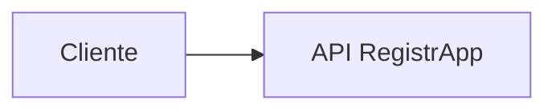

# 02 · Arquitectura inicial y decisiones

## Arquitectura mínima

No se agregan componentes futuros solo para “verse cloud”.

## Decisiones mínimas

Registrar:

- responsabilidad del cliente;
- responsabilidad de la API;
- datos de entrada/salida;
- errores HTTP relevantes;
- deuda técnica conocida.

## Evidencia

El README del proyecto debe contener el diagrama y una sección **Decisiones** que explique al menos una elección realizada por el grupo.
