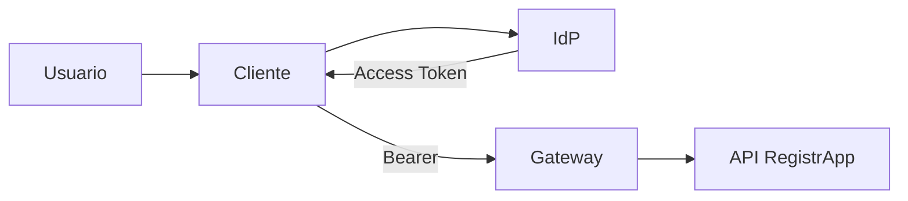

# 01 · Contrato de seguridad de RegistrApp

## Objetivo

Transferir JWT/claims como **contrato verificable**, no como decoración arquitectónica.

## Definir

- issuer esperado;
- audience de la API;
- scopes;
- expiración;
- responsabilidades de IdP, Gateway y backend.

## Diagrama

## Checkpoint

El grupo explica por qué leer el payload no equivale a validar el token.
