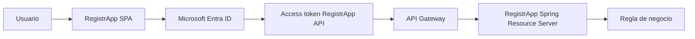
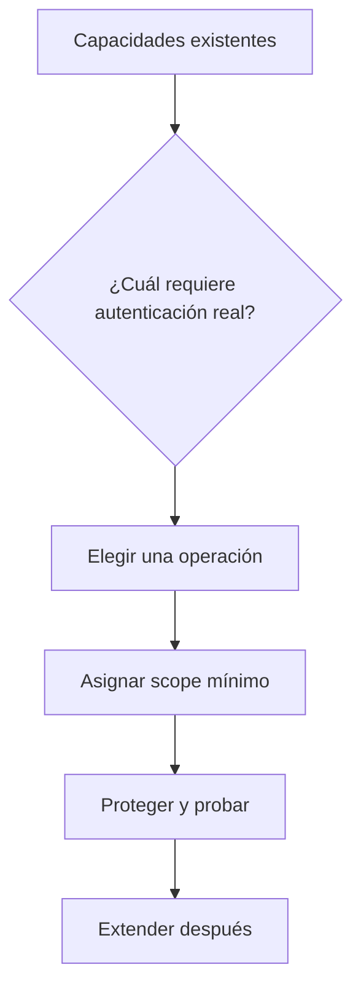

# RegistrApp · mapeo de transferencia Full Stack

## Objetivo

Traducir el patrón validado en [`labs/fullstack-seguro/`](../../labs/fullstack-seguro/README.md) a los componentes reales de RegistrApp, sin copiar el laboratorio literalmente.

## Mapeo de componentes

| Patrón aprendido | RegistrApp |
|---|---|
| SPA client | frontend de RegistrApp |
| API resource | backend/API de RegistrApp |
| scope `books.read` del lab | scope mínimo equivalente de RegistrApp |
| API Gateway | gateway/API Manager utilizado por el proyecto |
| Spring Resource Server | backend Spring Boot protegido |
| Member/Guest | integrantes/usuarios autorizados del tenant |



## Contrato mínimo de identidad

Antes de implementar, completar un registro sanitizado con:

```text
TENANT_ID=<tenant esperado>
SPA_CLIENT_ID=<App Registration SPA>
API_CLIENT_ID=<App Registration API>
API_SCOPE=api://<API_CLIENT_ID>/<scope>
ISSUER=https://login.microsoftonline.com/<TENANT_ID>/v2.0
EXPECTED_AUDIENCE=<aud real esperado por la API>
REDIRECT_URI=<URI exacta del frontend>
```

No versionar secrets, tokens ni credenciales.

## Elegir una sola capacidad para proteger primero

La transferencia inicial debe proteger **una operación existente y acotada**, no todo el sistema a la vez.

Ejemplos:

- consultar un recurso privado;
- crear una reserva/registro;
- consultar datos del usuario autenticado;
- modificar una operación que tenga sentido para el dominio real del grupo.

El nombre exacto depende de cada RegistrApp. No inventar endpoints solo para demostrar OAuth.



## Fronteras que deben conservarse

### SPA

- public client;
- MSAL;
- Authorization Code + PKCE;
- sin `client_secret`;
- solicita token para API propia.

### Gateway

- valida token tempranamente cuando corresponda;
- issuer correcto;
- audience correcto;
- scope de ruta;
- routing/políticas técnicas.

### Backend

- Resource Server;
- valida JWT/contexto;
- valida audience explícitamente;
- aplica authorities/scopes;
- conserva autorización de negocio.

## Lo que NO se transfiere literalmente

No copiar:

- nombres `BookShelf`;
- `books.read` si no corresponde al dominio;
- endpoints ficticios del laboratorio;
- IDs del ejemplo;
- configuración de otra cuenta/tenant.

La evidencia debe mostrar que el grupo **adaptó el patrón**.

## Checkpoint M1

- [ ] identifiqué SPA y API reales de RegistrApp;
- [ ] existen dos App Registrations separadas;
- [ ] definí un scope mínimo acorde al dominio;
- [ ] elegí una sola operación inicial;
- [ ] sé qué valida Gateway y qué valida backend;
- [ ] no trasladé secretos ni valores del laboratorio.

→ Continúa con [Plan de integración incremental](./02-plan-integracion-registrapp.md).
