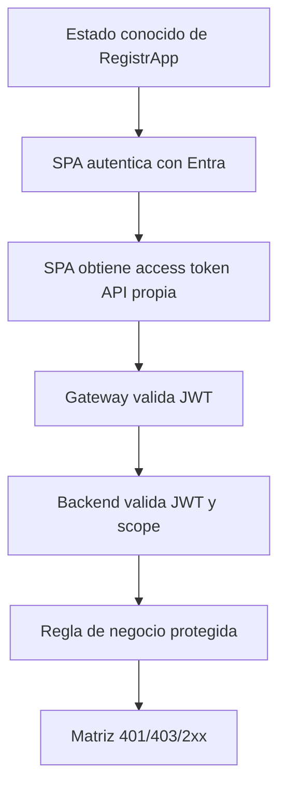
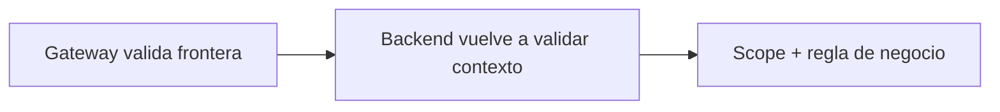
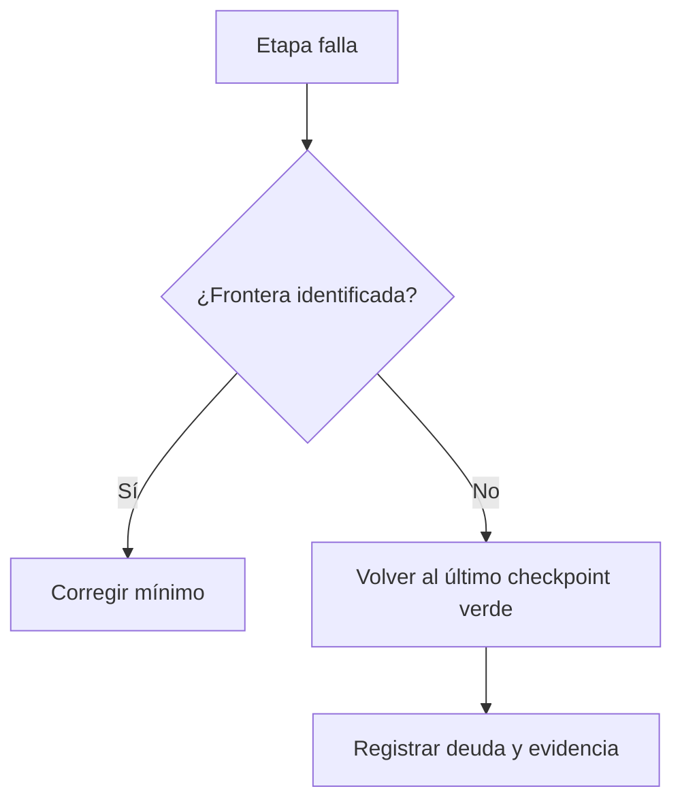

# RegistrApp · plan de integración incremental

## Objetivo

Integrar el patrón de identidad y seguridad sin introducir varias variables nuevas al mismo tiempo.

## Secuencia recomendada



Cada paso debe quedar verde antes de avanzar.

---

## Paso 0 · congelar estado de entrada

Registrar:

- commit/estado inicial;
- operación que se protegerá;
- comportamiento previo;
- deuda conocida que no forma parte de este incremento.

No mezclar refactors ajenos a identidad durante el mismo incremento si pueden evitarse.

## Paso 1 · integrar autenticación de SPA

Adaptar MSAL al frontend real:

- `SPA_CLIENT_ID` correcto;
- authority tenant-specific;
- redirect URI real;
- inicialización antes de APIs interactivas;
- login/logout;
- Member y Guest manual cuando aplique.

Checkpoint: el usuario se autentica, pero todavía no se considera protegida la API.

## Paso 2 · solicitar token de API propia

Definir el scope real de RegistrApp y solicitarlo explícitamente.

```text
api://<API_CLIENT_ID>/<scope-registrapp>
```

Checkpoint:

- access token existe;
- `aud` corresponde al recurso esperado;
- `scp` contiene el permiso esperado;
- token completo no se imprime ni versiona.

## Paso 3 · proteger la ruta en Gateway

Configurar JWT Authorizer/política equivalente para la operación elegida.

Validar:

- issuer;
- audience;
- scope requerido;
- request sin token rechazado.

Checkpoint: el Gateway distingue request autenticable de request inválido.

## Paso 4 · proteger backend Spring

Configurar Resource Server y autorización de la operación.

El backend no debe confiar en que el Gateway ya validó todo.



Checkpoint: la API rechaza directamente un token inválido o un usuario sin permiso según el diseño.

## Paso 5 · integrar autorización de negocio

No toda autorización cabe en un scope.

Ejemplo conceptual:

```text
scope permite invocar operación
+
regla de dominio determina si ese usuario puede operar ese recurso concreto
```

Checkpoint: la identidad técnica no sustituye las reglas propias de RegistrApp.

## Paso 6 · ejecutar matriz completa

No cerrar el incremento solo con HTTP 200.

Ejecutar al menos:

1. público permitido, si existe;
2. protegido sin token → 401;
3. token inválido/audience incorrecta → 401;
4. token válido sin scope → 403;
5. token + scope correcto → 2xx;
6. regla de negocio denegada → resultado coherente con diseño.

## Rollback

Si una etapa rompe el proyecto y no puede diagnosticarse en el bloque disponible:



No dejar RegistrApp en un estado parcialmente protegido e inexplicable.

## Checkpoint M2

- [ ] cada frontera fue integrada por separado;
- [ ] el frontend no contiene secrets;
- [ ] el token es para la API propia;
- [ ] Gateway y backend tienen responsabilidades explícitas;
- [ ] existe un último estado verde recuperable;
- [ ] no se mezclaron cambios irrelevantes.

→ Continúa con [Pruebas y evidencia](./03-pruebas-evidencia.md).
