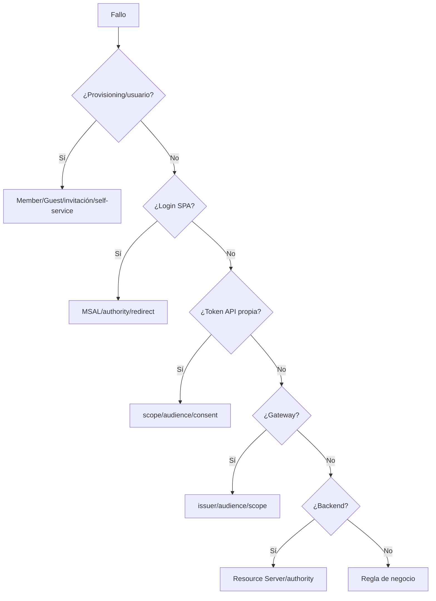
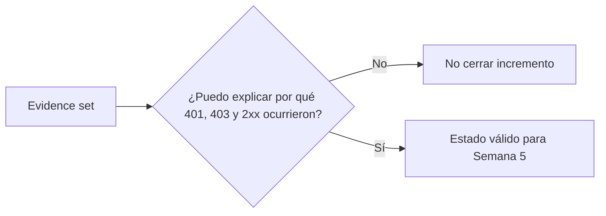

# RegistrApp · pruebas y evidencia del incremento

## Objetivo

Cerrar Semana 4 con evidencia reproducible del incremento real incorporado a RegistrApp, diferenciando autenticación, autorización técnica y autorización de negocio.

## Matriz mínima

| ID | Caso | Resultado esperado |
|---|---|---|
| REG-AUTH-01 | usuario sin autenticar abre zona protegida | no obtiene acceso útil |
| REG-AUTH-02 | request API sin token | 401 |
| REG-AUTH-03 | token inválido/expirado | 401 |
| REG-AUTH-04 | token para audience incorrecta | 401 |
| REG-AUTH-05 | token válido sin scope requerido | 403 |
| REG-AUTH-06 | token válido + scope correcto | 2xx |
| REG-AUTH-07 | identidad técnicamente válida pero regla de negocio deniega | rechazo coherente con diseño |
| REG-AUTH-08 | Guest manual autorizado | mismo circuito válido que Member cuando corresponda |

Si se implementó self-service, añadir:

| ID | Caso | Resultado esperado |
|---|---|---|
| REG-SSR-01 | usuario nuevo | sign-up → Guest |
| REG-SSR-02 | mismo usuario ya aprovisionado | sign-in normal |
| REG-SSR-03 | Guest manual previo | sigue funcionando; no regresión |

## Diagnóstico por frontera



No modificar varias fronteras a la vez durante troubleshooting.

## Evidencia mínima obligatoria

Conservar de manera sanitizada:

1. commit/estado antes del incremento;
2. diagrama Mermaid de la arquitectura real resultante;
3. evidencia de dos App Registrations, sin IDs completos cuando no sean necesarios públicamente;
4. scope utilizado;
5. Member/Guest manual probado cuando corresponda;
6. evidencia de login SPA;
7. claims sanitizados de un access token: `iss`, `aud`, `scp`, expiración aproximada;
8. request 401;
9. request 403;
10. request autorizado 2xx;
11. evidencia de responsabilidad Gateway/backend;
12. DevLog con al menos un problema diagnosticado por frontera;
13. deuda pendiente y próximo checkpoint.

## Evidencia opcional de self-service

Solo si Gate B fue trabajado:

- usuario inexistente antes;
- user flow ejecutado;
- Guest creado;
- segundo acceso como sign-in;
- repetición de token/Gateway/backend;
- prueba de no regresión del Guest manual.

## Qué NO evidenciar

No publicar:

- access/refresh token completo;
- client secret;
- password;
- código OTP;
- cookies de sesión;
- credenciales AWS/Azure;
- información personal innecesaria de compañeros.

## Plantilla mínima de DevLog

```text
Estado inicial:
Cambio intentado:
Frontera afectada:
Prueba ejecutada:
Resultado:
Fallo observado:
Causa identificada:
Corrección mínima:
Resultado posterior:
Deuda / siguiente paso:
```

## Gate final Semana 4



El criterio de cierre no es “funciona en mi navegador”; es poder demostrar y explicar el circuito completo implementado en RegistrApp.

← [Volver al checkpoint Semana 4](./README.md).
