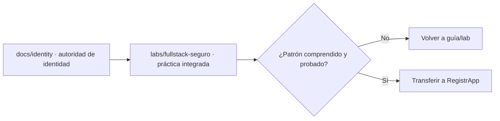
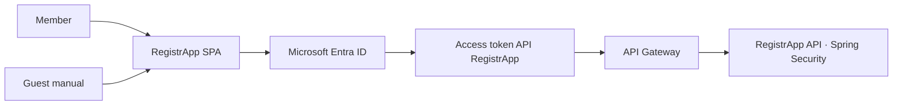
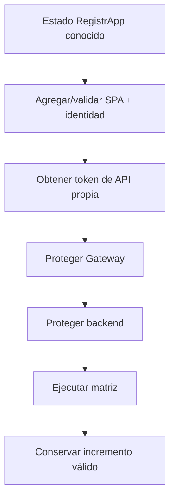

# RegistrApp · Checkpoint Semana 4

## Propósito

Semana 4 no vuelve a enseñar identidad ni seguridad Full Stack dentro de RegistrApp. El proyecto formativo **recibe competencias ya validadas** en los dominios y laboratorios canónicos del repositorio y las adapta al contexto real del grupo.

## Autoridades que consume este checkpoint

- [Identity & Access · dominio canónico](../../docs/identity/README.md)
- [Guía Entra completa · Parte I 0–7 y Parte II 8–14](../../docs/identity/entra-guia-completa/README.md)
- [Laboratorio Full Stack seguro](../../labs/fullstack-seguro/README.md)
- [Semana 4 · horizonte curricular](../../semanas/semana-04/README.md)

RegistrApp no redefine esas fuentes.

---

# Gate A · Transferencia base

Este gate corresponde al aprendizaje obligatorio antes de integrar el patrón en RegistrApp.

Debe existir evidencia defendible de:

1. tenant/directorio correcto y permisos conocidos;
2. **dos App Registrations**: SPA client y API resource;
3. SPA single-tenant configurada como public client, sin `client_secret`;
4. API propia con scope explícito;
5. al menos un integrante externo incorporado como Guest/B2B manual cuando aplique;
6. MSAL + Authorization Code + PKCE funcionando;
7. access token solicitado para la **API propia**, no para Microsoft Graph;
8. API Gateway/JWT Authorizer validando issuer, audience y scope;
9. Spring Security Resource Server validando el token y aplicando autorización;
10. casos reproducibles 401, 403 y 2xx;
11. evidencia sanitizada y DevLog.

**Solo después de cerrar este gate se considera válida la transferencia base.**

---

# Gate B · Extensión self-service B2B

El auto-registro de terceros pertenece a una **extensión posterior** y no bloquea la transferencia base.

Se trabaja solo si:

- el Gate A está cerrado;
- el tenant y los roles permiten configurar External Identities/User flows;
- existe tiempo/objetivo pedagógico para extender el lifecycle.

Puede incorporar:

- self-service habilitado;
- Identity Provider deliberadamente seleccionado;
- atributos mínimos;
- user flow;
- SPA asociada;
- usuario nuevo → sign-up → Guest;
- segundo acceso → sign-in;
- segunda batería integral de pruebas;
- no regresión del Guest manual.

Si el tenant no permite self-service, el grupo **documenta la limitación** y mantiene el Gate A como estado válido.

---

## Ruta de transferencia

1. [Guía operativa de identidad para RegistrApp](./guia-operativa-identidad-entra.md)
2. [Mapeo de arquitectura Full Stack a RegistrApp](./01-mapeo-transferencia-fullstack.md)
3. [Plan de integración incremental](./02-plan-integracion-registrapp.md)
4. [Pruebas y evidencia del incremento](./03-pruebas-evidencia.md)

## Regla de cambio mínimo

No migrar simultáneamente identidad, gateway, backend y reglas de negocio sin checkpoints intermedios.

## Salida de Semana 4

El estado final se convierte en entrada de Semana 5. Si una capacidad no alcanzó gate, se conserva el último estado válido y se documentan causa, evidencia y deuda pendiente.

> RegistrApp es transferencia del aprendizaje; no es el lugar donde se explica por primera vez MSAL, Entra, JWT Authorizer o Spring Security Resource Server.
