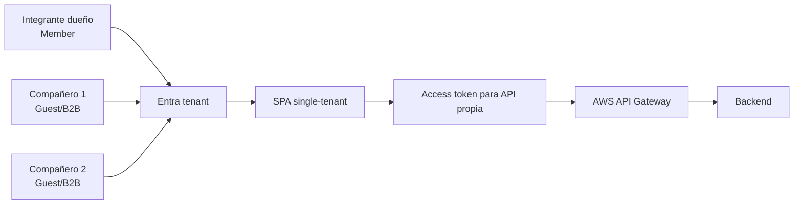

# RegistrApp · Checkpoint Semana 4

## Entrada

Estado acumulado y verificable de Semana 3. Este checkpoint no autoriza a asumir que todos los contenidos curriculares fueron cubiertos: cada sección parte desde su último estado real.

## Competencias potencialmente transferibles

Cuando hayan sido comprendidas fuera de RegistrApp, pueden transferirse:

- Authorization Code + PKCE;
- configuración de cliente frontend con MSAL;
- obtención y uso correcto de access token;
- usuarios externos Guest/B2B en Microsoft Entra ID para una aplicación single-tenant;
- protección de API con Spring Security Resource Server;
- scopes/claims y decisiones 401/403;
- separación de responsabilidades frontend / IdP / gateway / backend;
- controles básicos de arquitectura segura.

## Checkpoint específico · acceso de integrantes del grupo

Si el tenant y la App Registration fueron creados por un integrante y los demás compañeros no pertenecen al directorio, el escenario inicial esperado es:

No se debe cambiar automáticamente la aplicación a multitenant para resolver el acceso de compañeros. En esta etapa, el objetivo es evidenciar que el tenant controla qué usuarios externos incorpora.

Procedimiento, troubleshooting y validación completa:

→ [Guía · Microsoft Entra ID, usuarios externos, SPA y API Gateway](../../docs/identity/entra-usuarios-externos-spa-api-gateway.md)

### Evidencia mínima del checkpoint de identidad

1. App Registration de la SPA configurada como single-tenant;
2. integrante dueño visible como Member;
3. al menos un compañero visible como Guest;
4. invitación aceptada;
5. login exitoso del Member y del Guest;
6. access token solicitado para la API propia, no para Microsoft Graph;
7. request con `Authorization: Bearer ...` hacia API Gateway;
8. evidencia de un caso autorizado y uno rechazado;
9. explicación breve de `issuer`, `audience` y scope usado.

## Incremento esperado

No existe un incremento obligatorio único. El estudiante debe seleccionar solo los cambios habilitados por lo realmente aprendido y justificar su incorporación al proyecto.

Ejemplos válidos de incremento, si corresponde:

- proteger un endpoint previamente público;
- incorporar autenticación de usuario en frontend;
- permitir que los integrantes reales del grupo accedan mediante Guest/B2B;
- definir y aplicar un scope mínimo;
- corregir una frontera de seguridad detectada en el diseño;
- documentar el flujo completo de acceso a una capacidad existente.

## Evidencia

Registrar:

1. estado antes del cambio;
2. competencia nueva que habilitó el cambio;
3. archivos/commits modificados;
4. prueba funcional o técnica;
5. comportamiento 401/403 cuando aplique;
6. decisión técnica y deuda pendiente;
7. DevLog.

## Salida

El estado final de Semana 4 se convierte en la entrada de Semana 5. Si no hubo incremento, se conserva el último estado válido y se documenta la razón.

> RegistrApp es transferencia del aprendizaje; no es el dominio usado para enseñar por primera vez MSAL, Spring Security o arquitectura segura.
