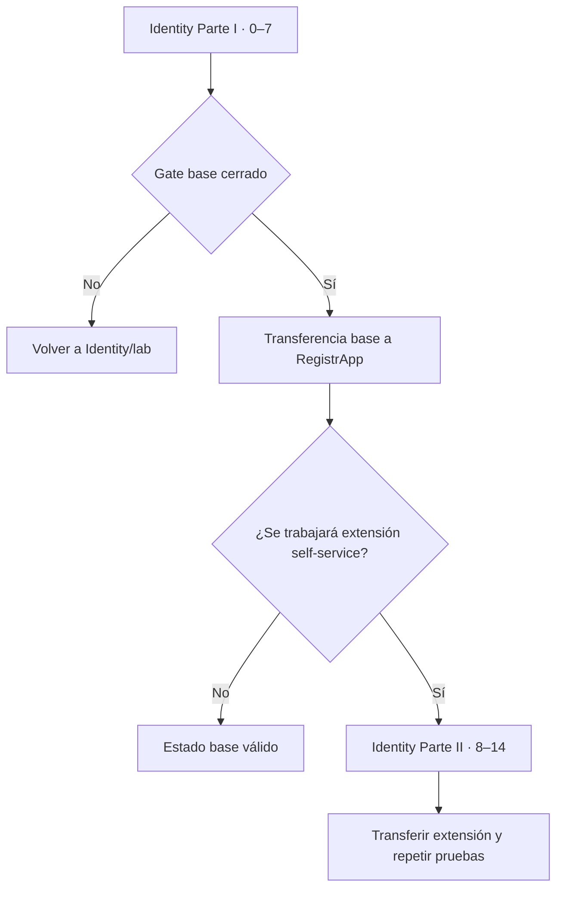
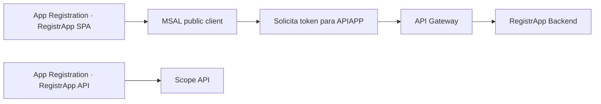
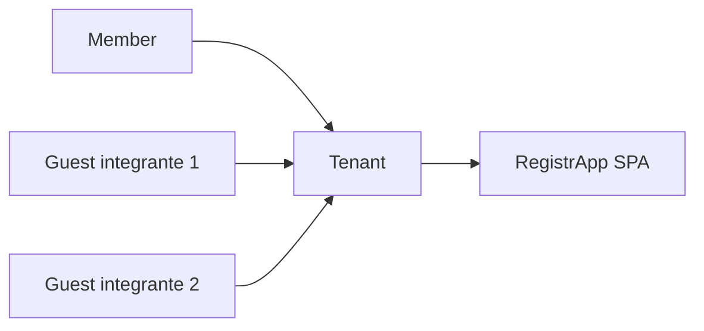
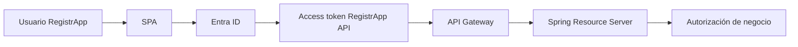

# RegistrApp · guía operativa de transferencia de identidad

Esta guía **no reemplaza** la documentación canónica de Microsoft Entra ID. Su función es indicar cuándo y cómo una competencia ya validada puede trasladarse a RegistrApp.

→ [Identity & Access · dominio canónico](../../docs/identity/README.md)  
→ [Guía completa por etapas](../../docs/identity/entra-guia-completa/README.md)

## Regla principal

RegistrApp puede transferir el **flujo base** cuando la Parte I de la guía Identity (`0–7`) esté cerrada. La Parte II (`8–14`, self-service B2B) es una extensión posterior y **no es requisito para considerar válida la integración base**.

---

## Gate base de identidad

Antes de transferir al proyecto deben estar defendibles:

- tenant/directorio correcto;
- SPA App Registration;
- API App Registration separada;
- scope de API propia;
- Guest/B2B manual cuando sea necesario para los integrantes;
- MSAL + Authorization Code + PKCE;
- access token para la API propia;
- issuer, audience y scope comprendidos;
- API Gateway/JWT Authorizer probado;
- 401/403/2xx explicables.

### Dos App Registrations

RegistrApp debe preservar esta separación:

No reutilizar la SPA como si fuera también el recurso API por conveniencia.

---

## Acceso de compañeros

Para una app single-tenant, el mecanismo base esperado sigue siendo Guest/B2B manual si otros integrantes no son Members del tenant.

No cambiar a multitenant solo para resolver el acceso del equipo.

---

## Extensión self-service

Solo después del flujo base puede agregarse:

- self-service B2B;
- Identity Provider;
- atributos;
- user flow;
- asociación de la SPA;
- alta automática de un Guest;
- segunda pasada completa de pruebas.

Si el tenant o los roles no permiten esta configuración, registrar la restricción. **No degrada el Gate base**.

## Qué se transfiere realmente

No se copian pantallas administrativas. Se transfieren decisiones y configuración del patrón:

## Evidencia en RegistrApp

La evidencia del proyecto debe mostrar:

- qué App Registration representa SPA y cuál API;
- scope utilizado;
- mecanismo de incorporación de integrantes;
- flujo MSAL funcionando;
- claims sanitizados suficientes para explicar `iss`, `aud`, `scp`;
- request sin token, sin scope y autorizado;
- responsabilidad del Gateway y del backend;
- deuda/limitación si self-service no está disponible.

→ Continúa con [Mapeo de arquitectura Full Stack a RegistrApp](./01-mapeo-transferencia-fullstack.md).
