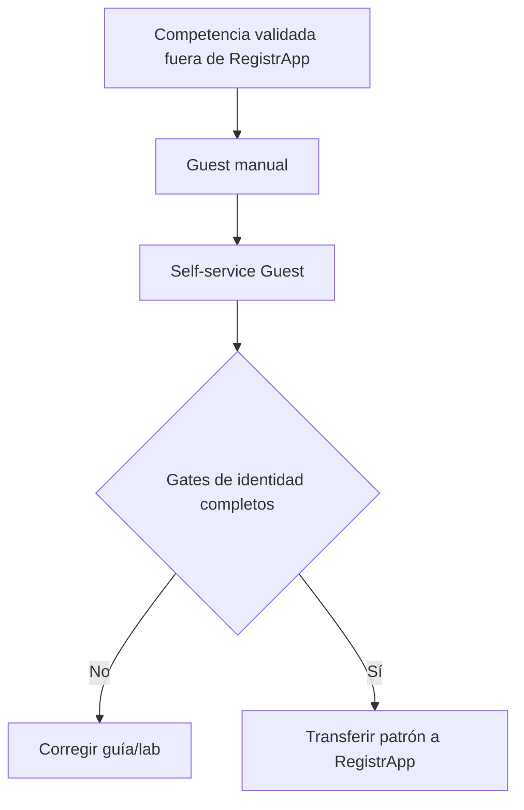
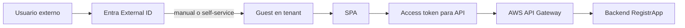

# RegistrApp · guía operativa de identidad Microsoft Entra

Antes de implementar autenticación o protección de endpoints en RegistrApp, completar la guía canónica:

→ **[Microsoft Entra ID · guía completa por etapas](../../docs/identity/entra-guia-completa/README.md)**

## Gates para transferir al proyecto

El grupo no debe copiar directamente configuración a RegistrApp hasta demostrar:

1. Azure for Students y cuenta correctos;
2. tenant/directorio correcto y permisos suficientes;
3. SPA single-tenant registrada;
4. API propia registrada y scope expuesto;
5. integrantes externos incorporados primero como Guest/B2B manual;
6. Member y Guest manual pueden autenticarse;
7. self-service sign-up habilitado cuando el tenant/permisos lo permiten;
8. user flow creado y asociado a la SPA;
9. un usuario externo nuevo puede auto-registrarse y aparece como Guest;
10. el mismo usuario puede volver a entrar posteriormente mediante sign-in;
11. SPA obtiene access token para la API propia;
12. API Gateway rechaza request sin token;
13. API Gateway acepta token correcto;
14. existe al menos un caso negativo de audience/scope/token.

## Qué se transfiere realmente

RegistrApp no necesita copiar todas las pantallas administrativas de Entra. Lo transferible es el **patrón arquitectónico y la configuración correspondiente**:

## Evidencia en RegistrApp

Registrar en DevLog:

- qué mecanismo de incorporación de usuarios se utilizó;
- si se probó Guest manual y self-service;
- qué App Registrations/scopes se utilizan, sin secretos;
- evidencia sanitizada del Guest aprovisionado;
- pruebas 401/403;
- diferencias observadas entre sign-up inicial y sign-in posterior;
- cualquier deuda pendiente.

La configuración administrativa del tenant no es una tarea aislada: forma parte de la evidencia de que el grupo comprende quién puede autenticarse, cómo se incorpora una identidad externa, para qué recurso se emite el token y quién valida la autorización técnica.
