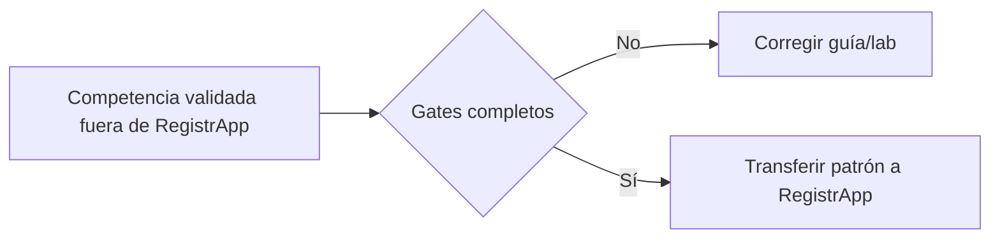

# RegistrApp · guía operativa de identidad Microsoft Entra

Antes de implementar autenticación o protección de endpoints en RegistrApp, completar la guía canónica:

→ **[Microsoft Entra ID · guía completa por etapas](../../docs/identity/entra-guia-completa/README.md)**

## Gates para transferir al proyecto

El grupo no debe copiar directamente configuración a RegistrApp hasta demostrar:

1. Azure for Students y cuenta correctos;
2. tenant/directorio correcto y permisos suficientes;
3. SPA single-tenant registrada;
4. API propia registrada y scope expuesto;
5. integrantes externos incorporados como Guest/B2B;
6. Member y Guest pueden autenticarse;
7. SPA obtiene access token para la API propia;
8. API Gateway rechaza request sin token;
9. API Gateway acepta token correcto;
10. existe al menos un caso negativo de audience/scope/token.

## Evidencia en RegistrApp

Registrar en DevLog qué parte del patrón se transfirió, qué App Registrations/scopes se utilizan (sin secretos), pruebas 401/403 y cualquier deuda pendiente.

La configuración administrativa del tenant no es una tarea aislada: forma parte de la evidencia de que el grupo comprende quién puede autenticarse, para qué recurso se emite el token y quién valida la autorización técnica.
