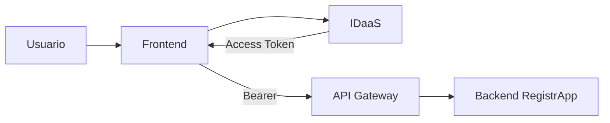

# 02 · Integración end-to-end

## Incremento mínimo

Proteger **un endpoint** antes de ampliar cobertura.

## Implementación

1. obtener token;
2. adjuntarlo al request;
3. pasar por Gateway;
4. validar seguridad;
5. llegar al endpoint;
6. observar 2xx.

No agregar nuevas entidades para justificar la semana.
