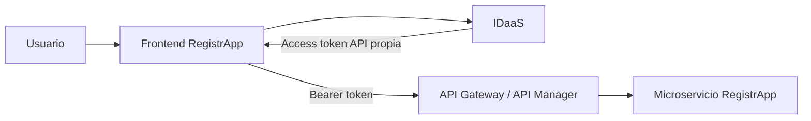

# RegistrApp · Semana 5

## Propósito

Transferir al proyecto formativo el patrón Full Stack seguro trabajado en Semana 5 **sólo después de que pueda demostrarse en el laboratorio**.

No reiniciar RegistrApp ni ampliar reglas de negocio para compensar deuda técnica.

## Estado de entrada

Recibe todo el estado de salida de Semana 4, incluidas sus deudas explícitas.

→ [Semana 5 del curso](../../semanas/semana-05/README.md)  
→ [Laboratorio Full Stack protegido](../../labs/fullstack-seguro/README.md)

## Incremento esperado

Cuando los gates estén verdes, integrar progresivamente:

La transferencia mínima puede limitarse a **un endpoint protegido**. El valor de la semana está en probar correctamente autenticación, propagación de token, validación/autorización y enrutamiento; no en aumentar el CRUD.

## Gate de entrada a la transferencia

No transferir todavía si no se puede demostrar:

- login funcional;
- access token disponible;
- token destinado a la API propia;
- diferencia entre ID token y access token;
- Gateway/API Manager capaz de aceptar/rechazar la credencial según política;
- microservicio accesible a través de la frontera protegida.

## Definition of Done del incremento

- [ ] RegistrApp conserva el incremento previo.
- [ ] El frontend obtiene o utiliza correctamente el access token del IDaaS elegido.
- [ ] La request incluye `Authorization: Bearer <token>`.
- [ ] La llamada entra por API Gateway/API Manager.
- [ ] Un endpoint del microservicio está protegido.
- [ ] Sin credencial válida la request se rechaza.
- [ ] Con credencial y autorización suficientes la request retorna 2xx.
- [ ] El grupo puede explicar `iss`, `aud`, vigencia y scope/permisos relevantes.
- [ ] Existe evidencia reproducible en repositorio/DevLog.

## Evidencia obligatoria

- comparación antes/después;
- artefactos modificados;
- decisión técnica tomada;
- referencia a commits/archivos;
- pruebas 401/403/2xx cuando correspondan;
- captura o salida reproducible del flujo end-to-end;
- DevLog;
- deuda pendiente explícita.

## No requerido esta semana

- más microservicios;
- nuevas entidades de dominio;
- persistencia adicional;
- reglas de negocio sofisticadas;
- mejoras visuales sin relación con el flujo seguro.

## Estado de salida

El estado completo resultante será la entrada de Semana 6. Las capacidades no demostradas continúan como deuda; no se marcan como cubiertas por haber existido en la planificación.
