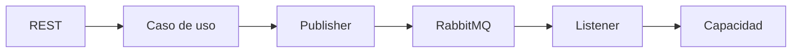

# Paso 3 · Integración incremental

## Objetivo

Incorporar el patrón sin reescribir RegistrApp.

## Secuencia

1. conservar el flujo existente;
2. agregar configuración RabbitMQ;
3. publicar un evento desde un punto conocido;
4. crear un listener;
5. delegar al caso de uso/capacidad correspondiente;
6. probar antes de agregar una segunda routing key.

## Modelo

## Checkpoint

La aplicación debe seguir funcionando si se elimina temporalmente el listener de la lógica central. RabbitMQ no debe “absorber” las reglas del dominio.
