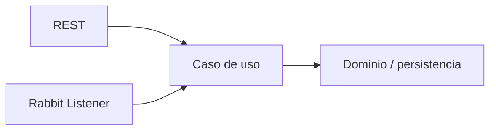

# RegistrApp · Semana 8

## Estado

Transferencia de la competencia de mensajería asíncrona trabajada en Semana 08.

## Estado de entrada

Recibe el estado real de salida de Semana 7. No reiniciar el proyecto ni agregar alcance funcional ajeno al contenido aprendido.

## Contenido transferible

- identificación de una capacidad candidata a procesamiento asíncrono;
- Producer;
- DirectExchange;
- routing key;
- Queue;
- Consumer;
- separación entre infraestructura de mensajería y lógica de aplicación.

## Incremento esperado

Seleccionar **una sola capacidad** del proyecto para demostrar el patrón. Ejemplos razonables: notificación, auditoría o procesamiento posterior.

La capacidad debe conservar una frontera propia y poder ser llamada desde un caso de uso común.

## Evidencia obligatoria

- diagrama de la topología;
- exchange, queue, binding y routing key visibles;
- mensaje publicado y consumido;
- código con responsabilidades separadas;
- decisión técnica;
- DevLog;
- referencia a commits/archivos.

## Estado de salida

El incremento asíncrono demostrable pasa a ser entrada de Semana 9. Cualquier deuda queda explícita; no se asume completitud por haber creado la infraestructura.
