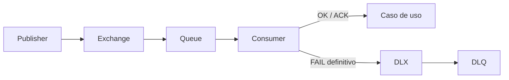

# 03 · DLX y DLQ

Registra:

```text
Main exchange:
Main queue:
Dead Letter Exchange:
Dead Letter Queue:
Binding / routing:
```

Mantén naming coherente y no mezcles lógica de negocio en la configuración del broker.


