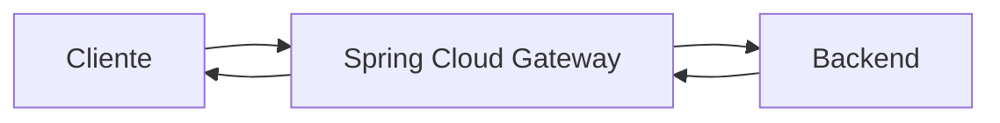

# Evidencias · Laboratorio API Gateway

## Integrantes
- Nombre:
- Nombre:
- Nombre:

## Arquitectura

## Pruebas HTTP
| Método | URL | Status | Headers relevantes | Interpretación |
|---|---|---:|---|---|
| GET | `/api/v1/posts` | | | |
| GET | `/api/v1/posts/1` | | | |
| POST | `/api/v1/posts` | | | |
| PUT | `/api/v1/posts/1` | | | |
| DELETE | `/api/v1/posts/1` | | | |

## Versionado
- Evidencia v1:
- Header `X-API-Version` v1:
- Evidencia v2:
- Header `X-API-Version` v2:
- ¿Por qué mantener ambas versiones?:

## CORS / preflight
- Request utilizado:
- `Access-Control-Allow-Origin`:
- `Access-Control-Allow-Methods`:
- Interpretación:

## Responsabilidades
| Responsabilidad | Cliente | Gateway | Backend | Justificación |
|---|:---:|:---:|:---:|---|
| routing | | | | |
| lógica de negocio | | | | |
| autenticación/autorización | | | | |
| transformación de rutas | | | | |
| persistencia | | | | |
| rate limiting | | | | |
| reglas de negocio | | | | |
| observabilidad | | | | |

## Recorrido de una petición
Explicar el flujo `cliente → gateway → backend → gateway → cliente`.

## Problemas encontrados
1. Problema:
   - causa:
   - solución:

## Colaboración GitHub
| Integrante | Rama | Pull Request | Aporte principal |
|---|---|---|---|
| | | | |

## Conclusiones
- 
