# 1.2.1 · OAuth2 y OpenID Connect (OIDC)

## Objetivo

Comprender la diferencia entre **autenticación** y **autorización**, reconocer qué problema resuelven OAuth2 y OpenID Connect, identificar sus actores principales y aplicar el flujo conceptualmente sobre **ReservApp** sin depender todavía de un proveedor específico.

> Esta semana interesa comprender **qué ocurre y por qué ocurre**. Los nombres de botones, pantallas y productos cloud vendrán después.

---

## 1. El problema: una aplicación no debería hacerlo todo

ReservApp necesita responder preguntas distintas:

1. **¿Quién es la persona que está usando el sistema?**
2. **¿Cómo demostramos que realmente es esa persona?**
3. **¿Qué operaciones puede ejecutar?**
4. **¿Sobre qué recursos puede ejecutar esas operaciones?**
5. **¿Durante cuánto tiempo debe considerarse válida esa autorización?**

Si ReservApp implementara todo por sí misma tendría que hacerse responsable de:

- almacenamiento y protección de contraseñas;
- recuperación de cuentas;
- MFA;
- sesiones;
- emisión y renovación de credenciales;
- revocación;
- políticas de acceso;
- integración con otros sistemas.

Separar identidad y autorización permite que un componente especializado resuelva una parte importante de estas responsabilidades.

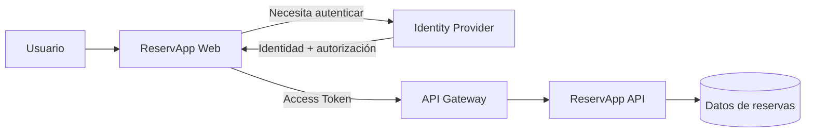

---

## 2. Un ejemplo cotidiano: “Continuar con Google”

Supongamos que una aplicación ofrece el botón:

```text
Continuar con Google
```

La aplicación **no necesita recibir tu contraseña de Google**.

En términos conceptuales ocurre algo como esto:

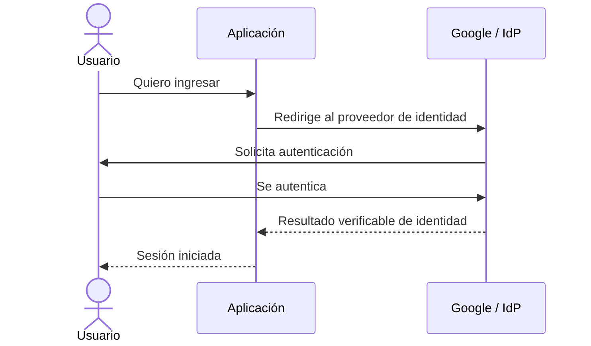

El punto importante es que la contraseña se entrega al proveedor de identidad, **no a la aplicación externa**.

Por ejemplo, si una app de música permite registrarse o iniciar sesión usando Google, el objetivo principal es que Google confirme una identidad que la aplicación pueda reconocer. Ahí OIDC es especialmente relevante.

La aplicación puede recibir información como:

```text
sub   → identificador estable del usuario
name  → nombre
email → correo, si fue solicitado y permitido
```

Eso no significa que la aplicación tenga acceso automático a Gmail, Drive, Fotos ni a todos los servicios de Google.

---

## 3. Autenticación y autorización

### Autenticación

La autenticación intenta responder:

> **¿Quién eres?**

Ejemplos:

- usuario + contraseña;
- contraseña + segundo factor;
- biometría;
- “Continuar con Google”;
- autenticación mediante otra identidad confiable.

El resultado no debería interpretarse como “puede hacer cualquier cosa”. Solo establece una identidad con determinado nivel de confianza.

### Autorización

La autorización responde:

> **¿Qué puedes hacer?**

Ejemplos en ReservApp:

- consultar reservas;
- crear una reserva;
- cancelar una reserva;
- administrar reservas de terceros.

Ejemplo cotidiano distinto:

> Una aplicación puede conocer quién eres mediante Google y, además, pedirte autorización para acceder a determinados archivos de Google Drive.

Ahí aparecen **dos decisiones distintas**:

1. Google confirma tu identidad.
2. Tú autorizas a la aplicación a utilizar una capacidad concreta sobre otro recurso.

### No son equivalentes

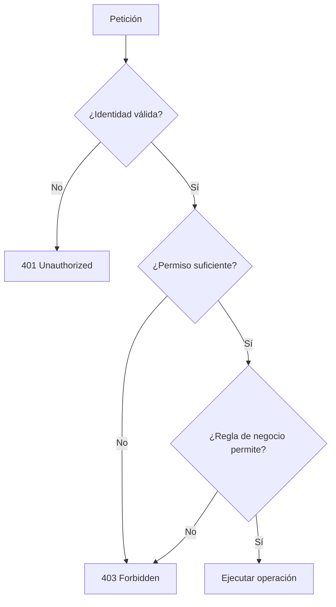

Una persona puede estar perfectamente autenticada y aun así no estar autorizada para una operación.

---

## 4. OAuth2: autorización delegada

OAuth2 es un **framework de autorización**.

La idea central es evitar que una aplicación tenga que recibir las credenciales del usuario para acceder a otro recurso. En vez de entregar la contraseña, se obtiene una autorización limitada representada normalmente mediante un **access token**.

Para comenzar, piensa así:

```text
credenciales del usuario ≠ access token
```

Las credenciales prueban identidad ante quien autentica.

El access token representa una autorización temporal para acceder a un recurso.

### Ejemplo: una herramienta de diseño quiere acceder a Google Drive

Imagina que estás usando una herramienta como Canva y eliges una función del tipo:

```text
Importar desde Google Drive
```

o quieres guardar/exportar contenido hacia Drive.

La aplicación no necesita pedirte:

```text
correo de Google
contraseña de Google
```

En cambio, puede enviarte a Google para que tú autorices un acceso limitado.

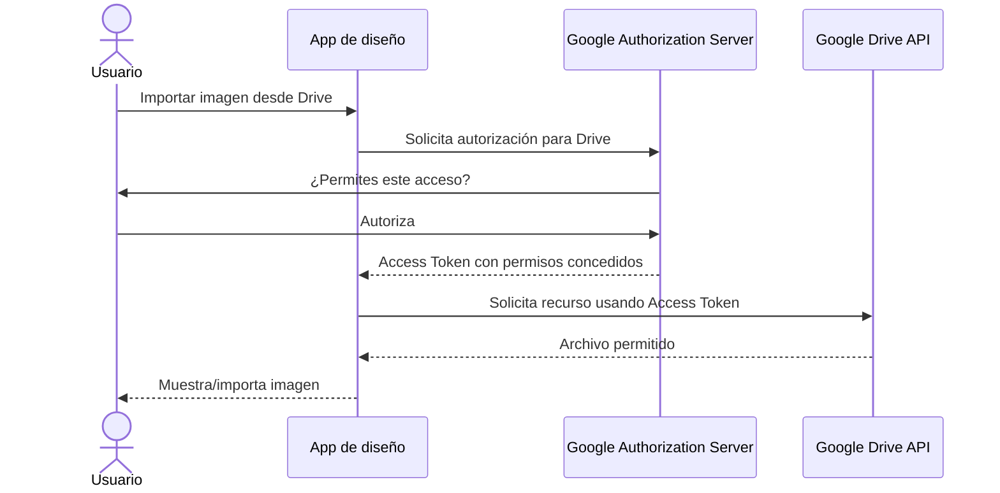

La idea clave es **autorización delegada**:

> “Yo, usuario, autorizo a esta aplicación a realizar ciertas acciones en otro servicio sin entregarle mi contraseña.”

### El permiso no debería ser ilimitado

Una aplicación podría necesitar:

```text
leer determinados archivos
```

sin necesitar necesariamente:

```text
borrar todos mis archivos
administrar mi cuenta completa
leer otros servicios
```

Esto conecta con los **scopes** y con el principio de mínimo privilegio.

---

## 5. OIDC: identidad sobre OAuth2

OAuth2 por sí solo no fue diseñado como protocolo de login.

**OpenID Connect (OIDC)** agrega una capa de identidad sobre OAuth2.

OIDC permite que el cliente obtenga información verificable sobre la autenticación realizada y sobre el sujeto autenticado.

Una simplificación útil para comenzar es:

```text
OAuth2 → autorización
OIDC   → identidad/autenticación sobre OAuth2
```

Pero ambos pueden aparecer dentro del mismo flujo.

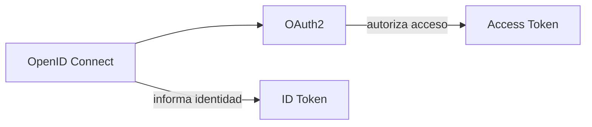

### Comparación rápida de situaciones cotidianas

| Situación | Concepto predominante |
|---|---|
| “Continuar con Google” para saber quién soy | OIDC / autenticación federada |
| Una app pide leer archivos de mi Drive | OAuth2 / autorización delegada |
| La misma app hace ambas cosas | OIDC + OAuth2 |
| Tener sesión iniciada pero no permiso para modificar un recurso | Autenticado, pero no autorizado |

---

## 6. Actores principales

### Resource Owner

Es quien puede autorizar acceso al recurso.

En ReservApp normalmente será el usuario.

En el ejemplo de Drive, eres tú: los archivos pertenecen a tu contexto y tú decides si la aplicación puede acceder.

### Client

Es la aplicación que solicita autorización.

Ejemplo:

```text
reservapp-web
```

En el ejemplo anterior sería la herramienta de diseño.

Importante: **client** no significa necesariamente “persona”. Es software.

### Authorization Server / Identity Provider

Componente que:

- autentica al usuario;
- conoce clientes registrados;
- aplica políticas;
- gestiona consentimiento cuando corresponde;
- emite tokens.

### Resource Server

Es el sistema que expone el recurso protegido.

Ejemplo en nuestra aplicación:

```text
reservapp-api
```

Ejemplo cotidiano:

```text
Google Drive API
```

### API Gateway

No es un actor obligatorio de OAuth2, pero nuestra arquitectura puede usarlo como punto transversal para:

- verificar que exista token;
- validar características técnicas del token;
- aplicar políticas generales;
- bloquear peticiones inválidas antes del backend.

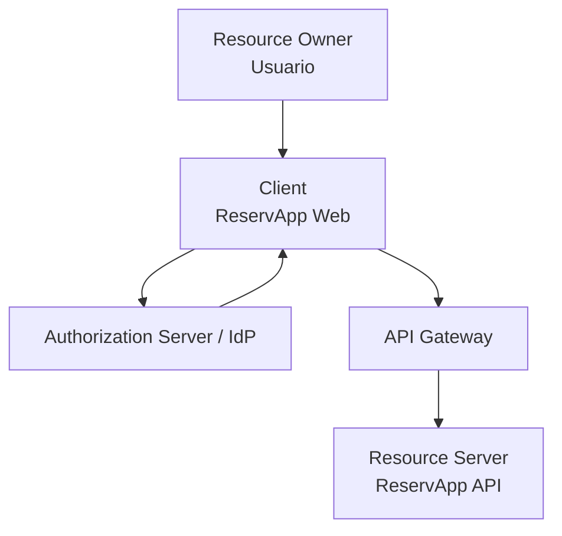

---

## 7. Access token e ID token

### Access token

Se utiliza para acceder a un recurso protegido.

El destinatario lógico es la API/resource server.

Puede permitir razonar sobre datos como:

```text
aud   = reservapp-api
scope = reservations.read reservations.write
exp   = ...
```

Conceptualmente:

```http
Authorization: Bearer <access_token>
```

### ID token

Pertenece a OIDC y está dirigido principalmente al **cliente**.

Su propósito es informar al cliente acerca de la autenticación realizada y la identidad asociada.

### Llevándolo al ejemplo cotidiano

```text
ID Token
→ “Google me informó quién se autenticó”.

Access Token
→ “Google autorizó a esta aplicación a usar determinada API con determinados permisos”.
```

Por eso iniciar sesión con Google y acceder a Google Drive **no son exactamente la misma operación**, aunque para el usuario ambas puedan aparecer dentro de una experiencia continua.

### Error frecuente

> “Tengo un JWT, entonces puedo usarlo para llamar a cualquier API.”

Incorrecto.

La forma del token no determina su propósito.

Debemos preguntar:

- ¿quién lo emitió?;
- ¿para quién fue emitido?;
- ¿qué tipo de token es?;
- ¿qué permisos representa?;
- ¿sigue vigente?

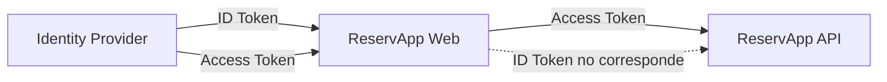

---

## 8. Claims, scopes y roles

### Claim

Un **claim** es una afirmación contenida en un token.

Ejemplos habituales:

```text
sub  → sujeto
iss  → emisor
aud  → audiencia
exp  → expiración
```

También pueden existir claims asociados a contexto, identidad o roles.

### Scope

Un **scope** representa una capacidad solicitada/concedida sobre un recurso.

Para ReservApp:

```text
reservations.read
reservations.write
```

En un ejemplo con almacenamiento de archivos, conceptualmente podríamos tener capacidades como:

```text
leer archivos autorizados
crear archivos
modificar archivos
```

Los nombres reales dependen de la API/proveedor; lo importante aquí es la idea de **limitar el permiso**.

Un scope debería expresar una capacidad razonablemente estable del recurso, no simplemente copiar botones de una interfaz.

### Role

Un rol suele representar una función dentro del sistema:

```text
customer
operator
admin
```

### Diferencia conceptual

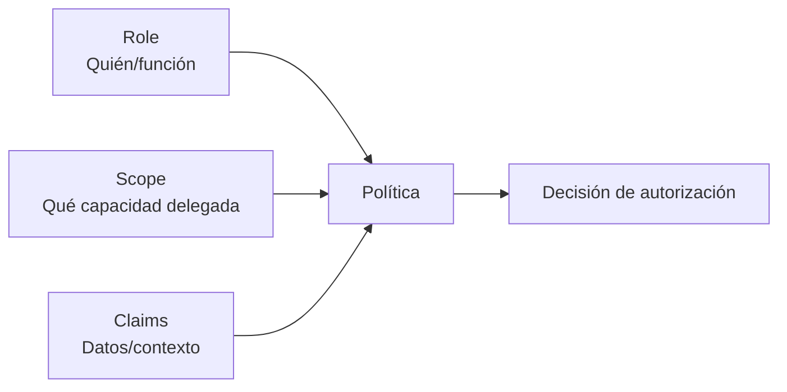

No existe una regla universal que diga “todo se resuelve con roles” o “todo se resuelve con scopes”. La arquitectura define cómo se combinan.

---

## 9. Authorization Code + PKCE

Para clientes públicos modernos, como una SPA o aplicación móvil, estudiaremos conceptualmente **Authorization Code + PKCE**.

PKCE agrega una prueba que vincula el inicio del flujo con quien posteriormente intenta intercambiar el código.

La idea importante es evitar tratar el código de autorización como si por sí solo fuera suficiente.

### Flujo simplificado

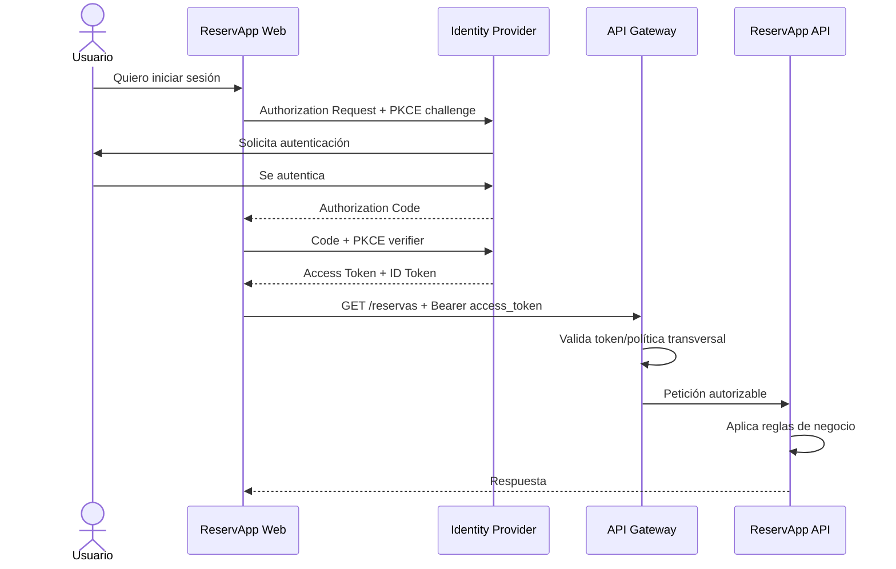

### Qué deben comprender

No hace falta memorizar todavía todos los parámetros.

Sí deben comprender que:

- la contraseña no viaja hacia ReservApp API;
- el usuario se autentica ante el IdP;
- el cliente recibe un código primero;
- luego obtiene tokens;
- el access token se presenta ante la API;
- PKCE protege el intercambio del código en clientes donde no podemos confiar en un secreto almacenado.

---

## 10. ¿Qué debería validar una API?

Recibir un token no basta.

Conceptualmente, una API debe poder confiar al menos en:

- **firma:** no fue modificado y proviene de una autoridad confiable;
- **issuer (`iss`):** fue emitido por el emisor esperado;
- **audience (`aud`):** fue emitido para esta API/recurso;
- **expiración (`exp`):** sigue vigente;
- **permisos:** posee scope/rol apropiado.

Después viene la autorización de negocio.

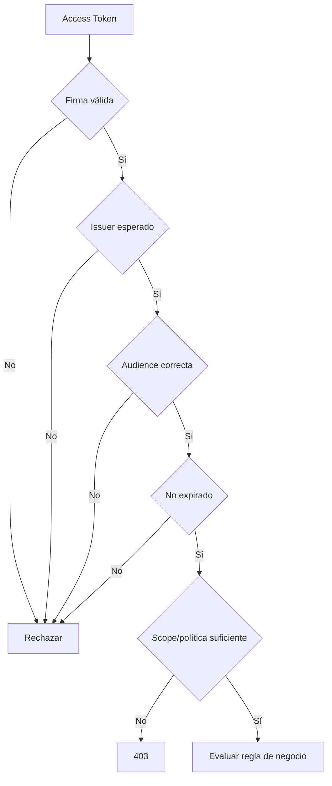

---

## 11. 401 vs 403

### 401 Unauthorized

La petición no posee credenciales de autenticación válidas o aceptables.

Ejemplos:

- falta token;
- token inválido;
- token expirado.

### 403 Forbidden

La identidad ya fue reconocida, pero la operación no está permitida.

Ejemplos:

- token válido sin `reservations.write`;
- usuario autenticado intentando administrar un recurso que no le corresponde.

> El nombre HTTP `Unauthorized` puede confundir: en la práctica, 401 está asociado a falta/fallo de autenticación, mientras que 403 expresa acceso prohibido aun existiendo identidad válida.

---

## 12. Autorización técnica vs autorización de negocio

Supongamos que un usuario posee:

```text
reservations.write
```

Eso podría autorizar la operación general de escritura.

Pero ReservApp mantiene esta regla:

> Un cliente solo puede cancelar sus propias reservas.

El scope no contiene necesariamente toda la información necesaria para resolver esa regla.

La API podría necesitar comparar:

```text
sub del usuario autenticado
        vs
ownerId de la reserva
```

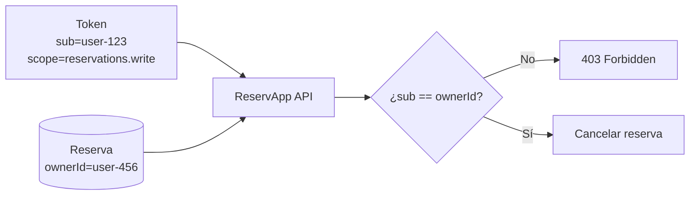

Por esto **tener gateway e IDaaS no elimina la seguridad del backend**.

---

## 13. Tres situaciones para no confundir conceptos

### Caso A · Solo identidad

```text
“Quiero entrar a una aplicación usando mi cuenta Google.”
```

Pregunta central:

> ¿Quién es este usuario?

Concepto predominante: **OIDC**.

### Caso B · Solo autorización a un recurso externo

```text
“Esta aplicación necesita permiso para acceder a determinados recursos de mi Drive.”
```

Pregunta central:

> ¿Qué le permito hacer a esta aplicación?

Concepto predominante: **OAuth2**.

### Caso C · Identidad + autorización

```text
“Entro usando Google y después autorizo a la aplicación para trabajar con archivos de Drive.”
```

Aquí aparecen ambos:

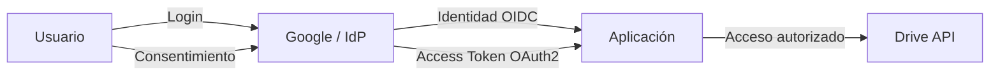

Esta es una buena forma de entender por qué **login social y acceso a APIs relacionadas no son sinónimos**.

---

## 14. Micropráctica

Para cada situación indiquen:

1. componente que debería detectarla;
2. si corresponde a autenticación, validación técnica, autorización o regla de negocio;
3. resultado esperado.

Casos:

1. El usuario ingresa credenciales incorrectas.
2. La API recibe un token expirado.
3. La petición llega sin token.
4. El token no contiene `reservations.write`.
5. El token fue emitido para otra API.
6. Un usuario con `reservations.write` intenta cancelar la reserva de otra persona.
7. Una aplicación sabe quién eres mediante Google, pero nunca recibió permiso para acceder a Drive.
8. El usuario revoca posteriormente el acceso de una aplicación a sus archivos.

---

## Errores conceptuales frecuentes

- creer que OAuth2 es simplemente “login”;
- creer que OIDC reemplaza OAuth2;
- pensar que “Continuar con Google” entrega acceso automático a todos los servicios de Google;
- confundir iniciar sesión con conceder acceso a Drive u otra API;
- usar ID token para invocar una API;
- asumir que todo JWT es confiable;
- confundir scopes con roles;
- creer que el gateway elimina la autorización del backend;
- asumir que un scope de escritura autoriza modificar cualquier registro.

---

## Checkpoint

Al terminar este tema debes poder dibujar y explicar:

```text
Usuario
  → Client
  → Identity Provider
  → Client con tokens
  → API Gateway
  → Resource Server
```

Y responder correctamente:

- autenticación vs autorización;
- OAuth2 vs OIDC;
- “Continuar con Google” vs autorizar acceso a una API como Drive;
- access token vs ID token;
- quién es client, authorization server y resource server;
- qué son scopes y claims;
- diferencia entre 401 y 403;
- qué valida técnicamente un token;
- por qué el backend mantiene reglas de autorización de negocio.

## Continuidad

El siguiente tema introduce **IDaaS y CIAM**: pasaremos de comprender el protocolo a comprender **quién opera la infraestructura de identidad, dónde viven usuarios/aplicaciones/políticas y qué responsabilidades delegamos**.