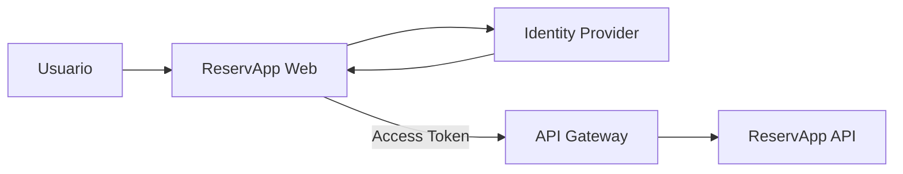

# 1.2.1 · OAuth2 y OpenID Connect (OIDC)

## Objetivo

Comprender la diferencia entre autenticación y autorización, reconocer el rol de OAuth2 y OIDC y aplicar estos conceptos al dominio formativo **ReservApp** sin depender todavía de Azure ni de otro proveedor específico.

## 1. ¿Qué problema estamos resolviendo?

ReservApp necesita responder dos preguntas distintas:

- **¿Quién es el usuario?** → autenticación.
- **¿Qué puede hacer?** → autorización.

No conviene que cada aplicación implemente por sí sola login, contraseñas, recuperación de cuentas, MFA, emisión de tokens y políticas de acceso.

## 2. OAuth2 y OIDC no son lo mismo

### OAuth2

Es un framework de **autorización**. Permite que una aplicación obtenga autorización para acceder a recursos protegidos en nombre de un usuario o de otro actor.

### OpenID Connect (OIDC)

Es una capa de identidad construida sobre OAuth2. Añade mecanismos para que el cliente conozca la identidad autenticada del usuario.

En términos simples:

```text
OAuth2 → qué se permite hacer
OIDC   → quién se autenticó
```

Esta simplificación ayuda a comenzar, aunque en una implementación real ambos participan dentro del mismo flujo.

## 3. Actores principales

### Resource Owner

Persona o entidad propietaria del acceso delegado. En nuestro caso: un usuario de ReservApp.

### Client

Aplicación que necesita acceder a un recurso. En ReservApp podría ser `reservapp-web`.

### Authorization Server / Identity Provider

Autentica al usuario, gestiona el consentimiento/políticas y emite tokens.

### Resource Server

API que protege recursos. En nuestro caso: `reservapp-api`.

### API Gateway

No es un actor obligatorio de OAuth2, pero en nuestra arquitectura puede aplicar políticas transversales antes de que la petición llegue al backend.

## 4. Access token vs ID token

### Access token

Se utiliza para acceder a una API.

Puede expresar información como:

```text
aud = reservapp-api
scope = reservations.read reservations.write
exp = ...
```

### ID token

Está dirigido al **cliente** y entrega información sobre la identidad autenticada.

No debe utilizarse como reemplazo del access token para llamar a la API.

## 5. Claims, scopes y roles

### Claim

Dato declarado dentro de un token.

Ejemplos:

```text
sub
iss
aud
exp
email
role
```

### Scope

Capacidad que una aplicación solicita y que puede concederse.

Para ReservApp:

```text
reservations.read
reservations.write
```

### Role

Representación de una función o agrupación de capacidades, por ejemplo `customer` u `operator`.

No confundir roles con scopes: pueden relacionarse, pero representan ideas distintas.

## 6. Authorization Code + PKCE

Para clientes públicos modernos, como una SPA o aplicación móvil, se trabaja conceptualmente con **Authorization Code + PKCE**.

Flujo simplificado:

1. ReservApp redirige al usuario al proveedor de identidad.
2. El usuario se autentica allí.
3. El proveedor devuelve un código al cliente mediante una redirect URI autorizada.
4. El cliente intercambia ese código usando la prueba PKCE.
5. Obtiene los tokens correspondientes.
6. Usa el access token para llamar a `reservapp-api`.

El objetivo por ahora no es memorizar parámetros del protocolo, sino entender por qué el cliente no debería manejar directamente la contraseña del usuario.

## 7. Flujo en ReservApp



Preguntas clave:

- ¿Dónde ocurre la autenticación?
- ¿Quién emite el token?
- ¿Quién consume el access token?
- ¿Qué debería validar el gateway?
- ¿Qué reglas todavía debe validar el backend?

## 8. 401 vs 403

### 401 Unauthorized

La petición no posee credenciales válidas para ser autenticada.

Ejemplos:

- no hay token;
- token inválido;
- token expirado.

### 403 Forbidden

La identidad está reconocida, pero no tiene autorización suficiente para la operación.

Ejemplo:

- token válido sin `reservations.write` intentando modificar una reserva.

## 9. Autorización técnica vs autorización de negocio

Tener:

```text
reservations.write
```

no implica automáticamente:

> “puedo modificar cualquier reserva”.

ReservApp puede tener una regla adicional:

> Un cliente solo puede modificar sus propias reservas.

Esa regla depende del dominio y debe validarse con información del negocio, normalmente en el backend.

## 10. Micropráctica

Para cada caso indiquen si corresponde principalmente a autenticación, autorización, validación técnica o regla de negocio:

1. El usuario ingresa sus credenciales.
2. La API verifica que el token no esté expirado.
3. La petición no contiene token.
4. El token no posee `reservations.write`.
5. El usuario intenta cancelar una reserva que pertenece a otra persona.

Justifiquen cada respuesta.

## Checkpoint

Al terminar este tema debes poder explicar:

- autenticación vs autorización;
- OAuth2 vs OIDC;
- access token vs ID token;
- actor cliente, authorization server y resource server;
- scopes y claims;
- diferencia entre 401 y 403;
- por qué el backend sigue teniendo responsabilidades aunque exista un API Gateway.

## Continuidad

El siguiente tema introduce **IDaaS y CIAM** para entender dónde viven usuarios, aplicaciones, políticas y configuración de identidad antes de diseñar el tenant de ReservApp.
