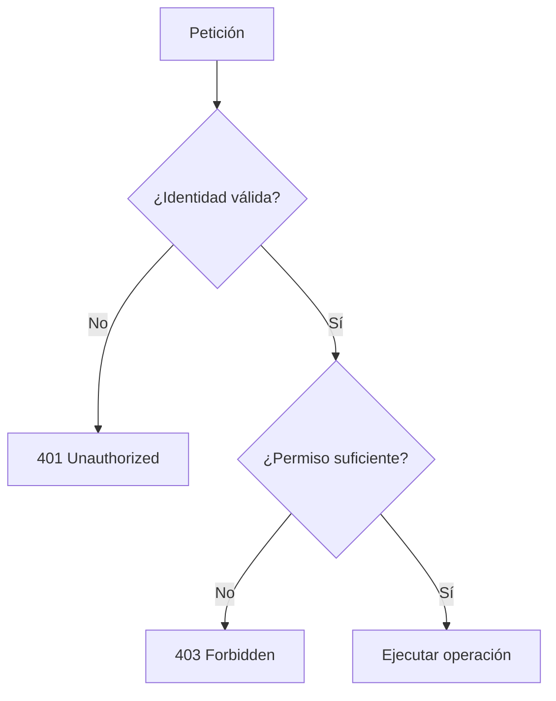
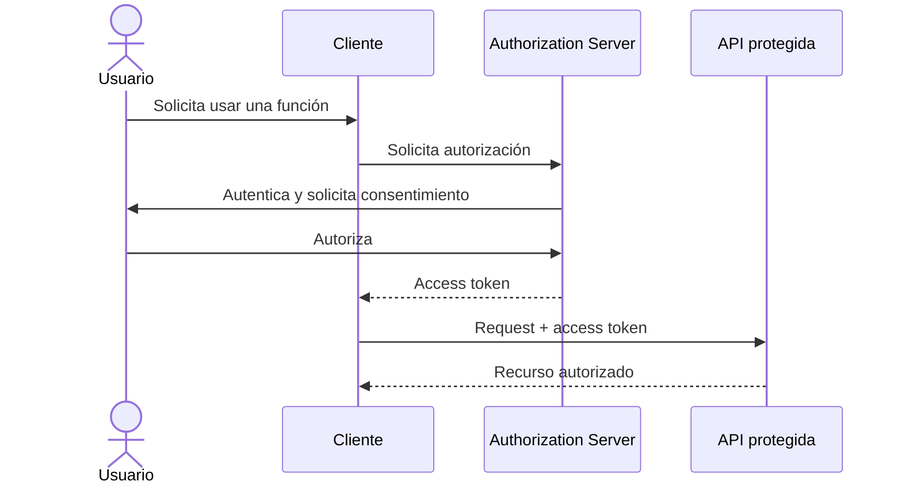
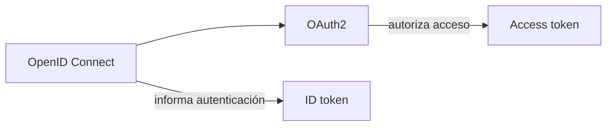
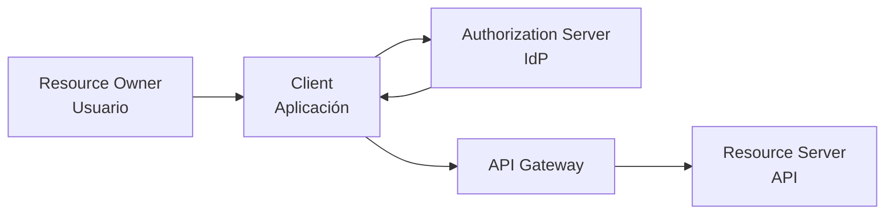
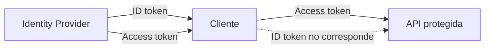
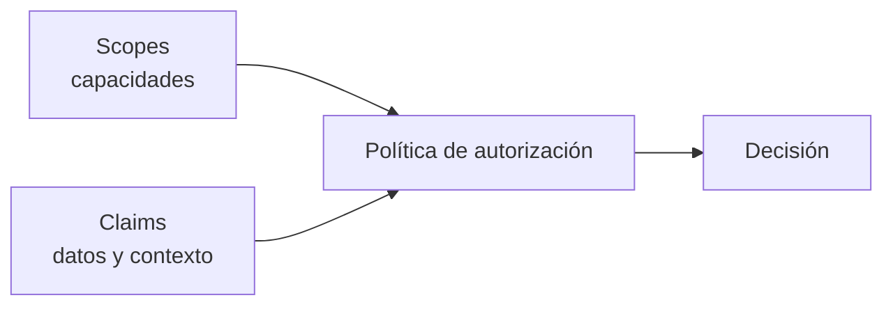
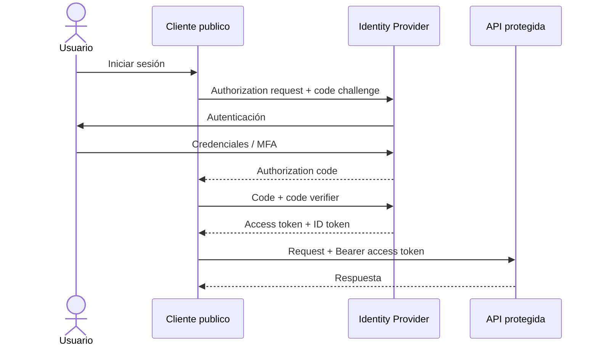
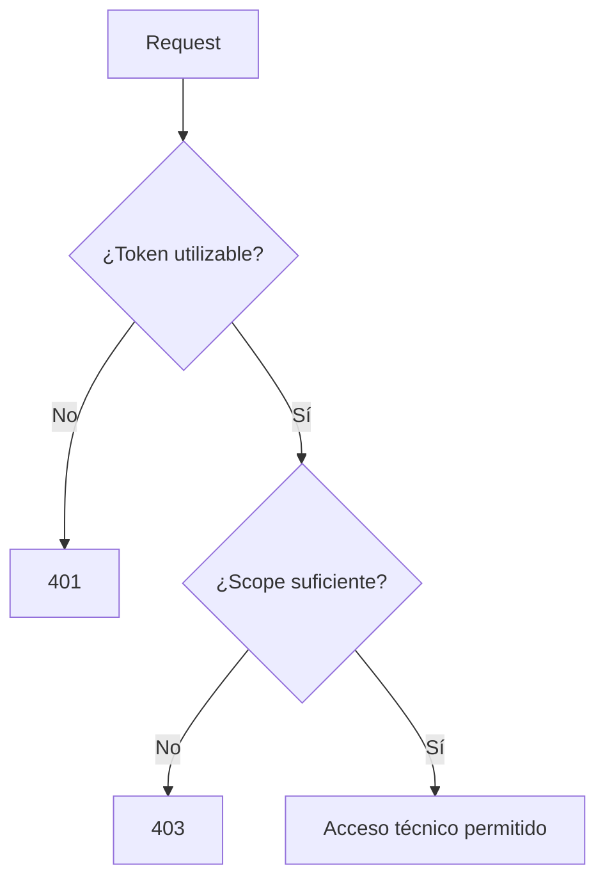

# 1.2.1 · OAuth2 y OpenID Connect (OIDC)

## Objetivo

Comprender la diferencia entre **autenticación** y **autorización**, reconocer los actores principales de OAuth2/OIDC y explicar conceptualmente Authorization Code + PKCE.

Este contenido se enseña con ejemplos pequeños e independientes. **RegistrApp no se usa como ejemplo conductor**; la transferencia al desafío ocurre después.

---

## 1. Autenticación vs autorización

### Autenticación

Responde:

> ¿Quién eres?

### Autorización

Responde:

> ¿Qué puedes hacer?

Un usuario puede estar autenticado y aun así no tener permiso para ejecutar una operación.



---

## 2. OAuth2

OAuth2 es un framework de **autorización delegada**.

La idea central es que una aplicación pueda obtener permiso limitado para acceder a un recurso sin recibir la contraseña del usuario.

Ejemplo: una aplicación quiere leer archivos autorizados desde un servicio de almacenamiento.



El **access token** representa autorización para un recurso determinado y bajo ciertas condiciones.

---

## 3. OpenID Connect

OIDC agrega una capa de identidad sobre OAuth2.

Una simplificación útil:

```text
OAuth2 → autorización
OIDC   → autenticación/identidad sobre OAuth2
```



### Ejemplo cotidiano

- “Continuar con Google” para reconocer quién inició sesión: OIDC.
- Una app pide permiso para leer una API de archivos: OAuth2.
- Una app hace ambas cosas: OIDC + OAuth2.

---

## 4. Actores principales

### Resource Owner

Persona o entidad capaz de autorizar acceso al recurso.

### Client

Aplicación que solicita autorización.

### Authorization Server / Identity Provider

Componente que autentica al usuario, conoce clientes registrados y emite tokens.

### Resource Server

API que protege el recurso.

### API Gateway

No es un actor obligatorio de OAuth2, pero puede aplicar controles técnicos transversales antes del backend.



---

## 5. Access token vs ID token

### Access token

- se presenta a una API;
- representa autorización;
- tiene audience y permisos asociados al recurso.

### ID token

- pertenece a OIDC;
- informa al cliente sobre la autenticación realizada;
- no debe tratarse automáticamente como token para llamar APIs.



---

## 6. Scopes y claims

### Scope

Representa una capacidad solicitada/concedida sobre un recurso.

Ejemplo independiente:

```text
products.read
products.write
```

### Claim

Es una afirmación contenida en un token.

Ejemplos:

```text
sub → sujeto
iss → emisor
aud → audiencia
exp → expiración
```



---

## 7. Authorization Code + PKCE

Para clientes públicos modernos, como SPA o aplicaciones móviles, estudiaremos **Authorization Code + PKCE**.

PKCE vincula el inicio del flujo con quien luego intercambia el authorization code.



### Qué debe comprender el estudiante

- la contraseña no se entrega a la API;
- el usuario se autentica ante el IdP;
- el cliente recibe primero un código;
- luego intercambia el código por tokens;
- el access token se presenta al recurso protegido;
- PKCE protege el intercambio del código en clientes que no pueden guardar un secreto de forma confiable.

---

## 8. 401 vs 403

Regla de aprendizaje:

- **401**: falta una autenticación/token utilizable;
- **403**: existe identidad/token reconocible, pero el permiso no alcanza.



---

## 9. Mini ejercicio independiente

Caso: una SPA ficticia consume `products-api`.

1. identifica Resource Owner, Client, Authorization Server y Resource Server;
2. explica dónde aparece el gateway si existe;
3. define `products.read` y `products.write`;
4. explica cuándo esperarías 401 y cuándo 403;
5. diferencia access token de ID token;
6. explica por qué PKCE es útil para un cliente público.

## Cierre

Antes de pasar al desafío transversal, el estudiante debe poder dibujar y explicar el flujo sin depender del nombre de un proveedor cloud ni de RegistrApp.

→ [Profundización opcional](./01-oauth2-oidc/README.md)
