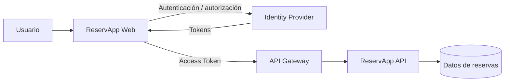
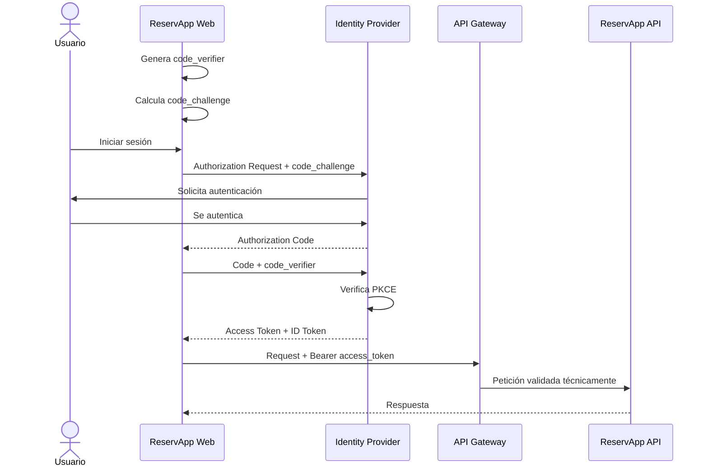

# 1.2.1 · OAuth2 y OpenID Connect (OIDC)

## Objetivo

Comprender la diferencia entre **autenticación** y **autorización**, reconocer qué problema resuelven OAuth2 y OpenID Connect, identificar sus actores principales y comprender el flujo moderno **Authorization Code + PKCE** sobre ReservApp.

Este README contiene el recorrido principal del tema. Puedes entender la materia leyendo solamente este documento. Cuando quieras profundizar una parte, encontrarás enlaces a documentos extendidos.

---

## 1. El problema

ReservApp necesita responder preguntas distintas:

- ¿quién está usando el sistema?;
- ¿cómo demostramos su identidad?;
- ¿qué puede hacer?;
- ¿sobre qué recursos?;
- ¿durante cuánto tiempo?;

Separar identidad, autorización y recurso protegido evita que cada aplicación tenga que resolver por sí misma contraseñas, MFA, emisión de credenciales, revocación y otras responsabilidades de seguridad.



---

## 2. Autenticación y autorización

### Autenticación

Responde:

> **¿Quién eres?**

Ejemplos: contraseña, MFA, biometría, passkey o "Continuar con Google".

### Autorización

Responde:

> **¿Qué puedes hacer?**

En ReservApp puede significar consultar, crear o cancelar reservas.

Una persona puede estar correctamente autenticada y no tener permiso para una operación determinada.

---

## 3. OAuth2

OAuth2 es un framework de **autorización delegada**.

La idea principal es permitir que una aplicación obtenga una autorización limitada para acceder a un recurso sin recibir la contraseña del usuario.

```text
credenciales del usuario ≠ access token
```

El access token representa una autorización temporal para un recurso determinado.

---

## 4. OpenID Connect

OpenID Connect agrega una capa de identidad sobre OAuth2.

Una simplificación útil:

```text
OAuth2 → autorización
OIDC   → autenticación / identidad sobre OAuth2
```

OIDC introduce, entre otras cosas, el **ID Token**, destinado principalmente al cliente para conocer información verificable sobre la autenticación realizada.

---

## 5. Actores principales

| Actor | Rol |
|---|---|
| Resource Owner | Persona que puede autorizar acceso al recurso. |
| Client | Aplicación que solicita autorización. En nuestro caso, ReservApp Web. |
| Authorization Server / IdP | Autentica, aplica políticas y emite tokens. |
| Resource Server | API que expone el recurso protegido. |
| API Gateway | Componente transversal de nuestra arquitectura; puede validar aspectos técnicos antes del backend. |

---

## 6. Tokens

### Access Token

Se presenta al Resource Server/API para acceder a recursos protegidos.

```http
Authorization: Bearer <access_token>
```

### ID Token

Pertenece a OIDC y comunica al cliente información verificable sobre la autenticación e identidad.

```text
ID Token     → información de identidad para el Client
Access Token → autorización para acceder a una API
```

---

## 7. Claims, scopes y roles

### Claim

Afirmación contenida en un token, por ejemplo `sub`, `iss`, `aud` o `exp`.

### Scope

Capacidad solicitada o concedida sobre un recurso, por ejemplo:

```text
reservations.read
reservations.write
```

### Role

Función del usuario dentro del sistema, por ejemplo:

```text
customer
operator
admin
```

Roles, scopes y claims pueden participar juntos en una política de autorización.

---

## 8. Authorization Code + PKCE

Para clientes modernos como aplicaciones web públicas o móviles, estudiaremos **Authorization Code + PKCE**.

PKCE agrega una prueba que vincula el comienzo del flujo con quien posteriormente intenta intercambiar el Authorization Code.

La idea central es:

> No basta con poseer el Authorization Code. El cliente debe demostrar que conserva una prueba creada al comenzar el flujo.



Los cuatro conceptos que no deben confundirse son:

```text
code_verifier      → prueba secreta original creada por el cliente
code_challenge     → valor derivado del verifier
Authorization Code → código temporal emitido por el servidor
Access Token       → credencial para acceder a la API
```

> **Si quieres profundizar:** revisa [Authorization Code + PKCE](07-authorization-code-pkce/README.md), donde el flujo se explica paso a paso.

---

## 9. Qué valida la API

Recibir un token no basta. Conceptualmente la API debe poder confiar en:

- firma;
- issuer (`iss`);
- audience (`aud`);
- expiración (`exp`);
- scopes, roles o políticas necesarias.

Después de la validación técnica todavía pueden existir reglas de negocio que impidan una operación.

---

## 10. Qué debes recordar

Al terminar este tema deberías poder explicar:

1. autenticación y autorización no son lo mismo;
2. OAuth2 resuelve autorización delegada;
3. OIDC agrega identidad sobre OAuth2;
4. Access Token e ID Token tienen propósitos distintos;
5. un scope no es lo mismo que un rol;
6. Authorization Code es temporal y no es un Access Token;
7. PKCE utiliza `code_verifier` y `code_challenge` para proteger el intercambio del código;
8. la API debe validar el token antes de confiar en él.

---

## 11. Comprueba que entendiste

Intenta responder sin mirar el material:

1. ¿Por qué ReservApp no debería recibir la contraseña de Google?
2. ¿Cuál es la diferencia entre Access Token e ID Token?
3. ¿Qué actor emite los tokens?
4. ¿Para qué sirve un scope?
5. ¿Por qué el Authorization Code no debería ser suficiente por sí solo?
6. ¿Quién crea el `code_verifier`?
7. ¿Qué compara el Authorization Server durante la validación PKCE?

---

## Siguiente paso

Después de comprender el flujo, continúa con el laboratorio de identidad de la semana y utiliza el diagrama para identificar qué actor está representando cada componente.
