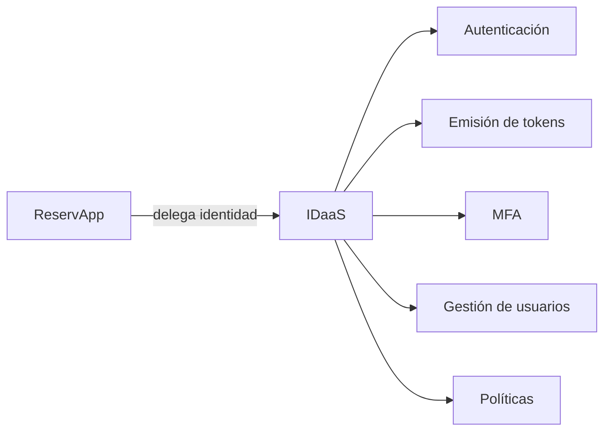
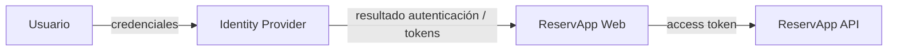
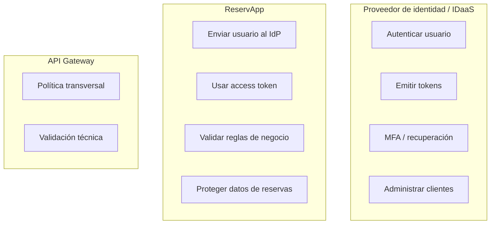
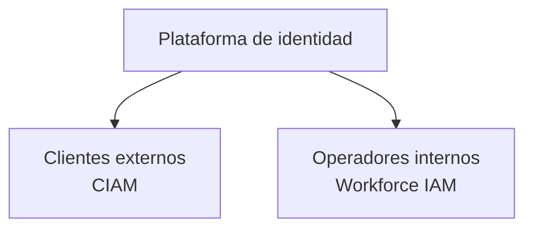
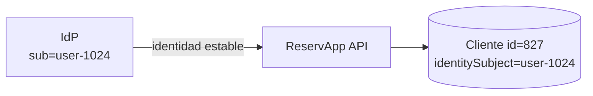
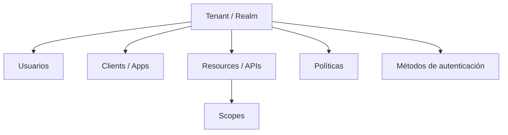
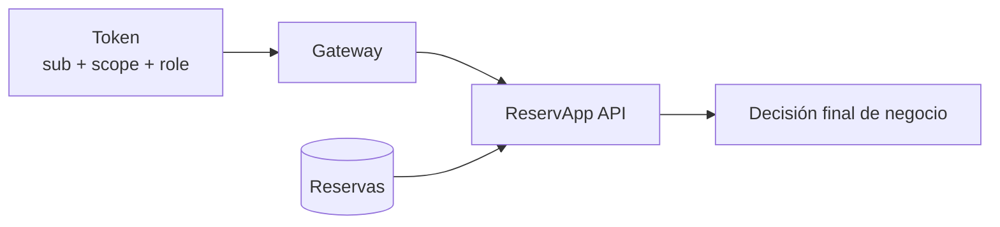
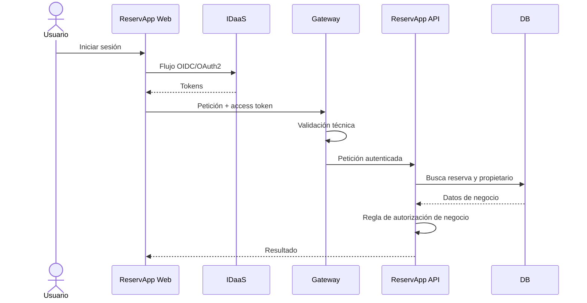

# 1.2.2 · Identity as a Service (IDaaS) y CIAM

## Objetivo

Comprender qué problema resuelve un proveedor de identidad, qué responsabilidades puede delegar una aplicación en un servicio de identidad y cómo se relacionan **IAM, IDaaS, IdP y CIAM** dentro de la arquitectura de **ReservApp**.

> El foco es reconocer capacidades y responsabilidades. Todavía no importa cómo se llama cada menú en un proveedor específico.

---

## 1. Del protocolo al servicio

En el tema anterior vimos OAuth2 y OIDC como protocolos/modelos de interacción.

Ahora aparece una pregunta distinta:

> **¿Quién implementa y opera toda esa infraestructura de identidad?**

ReservApp podría construir por sí misma:

- almacenamiento de credenciales;
- recuperación de contraseña;
- MFA;
- sesiones;
- emisión de tokens;
- administración de clientes;
- federación con otras identidades;
- auditoría;
- políticas de acceso.

Pero hacerlo implica responsabilidad operativa y de seguridad.

Un proveedor especializado puede ofrecer esas capacidades como servicio.



---

## 2. ¿Qué es IAM?

**IAM — Identity and Access Management** es el conjunto de procesos, políticas y tecnologías que permiten gestionar:

- identidades;
- autenticación;
- autorización;
- acceso a recursos;
- ciclo de vida de usuarios;
- auditoría y gobierno.

IAM es un concepto amplio.

No significa necesariamente “producto cloud”.

---

## 3. ¿Qué es un Identity Provider (IdP)?

Un **Identity Provider** es un sistema que autentica identidades y entrega afirmaciones o artefactos que otros sistemas pueden confiar.

En nuestro escenario puede actuar además como Authorization Server.

ReservApp confía en el IdP para no manejar directamente la contraseña del usuario.



La contraseña queda entre usuario e IdP, no entre usuario y backend de ReservApp.

---

## 4. ¿Qué es IDaaS?

**Identity as a Service (IDaaS)** significa consumir capacidades de identidad como un servicio administrado.

El proveedor normalmente se ocupa de buena parte de la infraestructura necesaria para:

- autenticación;
- directorio de usuarios;
- MFA;
- recuperación de cuentas;
- registro de aplicaciones;
- emisión y validación de tokens;
- integración con estándares como OAuth2/OIDC;
- federación;
- políticas de seguridad.

### Qué ganamos

- menor cantidad de seguridad crítica implementada desde cero;
- protocolos estandarizados;
- operaciones centralizadas;
- reutilización entre aplicaciones;
- mejor capacidad de evolución.

### Qué NO significa

IDaaS no significa:

> “la seguridad ahora es problema del proveedor”.

ReservApp todavía debe decidir:

- qué usuarios pueden hacer qué;
- qué permisos necesita cada operación;
- qué datos son sensibles;
- qué reglas de negocio protegen recursos;
- qué scopes/roles utilizar;
- cómo actuar ante errores y accesos indebidos.

---

## 5. Responsabilidad compartida

Una forma útil de comprender IDaaS es separar responsabilidades.



No todas las arquitecturas ubicarán exactamente las mismas comprobaciones en el mismo componente, pero la separación ayuda a razonar.

---

## 6. ¿Qué es CIAM?

**CIAM — Customer Identity and Access Management** es una especialización de IAM orientada a clientes, ciudadanos, consumidores o usuarios externos de una organización.

Sus preocupaciones suelen incluir:

- registro/autoregistro;
- inicio de sesión para grandes cantidades de usuarios externos;
- recuperación de cuenta;
- experiencia de usuario;
- login social o federado;
- consentimiento;
- perfiles;
- escalabilidad;
- seguridad sin requerir intervención administrativa por cada usuario.

### ReservApp como ejemplo

Si ReservApp permite que cualquier cliente cree una cuenta y administre sus propias reservas, estamos frente a un escenario cercano a CIAM.

Si además existieran trabajadores internos, podríamos tener dos poblaciones distintas:



La diferencia no es solo semántica: usuarios externos e internos pueden requerir políticas, experiencias y ciclos de vida distintos.

---

## 7. Usuario de identidad vs entidad de negocio

Este punto es importante.

Un usuario autenticado en el IdP **no tiene por qué ser exactamente la misma cosa** que una entidad de negocio en ReservApp.

Por ejemplo:

```text
IdP
sub = user-1024
email = ana@example.com
```

Mientras que la base de datos de ReservApp podría tener:

```text
Cliente
id = 827
identitySubject = user-1024
nombre = Ana
preferencias = ...
```



Separar ambas ideas evita acoplar excesivamente el dominio a un proveedor específico.

---

## 8. Tenant, aplicaciones y políticas

Un servicio de identidad necesita organizar sus recursos.

Por eso aparecen conceptos como:

- tenant / realm / organization;
- usuarios;
- grupos;
- aplicaciones/clientes;
- APIs/resources;
- métodos de autenticación;
- políticas;
- scopes;
- roles;
- claims.



La interfaz concreta cambia entre proveedores; estas relaciones conceptuales permanecen.

---

## 9. Scopes, roles y reglas de negocio en un entorno IDaaS

Supongamos un token con:

```text
sub   = user-123
scope = reservations.write
role  = customer
```

Podemos interpretar tres niveles distintos:

1. **Identidad:** `sub=user-123`.
2. **Capacidad general:** `reservations.write`.
3. **Contexto/función:** `role=customer`.

Pero todavía falta consultar el negocio para responder:

> ¿La reserva que intenta cancelar pertenece a `user-123`?



---

## 10. Qué puede validar cada componente

### Identity Provider

- credenciales;
- MFA;
- políticas de autenticación;
- emisión de tokens.

### ReservApp Web

- iniciar flujo de autenticación;
- recibir resultado del flujo;
- mantener estado de sesión de cliente de forma adecuada;
- enviar access token a la API.

### API Gateway

- existencia del token;
- issuer esperado;
- audience;
- expiración;
- políticas transversales;
- posiblemente scopes generales.

### ReservApp API

- autorización de negocio;
- propiedad del recurso;
- estados válidos de una reserva;
- permisos contextualizados;
- invariantes del dominio.



---

## 11. Actividad guiada · mapa de responsabilidades

En grupos, clasifiquen los siguientes casos entre:

- usuario;
- ReservApp Web;
- IDaaS/IdP;
- API Gateway;
- ReservApp API.

Casos:

1. validar la contraseña;
2. solicitar MFA;
3. emitir access token;
4. enviar `Authorization: Bearer ...`;
5. comprobar firma/issuer/audience;
6. determinar si falta `reservations.write`;
7. comprobar que la reserva pertenezca al usuario;
8. decidir si una reserva ya cancelada puede cancelarse otra vez;
9. mostrar nombre/avatar del usuario autenticado;
10. revocar una sesión comprometida.

### Pregunta adicional

¿Hay responsabilidades que podrían ubicarse en más de un componente?

Justifiquen según arquitectura, no por memorización.

---

## 12. Errores conceptuales frecuentes

- confundir IDaaS con OAuth2;
- pensar que IdP, IAM, IDaaS y CIAM son sinónimos exactos;
- asumir que el proveedor conoce las reglas de negocio de ReservApp;
- usar email como identificador técnico eterno sin analizar estabilidad;
- mezclar usuario de identidad con entidad `Cliente` del dominio;
- guardar secretos en frontend;
- creer que integrar un proveedor elimina la necesidad de diseñar autorización.

---

## Checkpoint

Al terminar este tema debes poder explicar:

- diferencia entre protocolo y servicio;
- qué es IAM;
- qué es un IdP;
- qué aporta IDaaS;
- qué distingue CIAM de un escenario de workforce IAM;
- qué responsabilidades se delegan y cuáles siguen en ReservApp;
- por qué usuario de identidad y entidad de negocio pueden ser distintos;
- dónde encajan tenant, apps, APIs, scopes y políticas.

## Continuidad

El siguiente tema usa estos conceptos para diseñar el **tenant de ReservApp**: qué identidades, aplicaciones, recursos y políticas necesita contener antes de tocar una consola real.