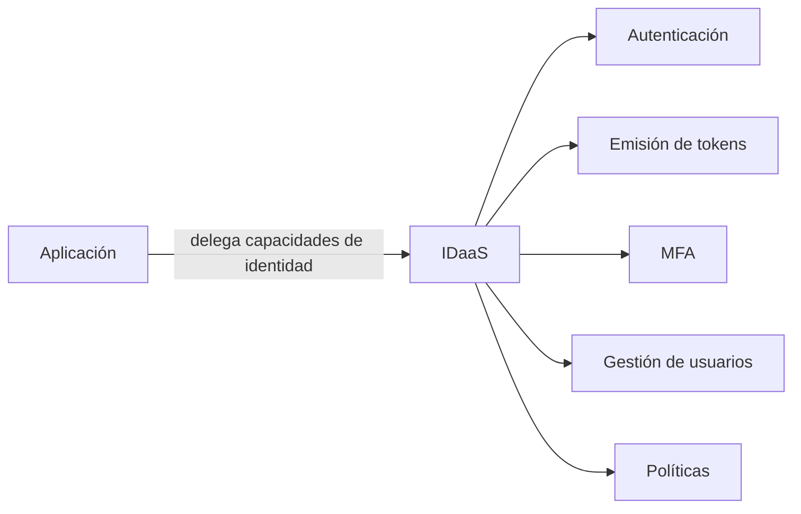
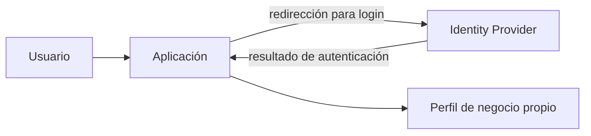
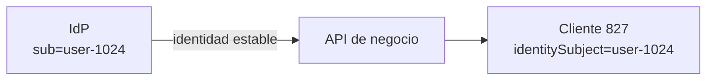
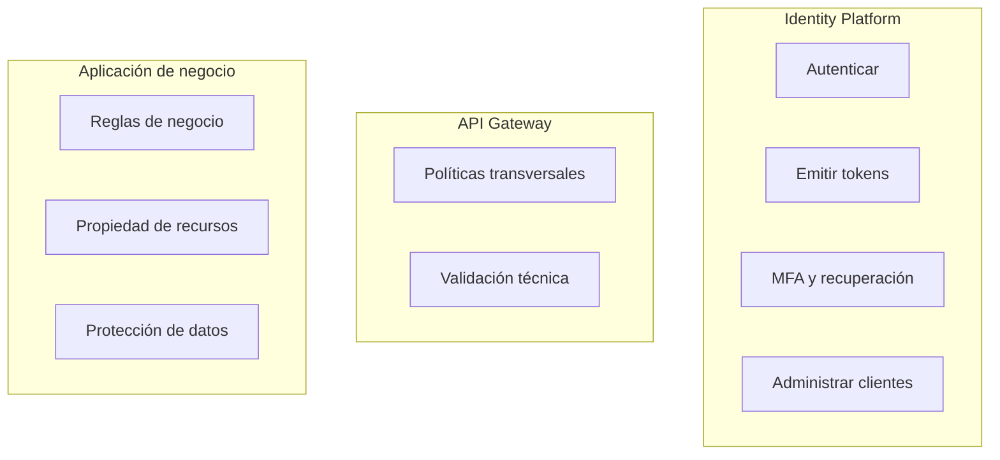
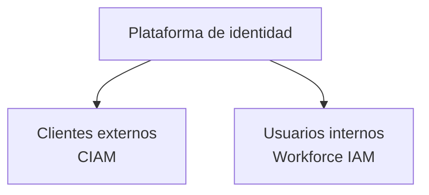
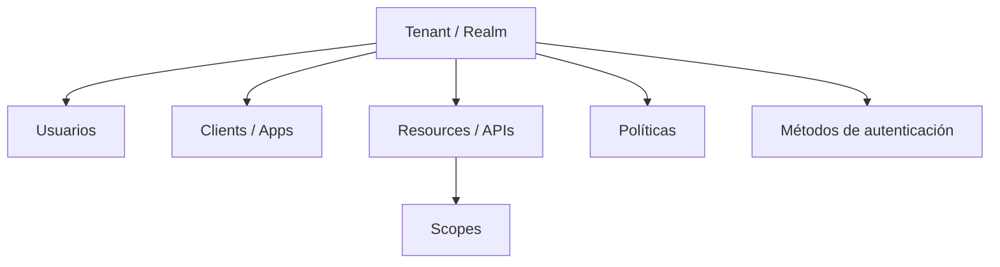
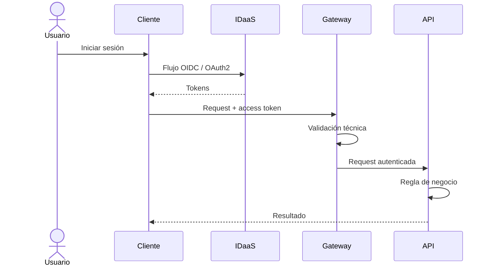

# 1.2.2 · Identity as a Service (IDaaS) y CIAM

## Objetivo

Comprender qué problema resuelve un proveedor de identidad y distinguir **IAM, IdP, IDaaS y CIAM** sin depender todavía de un proveedor cloud específico.

Los ejemplos son independientes de RegistrApp. La transferencia al desafío transversal ocurre después.

---

## 1. Del protocolo al servicio

OAuth2 y OIDC describen protocolos/modelos de interacción. IDaaS responde otra pregunta:

> ¿Quién implementa y opera las capacidades de identidad?

Un servicio administrado puede encargarse de autenticación, usuarios, MFA, recuperación de cuenta, emisión de tokens, registro de aplicaciones y políticas.



---

## 2. IAM, IdP, IDaaS y CIAM

### IAM

**Identity and Access Management** es el conjunto de procesos, políticas y tecnologías para gestionar identidades y acceso.

### IdP

Un **Identity Provider** autentica identidades y entrega afirmaciones o artefactos verificables para otros sistemas.

### IDaaS

**Identity as a Service** significa consumir capacidades de identidad como un servicio administrado.

### CIAM

**Customer Identity and Access Management** es IAM orientado a clientes, ciudadanos, consumidores o usuarios externos.

No son sinónimos exactos.

---

## 3. Ejemplo de identidad federada

Una aplicación ficticia permite iniciar sesión mediante un proveedor externo.



La aplicación puede delegar autenticación y aun mantener sus propios datos de negocio.

---

## 4. Identidad externa vs entidad de negocio

El usuario del proveedor de identidad no tiene por qué ser la misma entidad que usa el dominio de negocio.

Ejemplo:

```text
IdP
sub = user-1024
email = ana@example.com

Base de datos de negocio
customerId = 827
identitySubject = user-1024
plan = premium
```



Separar ambas ideas evita acoplar el dominio a un proveedor concreto.

---

## 5. Responsabilidad compartida

Un proveedor administrado no elimina las responsabilidades de la aplicación.



La ubicación exacta de cada control depende de la arquitectura, pero la responsabilidad debe estar explícita.

---

## 6. CIAM vs workforce IAM

Una solución orientada a público externo suele necesitar capacidades como:

- autoregistro;
- recuperación de cuenta;
- login social/federado;
- consentimiento;
- experiencia de usuario;
- escalabilidad para grandes poblaciones.

Un entorno de trabajadores internos suele tener políticas, ciclo de vida y gobierno distintos.



---

## 7. Tenant, aplicaciones y recursos

Los proveedores de identidad suelen organizar elementos conceptuales equivalentes a:

- tenant / realm / organization;
- usuarios;
- aplicaciones/clientes;
- APIs/resources;
- métodos de autenticación;
- scopes;
- roles;
- claims;
- políticas.



La interfaz concreta cambia entre proveedores; las relaciones conceptuales permanecen.

---

## 8. Flujo de responsabilidad



---

## 9. Mini actividad independiente

Clasifica cada responsabilidad entre **cliente, IdP/IDaaS, gateway o API**:

1. validar contraseña;
2. solicitar MFA;
3. emitir access token;
4. enviar `Authorization: Bearer ...`;
5. validar issuer/audience;
6. comprobar scope;
7. validar propiedad de un recurso;
8. decidir si una operación de negocio es válida;
9. recuperar una cuenta;
10. revocar una sesión comprometida.

Después discute cuáles podrían ubicarse en más de una capa y qué trade-off aparece.

## Cierre

El estudiante debe poder explicar:

- diferencia entre IAM, IdP, IDaaS y CIAM;
- qué responsabilidades se delegan;
- cuáles siguen perteneciendo a la aplicación;
- por qué identidad y entidad de negocio no son lo mismo;
- cómo encajan tenant, cliente, API, scopes y políticas.

→ [Profundización opcional](./02-idaas-ciam/README.md)
