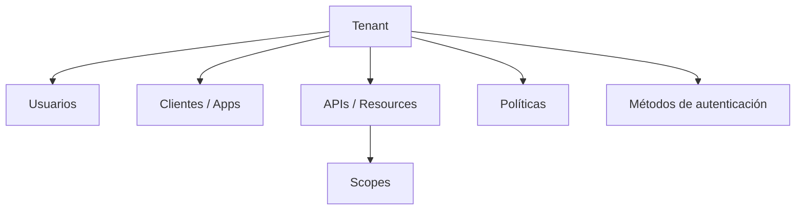
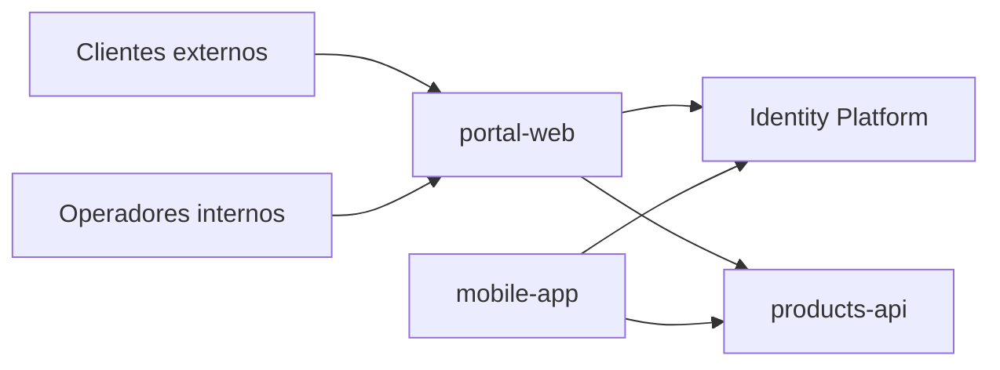
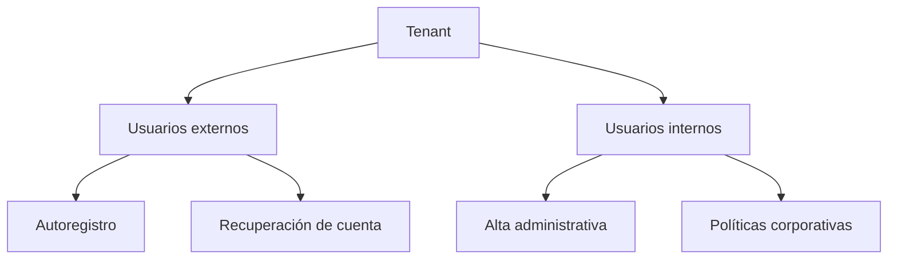
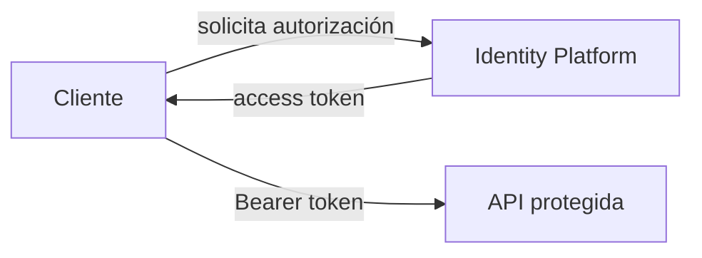
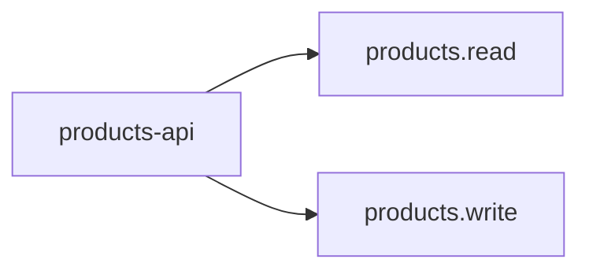
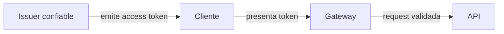

# 1.2.3 · Configurando un Tenant

## Objetivo

Comprender el tenant como una **frontera de organización y confianza** para identidades, aplicaciones y recursos antes de configurarlo en un proveedor real.

Este contenido se trabaja con un escenario ficticio independiente de RegistrApp.

---

## 1. Qué representa un tenant

Un tenant, realm u organización agrupa elementos de identidad bajo una frontera administrativa y de confianza.

Puede contener:

- usuarios;
- aplicaciones/clientes;
- APIs/resources;
- métodos de autenticación;
- roles;
- scopes;
- claims;
- políticas.



---

## 2. Caso independiente

Supongamos una empresa ficticia con:

- `portal-web`;
- `mobile-app`;
- `products-api`;
- clientes externos;
- operadores internos.

Antes de tocar una consola cloud debemos poder explicar cómo se relacionan esas piezas.



---

## 3. Poblaciones de usuarios

No todos los usuarios tienen necesariamente el mismo ciclo de vida o las mismas políticas.



El objetivo no es memorizar una pantalla, sino reconocer que poblaciones distintas pueden necesitar configuraciones distintas.

---

## 4. Aplicaciones y recursos

Dentro del tenant debemos distinguir:

### Cliente

Software que inicia un flujo y solicita tokens.

### Recurso / API

Sistema que recibe y valida access tokens destinados a él.



---

## 5. Scopes

Los scopes expresan capacidades sobre un recurso.

Ejemplo independiente:

```text
products.read
products.write
```

No deben copiar ciegamente botones de una interfaz ni convertirse en una lista infinita de casos de negocio.



---

## 6. Claims

Los claims aportan información sobre el token y su contexto.

Ejemplos frecuentes:

```text
iss
aud
sub
exp
scope
```

El hecho de que un claim exista no significa que toda decisión de negocio deba codificarse dentro del token.

---

## 7. Frontera de confianza

La pregunta importante es:

> ¿Qué componentes confían en qué emisor, para qué audiencia y bajo qué reglas?



Una API no debería aceptar cualquier token solo porque tenga formato JWT.

---

## 8. Mini actividad de diseño

Diseña conceptualmente un tenant para el caso ficticio.

Debes identificar:

1. poblaciones de usuarios;
2. clientes;
3. APIs/resources;
4. scopes;
5. claims relevantes;
6. políticas generales;
7. relación de confianza entre emisor y API.

No uses nombres de servicios cloud en la primera versión.

## 9. Preguntas de defensa

- ¿Por qué `portal-web` es un cliente y `products-api` es un resource server?
- ¿Qué cambia si aparece una app móvil?
- ¿Qué población puede autoregistrarse?
- ¿Qué audience esperaría `products-api`?
- ¿Qué scope usarías para lectura?
- ¿Qué parte de la autorización seguiría en el backend?

## Cierre

El estudiante debe poder diseñar la estructura conceptual antes de mapearla a Azure, AWS, Auth0, Keycloak u otro proveedor.

→ [Profundización opcional](./03-configurando-tenant/README.md)
