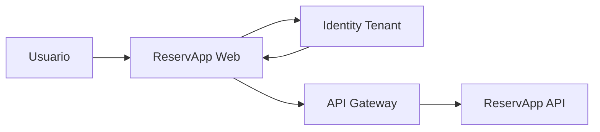

# 1.2.3 · Configurando un Tenant

## Objetivo

Comprender qué representa un tenant y diseñar el tenant de ReservApp antes de realizar una configuración real en una plataforma cloud.

> Esta semana **no se configura Azure**. El foco es entender la estructura y tomar decisiones que luego puedan trasladarse a cualquier proveedor compatible.

## 1. ¿Qué es un tenant?

Un tenant es un espacio lógico aislado donde un sistema de identidad administra, entre otras cosas:

- usuarios;
- aplicaciones;
- políticas;
- métodos de autenticación;
- configuración de seguridad;
- emisores y endpoints asociados.

Distintos productos usan nombres diferentes como `tenant`, `realm`, `organization` o similares. Lo importante es reconocer la función, no memorizar el nombre comercial.

## 2. ReservApp necesita un espacio de identidad

Para nuestro caso formativo queremos representar inicialmente:

- clientes externos;
- eventualmente operadores o administradores;
- una aplicación web;
- una API protegida;
- permisos de lectura y escritura de reservas.

Podemos expresarlo conceptualmente así:

```text
ReservApp Identity Space
├── Users
│   ├── customer-001
│   └── operator-001
├── Applications
│   ├── reservapp-web
│   └── reservapp-api
└── Permissions
    ├── reservations.read
    └── reservations.write
```

Esto es un **modelo conceptual**, no una receta exacta de interfaz de un proveedor.

## 3. Decisiones que debemos tomar antes de crear nada

### ¿Quiénes son los usuarios?

¿Son clientes externos? ¿Personal interno? ¿Ambos?

Esto importa porque puede cambiar el tipo de flujo, políticas y experiencia de acceso.

### ¿Qué aplicaciones existirán?

En ReservApp podemos distinguir al menos:

- `reservapp-web`: cliente utilizado por el usuario;
- `reservapp-api`: recurso protegido.

### ¿Qué datos de identidad necesitamos?

Ejemplos posibles:

```text
sub
name
email
role
```

No todos los datos deben convertirse en permisos.

### ¿Qué permisos necesita la aplicación?

```text
reservations.read
reservations.write
```

Los scopes deben representar capacidades sobre recursos, no simplemente copiar cargos o nombres de pantallas.

## 4. Issuer y confianza

Cuando una API recibe un token, no debería confiar en él únicamente porque “parece JWT”.

Debe existir una autoridad de identidad conocida. Conceptualmente, la API necesita validar aspectos como:

```text
issuer esperado
firma válida
audiencia correcta
no expirado
permisos suficientes
```

Por eso el tenant participa directamente en la relación de confianza.

## 5. Actividad práctica · Diseñar el tenant de ReservApp

En grupos, creen un archivo `tenant-design.md` con:

### A. Usuarios

Definan al menos dos tipos de usuario y expliquen qué diferencia de negocio existe entre ellos.

### B. Aplicaciones

Identifiquen:

- cliente;
- API/recurso protegido;
- qué componente solicita tokens;
- qué componente consume access tokens.

### C. Scopes

Partan con:

```text
reservations.read
reservations.write
```

y justifiquen si necesitan otro scope. Eviten crear scopes sin necesidad real.

### D. Claims

Propongan claims mínimos para identificar al sujeto y resolver la regla:

> Un cliente solo puede administrar sus propias reservas.

### E. Diagrama

Actualicen el flujo:



Añadan etiquetas que indiquen dónde aparecen autorización, token, scopes y validación.

## 6. Qué NO hacer todavía

No hace falta:

- crear cuentas cloud;
- crear un tenant real;
- copiar pantallas de Azure;
- generar secretos;
- almacenar credenciales;
- pegar JWT reales en el repositorio.

Primero debemos poder explicar **qué queremos configurar y por qué**.

## 7. Evidencia mínima

Al cerrar el tema, el grupo debe tener:

- `tenant-design.md`;
- usuarios definidos;
- aplicaciones identificadas;
- scopes propuestos;
- claims justificados;
- diagrama actualizado;
- explicación oral del rol del tenant.

## Continuidad

El siguiente tema transforma este diseño en la configuración conceptual de las **aplicaciones de ReservApp dentro del IDaaS**: Client ID, redirect URI, scopes, audiencia y relación cliente/API.
