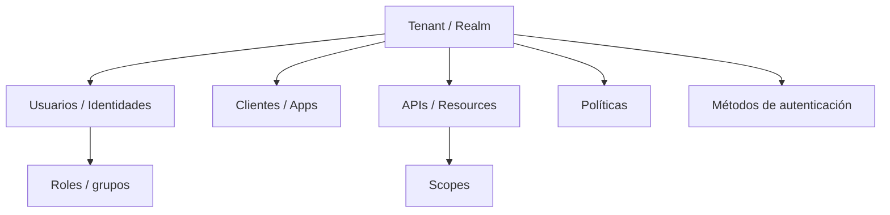
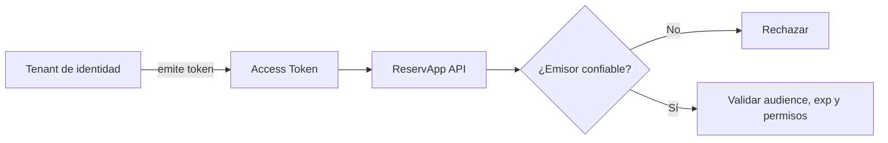
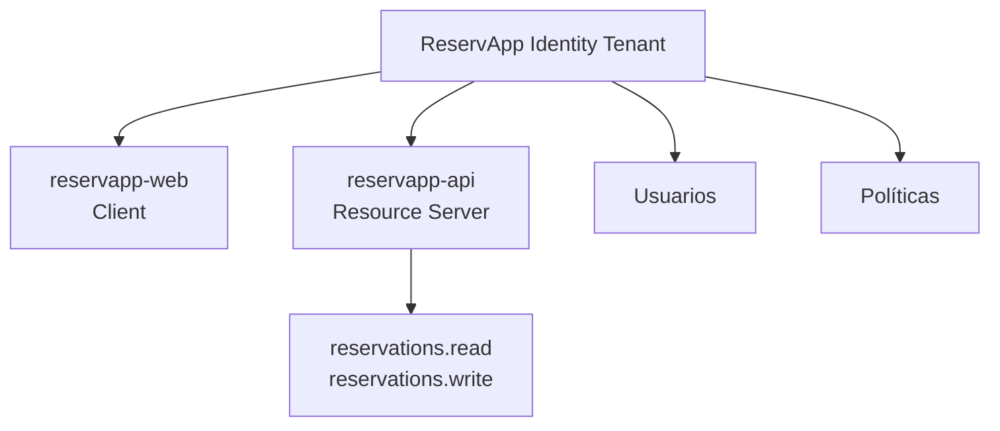
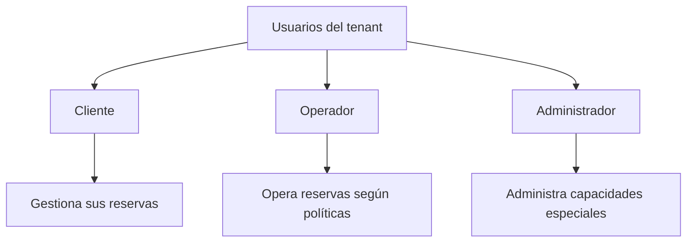
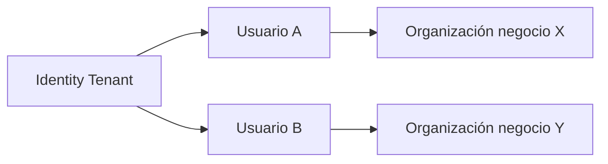
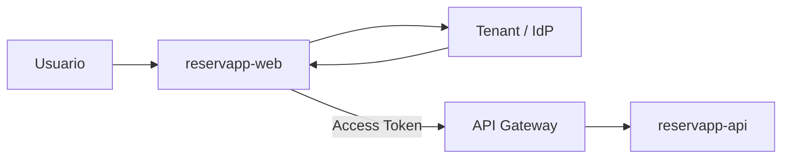
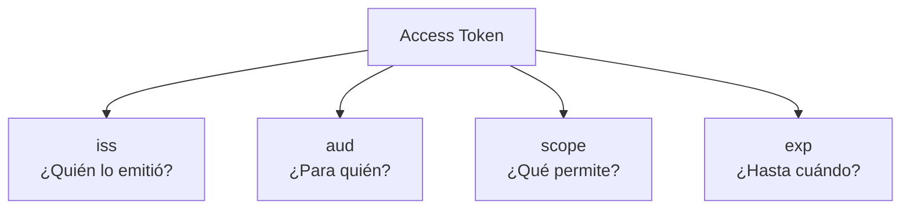
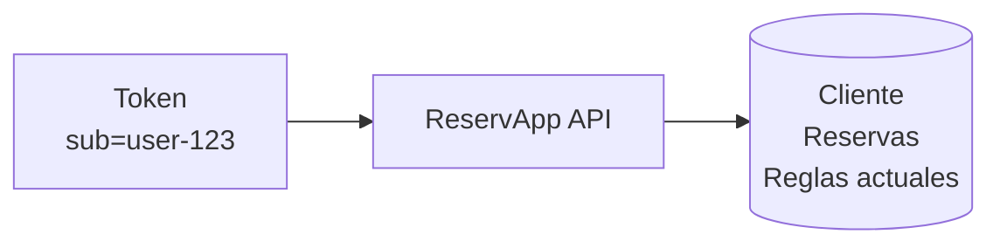
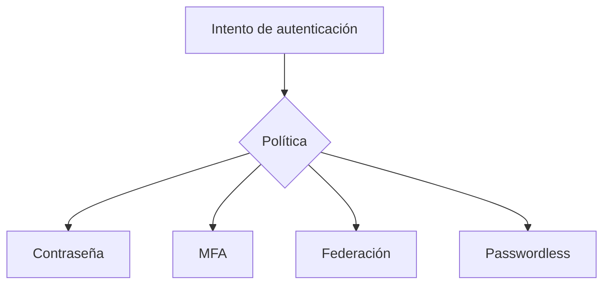
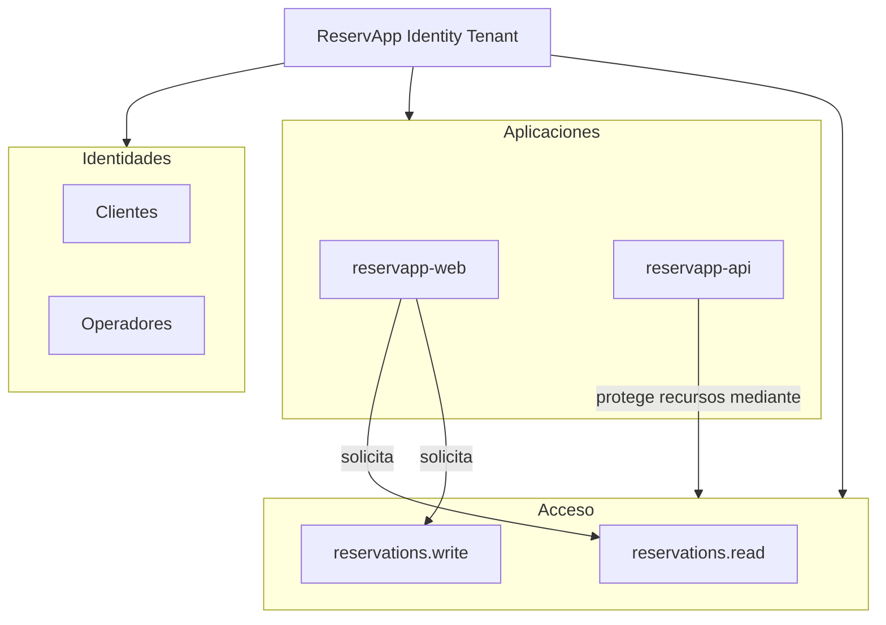

# 1.2.3 · Configurando un Tenant

## Objetivo

Comprender qué representa un **tenant** en una plataforma de identidad, qué elementos contiene, qué decisiones arquitectónicas deben tomarse antes de crearlo y cómo modelar conceptualmente el tenant de **ReservApp** sin depender todavía de una consola real.

> Esta semana el verbo “configurar” significa **diseñar correctamente lo que más adelante configuraremos**.

---

## 1. ¿Qué es realmente un tenant?

Un tenant es un **espacio lógico de administración y confianza** dentro de una plataforma de identidad.

Dentro de ese espacio se agrupan normalmente:

- identidades;
- aplicaciones/clientes;
- APIs o recursos protegidos;
- métodos de autenticación;
- políticas;
- roles;
- scopes;
- configuración de emisión de tokens;
- endpoints de identidad.

Distintos productos pueden utilizar nombres como:

```text
tenant
realm
organization
directory
```

El nombre comercial cambia; la función conceptual es similar.



---

## 2. El tenant establece una frontera de confianza

Cuando ReservApp recibe un token, no debería aceptarlo porque:

> “parece un JWT”.

Debe confiar en una autoridad concreta.

Por eso conceptos como **issuer** y tenant están relacionados.

La API necesita poder responder:

- ¿Quién emitió este token?
- ¿Confío en ese emisor?
- ¿Fue emitido para mí?
- ¿Sigue vigente?
- ¿Representa permisos suficientes?



---

## 3. ¿Un tenant equivale a una aplicación?

No.

Un tenant puede contener **múltiples aplicaciones y recursos**.

Para ReservApp distinguimos conceptualmente:

```text
Tenant ReservApp
├── reservapp-web
├── reservapp-api
├── usuarios
├── políticas
└── permisos
```



El tenant es el contenedor lógico; las aplicaciones son elementos registrados dentro de él.

---

## 4. ¿Quiénes viven dentro del tenant?

Antes de crear usuarios debemos identificar **poblaciones de identidad**.

En ReservApp podríamos tener:

### Cliente

Usuario externo que administra sus propias reservas.

### Operador

Usuario con funciones operativas sobre reservas de terceros.

### Administrador

Usuario con capacidades administrativas especiales.

Eso no significa que debamos crear tres roles porque sí. Primero debemos identificar diferencias reales de negocio.



---

## 5. Tenant y multitenancy no son exactamente lo mismo

La palabra **tenant** también aparece en arquitecturas SaaS multitenant.

Es importante no asumir que ambos usos son idénticos.

### Tenant de identidad

Agrupa configuración e identidades dentro del sistema de identidad.

### Tenant de negocio

Puede representar una organización, cliente o comunidad aislada dentro del dominio de una aplicación SaaS.

ReservApp podría tener en el futuro múltiples organizaciones de negocio usando un mismo proveedor de identidad.



Para esta semana trabajamos **tenant de identidad**, no diseño SaaS multitenant.

---

## 6. Aplicaciones que debemos modelar

ReservApp necesita al menos dos elementos conceptuales:

### `reservapp-web`

Actúa como **cliente**.

Responsabilidades principales:

- iniciar flujo de autenticación;
- solicitar autorización;
- recibir respuesta mediante redirect URI;
- usar access token para invocar la API.

### `reservapp-api`

Actúa como **resource server**.

Responsabilidades principales:

- aceptar tokens emitidos por un issuer confiable;
- validar audience;
- validar vigencia;
- verificar permisos;
- aplicar reglas de negocio.



---

## 7. Issuer, audience y scopes

Tres conceptos deben quedar relacionados.

### Issuer (`iss`)

Responde:

> ¿Quién emitió el token?

### Audience (`aud`)

Responde:

> ¿Para qué recurso fue emitido?

### Scope

Responde:

> ¿Qué capacidad fue concedida?

Ejemplo conceptual:

```text
iss   = https://identity.example/reservapp
aud   = reservapp-api
scope = reservations.read reservations.write
```



---

## 8. Claims de identidad y datos de negocio

No todo dato de ReservApp debería vivir en el token.

Un token puede incluir datos necesarios para identidad/autorización, pero no conviene convertirlo en una copia completa del perfil del usuario.

Por ejemplo:

```text
sub = user-123
role = customer
```

La API puede utilizar `sub` para buscar información actual del negocio.



Esto evita depender de información potencialmente desactualizada dentro del token para cada decisión de negocio.

---

## 9. Métodos de autenticación y políticas

Un tenant también puede definir cómo se autentican sus usuarios.

Ejemplos conceptuales:

- contraseña;
- MFA;
- autenticación federada;
- passwordless;
- políticas distintas según riesgo o población.

Esta semana no configuraremos ninguna, pero debemos comprender que la autenticación no es solo “crear usuario + contraseña”.



---

## 10. Diseño conceptual del tenant de ReservApp

Nuestro modelo inicial puede verse así:



Este diagrama no representa una consola concreta. Representa **decisiones que luego debemos traducir** al proveedor elegido.

---

## 11. Actividad práctica · `tenant-design.md`

En grupos creen un archivo:

```text
tenant-design.md
```

Debe incluir:

### A. Poblaciones de usuario

Definan al menos:

- cliente;
- operador.

Para cada uno indiquen qué diferencia real de negocio justifica distinguirlos.

### B. Aplicaciones

Identifiquen:

```text
reservapp-web
reservapp-api
```

Y expliquen:

- cuál es client;
- cuál es resource server;
- quién solicita tokens;
- quién consume access tokens.

### C. Scopes

Partan con:

```text
reservations.read
reservations.write
```

Luego respondan:

- ¿necesitamos otro scope?
- ¿estamos creando permisos porque existe una necesidad real o solo por completar una lista?

### D. Claims

Propongan los claims mínimos necesarios para reconocer al usuario y aplicar autorización.

Justifiquen cada uno.

### E. Confianza

Describan qué debería validar `reservapp-api` antes de aceptar un token.

### F. Diagrama Mermaid

Dibujen el tenant incluyendo:

- usuarios;
- cliente;
- API;
- scopes;
- flujo hacia gateway/backend.

---

## 12. Preguntas de razonamiento

1. ¿Por qué un tenant puede contener más de una aplicación?
2. ¿Por qué `client_id` no identifica a un usuario?
3. ¿Qué problema existiría si `reservapp-api` aceptara tokens de cualquier issuer?
4. ¿Qué ocurriría si el token tiene audience para otra API?
5. ¿Conviene poner en el token el historial completo de reservas del usuario? ¿Por qué?
6. ¿Tenant de identidad y tenant de negocio significan siempre lo mismo?

---

## 13. Qué NO hacer todavía

No necesitamos:

- crear cuenta cloud;
- crear tenant real;
- copiar capturas de consola;
- generar secretos;
- almacenar credenciales;
- pegar JWT reales;
- decidir un proveedor definitivo.

El resultado correcto de esta etapa es **un diseño que pueda implementarse posteriormente**.

---

## Checkpoint

Al terminar debes poder explicar:

- qué es un tenant;
- qué contiene;
- cómo establece una frontera de confianza;
- diferencia entre tenant y aplicación;
- relación entre issuer, audience y scopes;
- por qué token e información de negocio no son equivalentes;
- diferencia entre tenant de identidad y tenant de negocio;
- cómo sería conceptualmente el tenant de ReservApp.

## Continuidad

El siguiente tema baja un nivel: dentro del tenant diseñaremos **cómo se registran `reservapp-web` y `reservapp-api`**, qué representa un Client ID, por qué existen redirect URIs, qué diferencia hay entre cliente público/confidencial y cómo se relacionan cliente, API, audience y scopes.