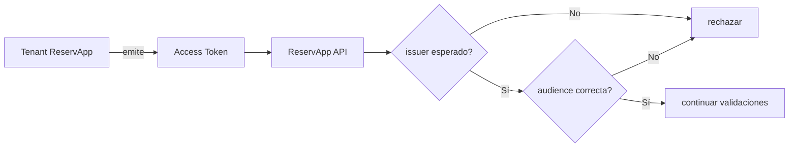

# Tenant como frontera de confianza

← [Volver a la profundización](./README.md)

Un tenant define un contexto dentro del cual una plataforma de identidad administra configuraciones y relaciones de confianza.

## ¿Por qué importa?

Una API no debe aceptar un token únicamente porque tenga formato JWT. Debe verificar, entre otras cosas, quién lo emitió.

```text
Token
├── iss → ¿quién lo emitió?
├── aud → ¿para quién fue emitido?
├── exp → ¿sigue vigente?
└── permisos → ¿qué autoriza?
```

El `issuer` ayuda a identificar la autoridad que emitió el token. Esa autoridad suele estar vinculada al tenant o dominio de identidad correspondiente.

## Ejemplo conceptual



## Lo que no significa

El tenant no reemplaza:

- la API;
- la base de datos;
- el gateway;
- las reglas de negocio.

Su función pertenece al dominio de identidad y confianza.

## Pregunta de comprobación

Si una API recibe un JWT correctamente firmado por otro tenant que no pertenece al contexto de ReservApp, ¿debería aceptarlo?

No. La firma puede ser técnicamente válida y aun así provenir de un emisor en el que la API no confía.