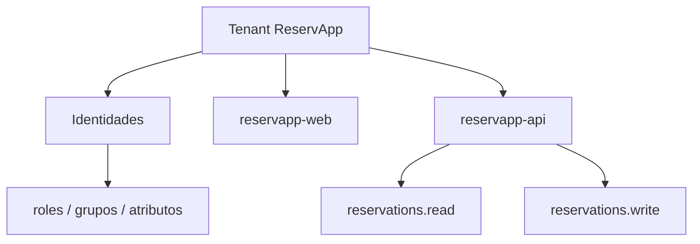

# Poblaciones, aplicaciones y recursos dentro del tenant

← [Volver a la profundización](./README.md)

Diseñar un tenant requiere identificar quiénes participan y qué elementos deben quedar representados.

## Poblaciones de identidad

En ReservApp pueden existir, por ejemplo:

- clientes que gestionan sus reservas;
- operadores que atienden reservas;
- administradores con capacidades de gestión.

No todas las poblaciones tienen necesariamente las mismas políticas de acceso, recuperación de cuenta o MFA.

## Aplicaciones cliente

Una aplicación cliente inicia flujos de autenticación/autorización.

Ejemplo:

```text
reservapp-web
```

El tenant mantiene información como su `client_id`, redirect URIs permitidas y flujos habilitados.

## Recursos protegidos

Una API representa un recurso que debe protegerse.

Ejemplo:

```text
reservapp-api
```

Puede exponer capacidades como:

```text
reservations.read
reservations.write
```

## Relación conceptual



El tenant organiza relaciones de identidad. Los datos propios del negocio —por ejemplo una reserva concreta— siguen perteneciendo a ReservApp y no al proveedor de identidad.